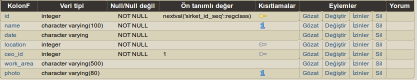
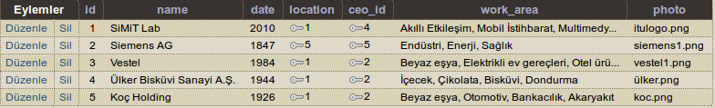
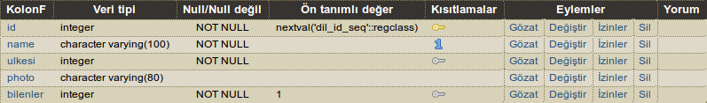
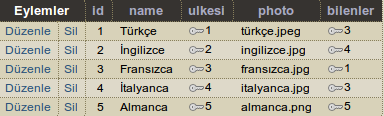
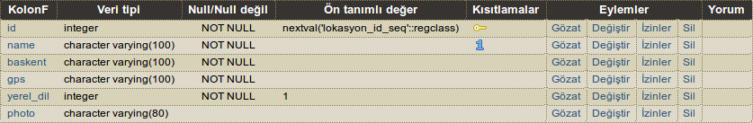
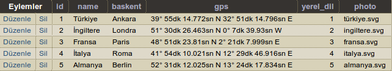

Parts Implemented by Ahmet Eğinkaya
===================================

Genel Bilgilendirme
-------------------

Proje raporunun bu kısmında Sirket, lokasyon ve dil tablolarının içerikleri ve yeni çoklu ekleme, varolan çokluyu silme, güncelleme ve arama fonksiyonlarını gerçekleyen veritabanı işlemleri açıklanacaktır. Ayrıca Python üzerinde bu tabloların kullanımı ile ilgili kodlar ve veritabanı bağlantıları açıklanacaktır.

|
1. Sirket
---------

Sirket varlığı ve site içerisindeki /Sirketler/* sayfaları sirket tablosunda gerçeklendi. Bu tablo da id, name, date, location, ceo_id, work_area ve photo satırlarından oluşmaktadır.

   figure 1.1

|

   Figure 1.1 deki sirket tablosu database görüntüsünün içeriği şu şekildedir:

|

  - ID INTEGER türde tanımlanmıştır ve tablonun birincil anahtarıdır.
  - Name, date ve work_area VARCHAR türünde tanımlanmıştır ve varlığın ilgili bölümlerini içerir.
  - Photo VARCHAR türünde tanımlanmıştır. Bu satır html içerisinde  etiketi içerisine yerleştirilmiştir ve uygun formatta verilen resimler kullanıcıya gösterilebilecek şekilde ayarlanmıştır.
  - Location INTEGER türünde ve lokasyon tablosuyla bağlantı kuran bir dış anahtar olarak tanımlanmıştır.
  - Ceo_id INTEGER türünde ve kişiler tablosuna bağlantı kuran bir dış anahtar olarak tanımlandı.
  - Name ve photo aynı zamanda UNIQUE olarak tanımlandı.

|

Sirket tablosunun içeriği figure 1.2 de gösterilmiştir.

   figure 1.2

|

   **Tablo Oluşturma**

.. code-block:: python

  def init_sirketler_db(cursor):
    query = """DROP TABLE IF EXISTS SIRKET"""
    cursor.execute(query)
    query = """CREATE TABLE SIRKET (
        ID SERIAL PRIMARY KEY,
        NAME varchar(100) UNIQUE NOT NULL,
        DATE varchar NOT NULL,
        LOCATION INTEGER NOT NULL REFERENCES LOKASYON(ID) ON DELETE CASCADE ON UPDATE CASCADE,
        CEO_ID INTEGER NOT NULL REFERENCES KISILER(ID) ON DELETE CASCADE ON UPDATE CASCADE DEFAULT 1,
        WORK_AREA varchar(500),
        PHOTO varchar(80) UNIQUE
        )"""
    cursor.execute(query)
    insert_sirket(cursor)

|
Yukarıdaki kod diliminde sirket tablosu oluşturulmuştur. Sirket tablosu daha önce oluşturulduysa o tablo silinir ve sıfırdan yeni tablo oluşturulur. Kodun bu partında birincil anahtar ve dış anahtarlar da belirlenmiştir. Bağlı olduğu diğer tablolardaki değişikliklerden etkilenme biçimleri de (ON DELETE CASCADE , ON UPDATE CASCADE) yine bu kısımda belirtilmiştir. Name, date, location ve ceo_id boş değer olarak girilemez. Aynı isimde name ve photo kullanılamaz çünkü UNIQUE olarak tanımlandı. Son satırda çağrılan fonksiyon aşağıda gösterilmiştir.

|

**Tabloya İlk Değer Atama**

Aşağıda belirtilen kod diliminde, daha önce oluşturduğumuz sirket tablosuna çoklular eklenir.

.. code-block:: python

   def insert_sirket(cursor):
    query = """INSERT INTO SIRKET
        (NAME, DATE, LOCATION, CEO_ID, WORK_AREA, PHOTO) VALUES (
        'SiMiT Lab',
        2010,
        1,
        4,
        'Akıllı Etkileşim, Mobil İstihbarat, Multimedya Teknolojileri',
        'itulogo.png'
        )"""
    cursor.execute(query)
    query = """INSERT INTO SIRKET
        (NAME, DATE, LOCATION, CEO_ID, WORK_AREA, PHOTO) VALUES (
        'Siemens AG',
        1847,
        5,
        5,
        'Endüstri, Enerji, Sağlık',
        'siemens1.png'
        )"""
    cursor.execute(query)
    query = """INSERT INTO SIRKET
        (NAME, DATE, LOCATION, CEO_ID, WORK_AREA, PHOTO) VALUES (
        'Vestel',
        1984,
        1,
        2,
        'Beyaz eşya, Elektrikli ev gereçleri, Otel ürünleri üretimi',
        'vestel1.png'
        )"""
    cursor.execute(query)
    query = """INSERT INTO SIRKET
        (NAME, DATE, LOCATION, CEO_ID, WORK_AREA, PHOTO) VALUES (
        'Ülker Bisküvi Sanayi A.Ş.',
        1944,
        1,
        2,
        'İçecek, Çikolata, Bisküvi, Dondurma',
        'ülker.png'
        )"""
    cursor.execute(query)
    query = """INSERT INTO SIRKET
        (NAME, DATE, LOCATION, CEO_ID, WORK_AREA, PHOTO) VALUES (
        'Koç Holding',
        1926,
        1,
        2,
        'Beyaz eşya, Otomotiv, Bankacılık, Akaryakıt',
        'koc.png'
        )"""
    cursor.execute(query)

|

**Şirket Listeleme(SELECT)**

Veritabanındaki şirketlerin listelenip kullanıcıya gösterilme işlemi /sirketler sayfasının GET metodu ile çağrılması sonucu yapılmaktadır. Yapılan SELECT query'si sonucunda veritabanından gelen satırlar html sorgusunda yazdırılmaktadır.

.. code-block:: python

  @app.route('/sirketler', methods = ['GET', 'POST'])
  def sirketler_sayfasi():
     connection = dbapi2.connect(app.config['dsn'])
     cursor = connection.cursor()
     if request.method == 'GET':
          now = datetime.datetime.now()
          query = """SELECT S.ID,S.NAME,S.DATE,L.NAME,K.ISIM, S.WORK_AREA,S.PHOTO FROM KISILER AS K,
                   SIRKET AS S, LOKASYON AS L WHERE ((S.LOCATION = L.ID) AND (S.CEO_ID = K.ID))"""
          cursor.execute(query)
          sirket=cursor.fetchall()
          query = "SELECT ID,ISIM FROM KISILER"
          cursor.execute(query)
          kisiler =cursor.fetchall()
          query = "SELECT ID,NAME FROM LOKASYON"
          cursor.execute(query)
          lokasyon =cursor.fetchall()
         return render_template('sirketler.html', sirket = sirket, current_time=now.ctime(),kisiler=kisiler, lokasyon = lokasyon)

|

**Yeni Şirket Ekleme**

Sirket tablosu içerisine yeni şirket ekleme işlemi /sirketler sayfasında gerçeklenmiştir. Şirketlerin listelendiği bölümün hemen altında şirket ekleme bölümü bulunmaktadır. Kullanıcı istenilen bilgileri girdikten sonra Sirket ekle butonuna basarak bilgileri gönderir.

Aşağıdaki kod diliminde  Sirket classının tanımlanması gösterilmiştir.

.. code-block:: python

  class Sirket:
     def __init__(self, name, date, location, ceo_id, work_area, photo):
        self.name = name
        self.date = date
        self.location = location
        self.ceo_id = ceo_id
        self.work_area = work_area
        self.photo = photo

Aşağıdaki kod diliminde ise yeni şirket ekleme fonksiyonunun nasıl yazıldığı gösterilmiştir.

.. code-block:: python

  def add_sirket(cursor, request, sirket):
     query = """INSERT INTO SIRKET
          (NAME, DATE, LOCATION, CEO_ID, WORK_AREA, PHOTO) VALUES (
          %s,
          %s,
          %s,
          %s,
          %s,
          %s
          )"""
     cursor.execute(query, (sirket.name, sirket.date, sirket.location, sirket.ceo_id, sirket.work_area, sirket.photo))

|

Burada, varlık niteliklerinin girildiği diğer bir fonksiyondan sirket çoklusu alınır ve içeriği uygun niteliklere eklenir.

|

sirket çoklusunu döndüren fonksiyon server.py ta tanımlanmıştır ve aşağıdaki gibidir.

|

.. code-block:: python

      elif "add" in request.form:
          sirket = Sirket(request.form['name'],
                     request.form['date'],
                     request.form['location_name'],
                     request.form['kisiler_isim'],
                     request.form['work_area'],
                     request.form['photo'])

          add_sirket(cursor, request, sirket)

          connection.commit()
          return redirect(url_for('sirketler_sayfasi'))

|

Ekle butonuna basıldığında verilen formdaki veriler /sirketler sayfasından POST metodu ile alınmaktadır. Alınan değerleri doğru bir şekilde saklamak için database ile benzer içeriği olan bir python sınıfı oluşturulmuştur. Bu sınıftan bir nesne oluşturularak alınan input verileri nesnenin ilgili alanlarına atılmıştır.

|

**Arama Fonksiyonu**

Arama fonksiyonunda aranacak şirket ismi arama barına girilerek yapılabilir. Arama fonksiyonu aşağıda gösterilmiştir.

.. code-block:: python

  elif "search" in request.form:
        aranan = request.form['aranan'];
        query = """SELECT S.ID,S.NAME,S.DATE,L.NAME,K.ISIM, S.WORK_AREA,S.PHOTO FROM KISILER AS K,
                 SIRKET AS S, LOKASYON AS L WHERE ((S.LOCATION = L.ID) AND (S.CEO_ID = K.ID) AND (S.NAME LIKE %s))"""
        cursor.execute(query,[aranan])
        sirket=cursor.fetchall()
        now = datetime.datetime.now()
        return render_template('sirket_ara.html', sirket = sirket, current_time=now.ctime(), sorgu = aranan)

|

**Güncelleme Fonksiyonu**

Aşağıdaki kod diliminde yeni şirket ekleme fonksiyonuna benzer olarak güncellenecek çoklu diğer fonksiyondan sirket etiketiyle çekilir ve ilgili niteliklere güncellenen bilgiler eklenir.

|

.. code-block:: python

   def update_sirketler(cursor, id, sirket):
    query="""
         UPDATE SIRKET
         SET NAME=INITCAP(%s),
         DATE=%s,
         LOCATION=%s,
         CEO_ID=%s,
         WORK_AREA=%s,
         PHOTO=%s
         WHERE ID=%s
         """
    cursor.execute(query,(sirket.name, sirket.date, sirket.location, sirket.ceo_id, sirket.work_area, sirket.photo, id))

.. code-block:: python

   @app.route('/sirketler/<sirket_id>', methods=['GET', 'POST'])
   def sirketler_update_page(sirket_id):
    connection = dbapi2.connect(app.config['dsn'])
    cursor = connection.cursor()
    if request.method == 'GET':
        query = """SELECT * FROM SIRKET WHERE (ID = %s)"""
        cursor.execute(query,sirket_id)
        sirket = cursor.fetchall()
        now = datetime.datetime.now()
        query = "SELECT ID,ISIM FROM KISILER"
        cursor.execute(query)
        kisiler =cursor.fetchall()
        query = "SELECT ID,NAME FROM LOKASYON"
        cursor.execute(query)
        lokasyon =cursor.fetchall()
        return render_template('sirket_guncelle.html', sirket = sirket, current_time=now.ctime(), kisiler = kisiler, lokasyon=lokasyon)
    elif request.method == 'POST':
        if "update" in request.form:
            sirket1 = Sirket(request.form['name'],
                            request.form['date'],
                            request.form['location_name'],
                            request.form['kisiler_isim'],
                            request.form['work_area'],
                            request.form['photo'])
            update_sirketler(cursor, request.form['sirket_id'], sirket1)
            connection.commit()
            return redirect(url_for('sirketler_sayfasi'))

|

**Silme Fonksiyonu**

Silinmek istenen çoklunun birincil anahtarı olan ID'sini alarak fonksiyona gönderir ve çokluyu siler.

.. code-block:: python

   elif "delete" in request.form:
            delete_sirketler(cursor, sirket_id)
            connection.commit()
            return redirect(url_for('sirketler_sayfasi'))

.. code-block:: python

   def delete_sirketler(cursor, id):
         query="""DELETE FROM SIRKET WHERE ID = %s"""
         cursor.execute(query, id)

|

2. Dil
------

Dil varlığı ve site içerisindeki /Diller/* sayfaları dil tablosunda gerçeklendi. Bu tablo da id, name, ulkesi, photo ve bilenler satırlarından oluşmaktadır.

   figure 2.1

|

   Figure 2.1 deki dil tablosu database görüntüsünün içeriği şu şekildedir:

|

  - ID INTEGER türde tanımlanmıştır ve tablonun birincil anahtarıdır.
  - Name VARCHAR türünde tanımlanmıştır ve varlığın ilgili bölümlerini içerir.
  - Photo VARCHAR türünde tanımlanmıştır. Bu satır html içerisinde  etiketi içerisine yerleştirilmiştir ve uygun formatta verilen resimler kullanıcıya gösterilebilecek şekilde ayarlanmıştır.
  - Ulkesi INTEGER türünde ve lokasyon tablosuyla bağlantı kuran bir dış anahtar olarak tanımlanmıştır.
  - Bilenler INTEGER türünde ve kişiler tablosuna bağlantı kuran bir dış anahtar olarak tanımlandı.
  - Name aynı zamanda UNIQUE olarak tanımlandı.

|

Dil tablosunun içeriği figure 2.2 de gösterilmiştir.

   figure 2.2

|

**Tablo Oluşturma**

.. code-block:: python

  def init_diller_db(cursor):
    query = """DROP TABLE IF EXISTS DIL"""
    cursor.execute(query)
    query = """CREATE TABLE DIL (
        ID SERIAL PRIMARY KEY,
        NAME varchar(100) UNIQUE NOT NULL,
        ULKESI INTEGER NOT NULL REFERENCES LOKASYON(ID) ON DELETE CASCADE ON UPDATE CASCADE,
        PHOTO varchar(80),
        BILENLER INTEGER NOT NULL REFERENCES KISILER(ID) ON DELETE CASCADE ON UPDATE CASCADE DEFAULT 1
        )"""
    cursor.execute(query)
    insert_dil(cursor)

|

Yukarıdaki kod diliminde dil tablosu oluşturulmuştur. Dil tablosu daha önce oluşturulduysa o tablo silinir ve sıfırdan yeni tablo oluşturulur. Kodun bu partında birincil anahtar ve dış anahtarlar da belirlenmiştir. Bağlı olduğu diğer tablolardaki değişikliklerden etkilenme biçimleri de (ON DELETE CASCADE , ON UPDATE CASCADE) yine bu kısımda belirtilmiştir. Name, ulkesi ve bilenler boş değer olarak girilemez. Aynı isimde name kullanılamaz çünkü UNIQUE olarak tanımlandı. Son satırda çağrılan fonksiyon aşağıda gösterilmiştir.

|

**Tabloya İlk Değer Atama**

Aşağıda belirtilen kod diliminde, daha önce oluşturduğumuz dil tablosuna çoklular eklenir.

.. code-block:: python

   def insert_dil(cursor):
    query = """INSERT INTO DIL
        (NAME, ULKESI, PHOTO, BILENLER) VALUES (
        'Türkçe',
        1,
        'türkçe.jpeg',
        3
        )"""
    cursor.execute(query)
    query = """INSERT INTO DIL
        (NAME, ULKESI, PHOTO, BILENLER) VALUES (
        'İngilizce',
        2,
        'ingilizce.jpg',
        4
        )"""
    cursor.execute(query)
    query = """INSERT INTO DIL
        (NAME, ULKESI, PHOTO, BILENLER) VALUES (
        'Fransızca',
        3,
        'fransızca.jpg',
        1
        )"""
    cursor.execute(query)
    query = """INSERT INTO DIL
        (NAME, ULKESI, PHOTO, BILENLER) VALUES (
        'İtalyanca',
        4,
        'italyanca.jpg',
        3
        )"""
    cursor.execute(query)
    query = """INSERT INTO DIL
        (NAME, ULKESI, PHOTO, BILENLER) VALUES (
        'Almanca',
        5,
        'almanca.png',
        5
        )"""
    cursor.execute(query)

|

**Dil Listeleme(SELECT)**

Veritabanındaki dillerin listelenip kullanıcıya gösterilme işlemi /diller sayfasının GET metodu ile çağrılması sonucu yapılmaktadır. Yapılan SELECT query'si sonucunda veritabanından gelen satırlar html sorgusunda yazdırılmaktadır.

.. code-block:: python

   @app.route('/diller', methods = ['GET', 'POST'])
   def diller_sayfasi():
         connection = dbapi2.connect(app.config['dsn'])
         cursor = connection.cursor()
         if request.method == 'GET':
         now = datetime.datetime.now()
         query = """SELECT D.ID, D.NAME, L.NAME, D.PHOTO, K.ISIM FROM KISILER AS K,
                     LOKASYON AS L, DIL AS D WHERE((D.ULKESI = L.ID) AND (D.BILENLER = K.ID))"""

         cursor.execute(query)
            dil=cursor.fetchall()
         query = "SELECT ID,ISIM FROM KISILER"
         cursor.execute(query)
         kisiler =cursor.fetchall()
         query = "SELECT ID,NAME FROM LOKASYON"
         cursor.execute(query)
         lokasyon =cursor.fetchall()
         return render_template('diller.html', dil = dil, current_time=now.ctime(), kisiler = kisiler, lokasyon = lokasyon)

|

**Yeni Dil Ekleme(ADD)**

Dil tablosu içerisine yeni dil ekleme işlemi /diller sayfasında gerçeklenmiştir. Dillerin listelendiği bölümün hemen altında dil ekleme bölümü bulunmaktadır. Kullanıcı istenilen bilgileri girdikten sonra Dil ekle butonuna basarak bilgileri gönderir.

Aşağıdaki kod diliminde  Dil classının tanımlanması gösterilmiştir.

.. code-block:: python

    class Dil:
    def __init__(self, name, ulkesi, photo, bilenler):
        self.name = name
        self.ulkesi = ulkesi
        self.photo = photo
        self.bilenler = bilenler

Aşağıdaki kod diliminde ise yeni dil ekleme fonksiyonunun nasıl yazıldığı gösterilmiştir.

.. code-block:: python

  def add_dil(cursor, request, dil):
    query = """INSERT INTO DIL
        (NAME, ULKESI, PHOTO, BILENLER) VALUES (
        %s,
        %s,
        %s,
        %s
        )"""
    cursor.execute(query, (dil.name, dil.ulkesi, dil.photo, dil.bilenler))

|

Burada, varlık niteliklerinin girildiği diğer bir fonksiyondan dil çoklusu alınır ve içeriği uygun niteliklere eklenir.
Dil çoklusunu döndüren fonksiyon server.py ta tanımlanmıştır ve aşağıdaki gibidir.

|

.. code-block:: python

      elif "add" in request.form:
        dil = Dil(request.form['name'],
                  request.form['lokasyon_name'],
                  request.form['photo'],
                  request.form['kisiler_isim'])

        add_dil(cursor, request, dil)

        connection.commit()
        return redirect(url_for('diller_sayfasi'))

|

Ekle butonuna basıldığında verilen formdaki veriler /diller sayfasından POST metodu ile alınmaktadır. Alınan değerleri doğru bir şekilde saklamak için database ile benzer içeriği olan bir python sınıfı oluşturulmuştur. Bu sınıftan bir nesne oluşturularak alınan input verileri nesnenin ilgili alanlarına atılmıştır.

|

**Arama Fonksiyonu(SEARCH)**

Arama fonksiyonunda aranacak dil ismi arama barına girilerek yapılabilir. Arama fonksiyonu aşağıda gösterilmiştir.

.. code-block:: python

  elif "search" in request.form:
        aranan = request.form['aranan'];
        query = """SELECT D.ID, D.NAME, L.NAME, D.PHOTO, K.ISIM FROM KISILER AS K,
                LOKASYON AS L, DIL AS D WHERE((D.ULKESI = L.ID) AND (D.BILENLER = K.ID) AND (D.NAME LIKE %s))"""

        cursor.execute(query,[aranan])
        dil=cursor.fetchall()
        now = datetime.datetime.now()
        return render_template('dil_ara.html', dil = dil, current_time=now.ctime(), sorgu = aranan)

|

**Güncelleme Fonksiyonu(UPDATE)**

Aşağıdaki kod diliminde yeni dil ekleme fonksiyonuna benzer olarak güncellenecek çoklu diğer fonksiyondan dil etiketiyle çekilir ve ilgili niteliklere güncellenen bilgiler eklenir.

|

.. code-block:: python

   def update_diller(cursor, id, dil):
            query="""
            UPDATE DIL
            SET NAME=INITCAP(%s),
            ULKESI=%s,
            PHOTO=INITCAP(%s),
            BILENLER=%s
            WHERE ID=%s
            """
            cursor.execute(query,(dil.name, dil.ulkesi, dil.photo, dil.bilenler, id))

|

.. code-block:: python

   @app.route('/diller/<dil_id>', methods=['GET', 'POST'])
   def diller_update_page(dil_id):
    connection = dbapi2.connect(app.config['dsn'])
    cursor = connection.cursor()
    if request.method == 'GET':
        query = """SELECT * FROM DIL WHERE (ID = %s)"""
        cursor.execute(query,dil_id)
        dil = cursor.fetchall()
        now = datetime.datetime.now()
        query = "SELECT ID,ISIM FROM KISILER"
        cursor.execute(query)
        kisiler =cursor.fetchall()
        query = "SELECT ID,NAME FROM LOKASYON"
        cursor.execute(query)
        lokasyon =cursor.fetchall()
        return render_template('dil_guncelle.html', dil = dil, current_time=now.ctime(), kisiler = kisiler, lokasyon = lokasyon )
    elif request.method == 'POST':
        if "update" in request.form:
            dil1 = Dil(request.form['name'],
                     request.form['lokasyon_name'],
                     request.form['photo'],
                     request.form['kisiler_isim'])
            update_diller(cursor, request.form['dil_id'], dil1)
            connection.commit()
            return redirect(url_for('diller_sayfasi'))

|

**Silme Fonksiyonu(DELETE)**

Silinmek istenen çoklunun birincil anahtarı olan ID'sini alarak fonksiyona gönderir ve çokluyu siler.

.. code-block:: python

   elif "delete" in request.form:
            delete_diller(cursor, dil_id)
            connection.commit()
            return redirect(url_for('diller_sayfasi'))

.. code-block:: python

   def delete_diller(cursor, id):
         query="""DELETE FROM DIL WHERE ID = %s"""
         cursor.execute(query, id)

|

3. Lokasyon
-----------

Lokasyon varlığı ve site içerisindeki /Lokasyonlar/* sayfaları lokasyon tablosunda gerçeklendi. Bu tablo da id, name, baskent,GPS, yerel_dil ve photo satırlarından oluşmaktadır.

   figure 3.1

|

   Figure 3.1 deki lokasyon tablosu database görüntüsünün içeriği şu şekildedir:

|

  - ID INTEGER türde tanımlanmıştır ve tablonun birincil anahtarıdır.
  - Name, baskent ve GPS VARCHAR türünde tanımlanmıştır ve varlığın ilgili bölümlerini içerir.
  - Photo VARCHAR türünde tanımlanmıştır. Bu satır html içerisinde  etiketi içerisine yerleştirilmiştir ve uygun formatta verilen resimler kullanıcıya gösterilebilecek şekilde ayarlanmıştır.
  - Yerel_dil INTEGER türünde ve lokasyon tablosuyla bağlantı kuran bir dış anahtar olarak tanımlanmıştır.
  - Name aynı zamanda UNIQUE olarak tanımlandı.

|

Lokasyon tablosunun içeriği figure 3.2 de gösterilmiştir.

   figure 3.2

|

**Tablo Oluşturma**

.. code-block:: python

  def init_lokasyonlar_db(cursor):
    query = """DROP TABLE IF EXISTS LOKASYON"""
    cursor.execute(query)
    query = """CREATE TABLE LOKASYON (
        ID SERIAL PRIMARY KEY,
        NAME varchar(100) UNIQUE NOT NULL,
        BASKENT varchar(100) NOT NULL,
        GPS varchar(100) NOT NULL,
        YEREL_DIL INTEGER NOT NULL REFERENCES DIL(ID) ON DELETE CASCADE ON UPDATE CASCADE DEFAULT 1,
        PHOTO varchar(80)
        )"""
    cursor.execute(query)
    insert_lokasyon(cursor)

|

Yukarıdaki kod lokasyoniminde lokasyon tablosu oluşturulmuştur. Lokasyon tablosu daha önce oluşturulduysa o tablo silinir ve sıfırdan yeni tablo oluşturulur. Kodun bu partında birincil anahtar ve dış anahtar da belirlenmiştir. Bağlı olduğu diğer tablolardaki değişikliklerden etkilenme biçimleri de (ON DELETE CASCADE , ON UPDATE CASCADE) yine bu kısımda belirtilmiştir. Name, baskent, GPS ve yerel_dil bos değer olarak girilemez. Aynı isimde name kullanılamaz çünkü UNIQUE olarak tanımlandı. Son satırda çağrılan fonksiyon aşağıda gösterilmiştir.

|

**Tabloya İlk Değer Atama**

Aşağıda belirtilen kod diliminde, daha önce oluşturduğumuz lokasyon tablosuna çoklular eklenir.

.. code-block:: python

   def insert_lokasyon(cursor):
    query = """INSERT INTO LOKASYON
        (NAME, BASKENT, GPS, YEREL_DIL, PHOTO) VALUES (
        'Türkiye',
        'Ankara',
        '39° 55dk 14.772sn N 32° 51dk 14.796sn E',
        1,
        'türkiye.svg'
        )"""
    cursor.execute(query)
    query = """INSERT INTO LOKASYON
        (NAME, BASKENT, GPS, YEREL_DIL, PHOTO) VALUES (
        'İngiltere',
        'Londra',
        '51° 30dk 26.463sn N 0° 7dk 39.93sn W',
        2,
        'ingiltere.svg'
        )"""
    cursor.execute(query)
    query = """INSERT INTO LOKASYON
        (NAME, BASKENT, GPS, YEREL_DIL, PHOTO) VALUES (
        'Fransa',
        'Paris',
        '48° 51dk 23.81sn N 2° 21dk 7.999sn E',
        3,
        'fransa.svg'
        )"""
    cursor.execute(query)
    query = """INSERT INTO LOKASYON
        (NAME, BASKENT, GPS, YEREL_DIL, PHOTO) VALUES (
        'İtalya',
        'Roma',
        '41° 54dk 10.021sn N 12° 29dk 46.916sn E',
        4,
        'italya.svg'
        )"""
    cursor.execute(query)
    query = """INSERT INTO LOKASYON
        (NAME, BASKENT, GPS, YEREL_DIL, PHOTO) VALUES (
        'Almanya',
        'Berlin',
        '52° 31dk 12.025sn N 13° 24dk 17.834sn E',
        5,
        'almanya.svg'
        )"""
    cursor.execute(query)

|

**Lokasyon Listeleme(SELECT)**

Veritabanındaki lokasyonlerin listelenip kullanıcıya gösterilme işlemi /lokasyonlar sayfasının GET metodu ile çağrılması sonucu yapılmaktadır. Yapılan SELECT query'si sonucunda veritabanından gelen satırlar html sorgusunda yazdırılmaktadır.

.. code-block:: python

   @app.route('/lokasyonlar', methods = ['GET', 'POST'])
   def lokasyonlar_sayfasi():
         connection = dbapi2.connect(app.config['dsn'])
         cursor = connection.cursor()
         if request.method == 'GET':
         now = datetime.datetime.now()

         query = """SELECT L.ID, L.NAME, L.BASKENT, L.GPS, D.NAME, L.PHOTO
                      FROM LOKASYON AS L, DIL AS D
                      WHERE(
                     (L.YEREL_DIL = D.ID)
                  )"""

         cursor.execute(query)
         lokasyon=cursor.fetchall()
         query = "SELECT ID,NAME FROM DIL"
         cursor.execute(query)
         diller =cursor.fetchall()
         return render_template('lokasyonlar.html', lokasyon = lokasyon, current_time=now.ctime(),diller=diller)

|

**Yeni Lokasyon Ekleme(ADD)**

Lokasyon tablosu içerisine yeni lokasyon ekleme işlemi /lokasyonlar sayfasında gerçeklenmiştir. Lokasyonlarin listelendiği bölümün hemen altında lokasyon ekleme bölümü bulunmaktadır. Kullanıcı istenilen bilgileri girdikten sonra Lokasyon ekle butonuna basarak bilgileri gönderir.

Aşağıdaki kod lokasyoniminde  Lokasyon classının tanımlanması gösterilmiştir.

.. code-block:: python

    class Lokasyon:
    def __init__(self, name, baskent, gps, yerel_dil, photo):
        self.name = name
        self.baskent = baskent
        self.gps = gps
        self.yerel_dil = yerel_dil
        self.photo = photo

Aşağıdaki kod lokasyoniminde ise yeni lokasyon ekleme fonksiyonunun nasıl yazıldığı gösterilmiştir.

.. code-block:: python

  def add_lokasyon(cursor, request, lokasyon):
    query = """INSERT INTO LOKASYON
        (NAME, BASKENT, GPS, YEREL_DIL, PHOTO) VALUES (
        %s,
        %s,
        %s,
        %s,
        %s
        )"""
    cursor.execute(query, (lokasyon.name, lokasyon.baskent, lokasyon.gps, lokasyon.yerel_dil, lokasyon.photo))

|

Burada, varlık niteliklerinin girildiği diğer bir fonksiyondan lokasyon çoklusu alınır ve içeriği uygun niteliklere eklenir.
Lokasyon çoklusunu döndüren fonksiyon server.py ta tanımlanmıştır ve aşağıdaki gibidir.

|

.. code-block:: python

      elif "add" in request.form:
        lokasyon = Lokasyon(request.form['name'],
                     request.form['baskent'],
                     request.form['gps'],
                     request.form['diller_isim'],
             request.form['photo'])

        add_lokasyon(cursor, request, lokasyon)

        connection.commit()
        return redirect(url_for('lokasyonlar_sayfasi'))

|

Ekle butonuna basıldığında verilen formdaki veriler /lokasyonlar sayfasından POST metodu ile alınmaktadır. Alınan değerleri doğru bir şekilde saklamak için database ile benzer içeriği olan bir python sınıfı oluşturulmuştur. Bu sınıftan bir nesne oluşturularak alınan input verileri nesnenin ilgili alanlarına atılmıştır.

|

**Arama Fonksiyonu(SEARCH)**

Arama fonksiyonunda aranacak lokasyon ismi arama barına girilerek yapılabilir. Arama fonksiyonu aşağıda gösterilmiştir.

.. code-block:: python

  elif "search" in request.form:
        aranan = request.form['aranan'];

        query = """SELECT L.ID, L.NAME, L.BASKENT, L.GPS, D.NAME , L.PHOTO
                    FROM LOKASYON AS L, DIL AS D
                    WHERE(
                        (L.YEREL_DIL = D.ID)
                    ) AND (L.NAME LIKE %s)"""

        cursor.execute(query,[aranan])
        lokasyon=cursor.fetchall()
        now = datetime.datetime.now()
        return render_template('lokasyon_ara.html', lokasyon = lokasyon, current_time=now.ctime(), sorgu = aranan)

|

**Güncelleme Fonksiyonu(UPDATE)**

Aşağıdaki kod lokasyoniminde yeni lokasyon ekleme fonksiyonuna benzer olarak güncellenecek çoklu diğer fonksiyondan lokasyon etiketiyle çekilir ve ilgili niteliklere güncellenen bilgiler eklenir.

|

.. code-block:: python

   def update_lokasyonlar(cursor, id, lokasyon):
    query="""
        UPDATE LOKASYON
        SET NAME=INITCAP(%s),
        BASKENT=INITCAP(%s),
        GPS=INITCAP(%s),
        YEREL_DIL=%s,
        PHOTO=%s
        WHERE ID=%s
        """
    cursor.execute(query,(lokasyon.name, lokasyon.baskent, lokasyon.gps, lokasyon.yerel_dil, lokasyon.photo, id))

|

.. code-block:: python

   @app.route('/lokasyonlar/<lokasyon_id>', methods=['GET', 'POST'])
   def lokasyonlar_update_page(lokasyon_id):
    connection = dbapi2.connect(app.config['dsn'])
    cursor = connection.cursor()
    if request.method == 'GET':
        query = """SELECT * FROM LOKASYON WHERE (ID = %s)"""
        cursor.execute(query,lokasyon_id)
        lokasyon = cursor.fetchall()
        now = datetime.datetime.now()
        query = "SELECT ID,NAME FROM DIL"
        cursor.execute(query)
        diller =cursor.fetchall()
        return render_template('lokasyon_guncelle.html', lokasyon = lokasyon, current_time=now.ctime(), diller = diller)
    elif request.method == 'POST':
        if "update" in request.form:
            lokasyon1 = Lokasyon(request.form['name'],
                     request.form['baskent'],
                     request.form['gps'],
                     request.form['diller_isim'],
             request.form['photo'])
            update_lokasyonlar(cursor, request.form['lokasyon_id'], lokasyon1)
            connection.commit()
            return redirect(url_for('lokasyonlar_sayfasi'))

|

**Silme Fonksiyonu(DELETE)**

Silinmek istenen çoklunun birincil anahtarı olan ID'sini alarak fonksiyona gönderir ve çokluyu siler.

.. code-block:: python

   elif "delete" in request.form:
            delete_lokasyonlar(cursor, lokasyon_id)
            connection.commit()
            return redirect(url_for('lokasyonlar_sayfasi'))

.. code-block:: python

   def delete_lokasyonlar(cursor, id):
      query="""DELETE FROM LOKASYON WHERE ID = %s"""
      cursor.execute(query, id)

|
