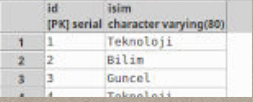
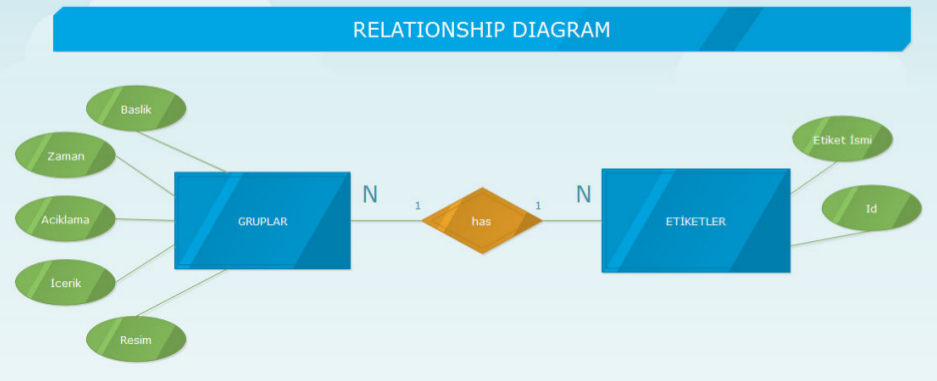
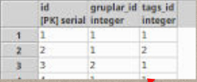
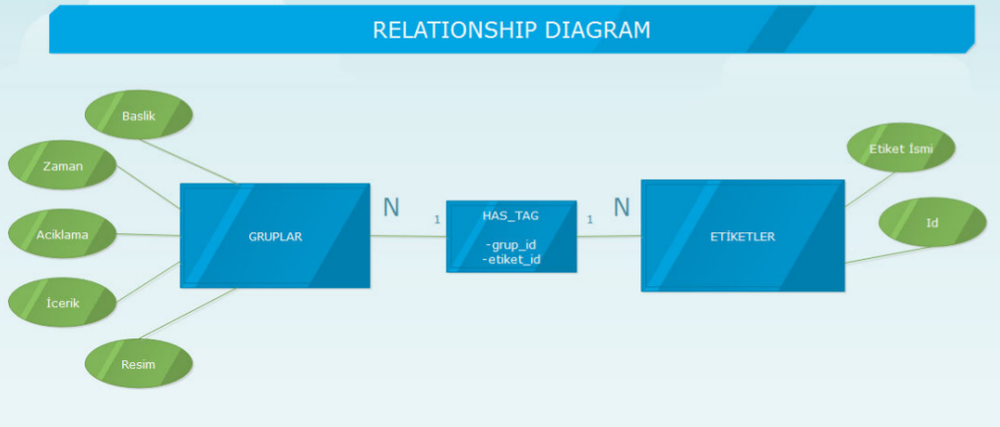

Parts Implemented by Çağrı Gökçe
================================
Gruplar, Tags(Etiketler), Has_Tag(Etiket İlişkisi) tabloları ve özellikleri bu bölümde açıklanacaktır. Ayrıca Python üzerinde bu tabloların kullanımı ile ilgili kodlar paylaşılacaktır ve veritabanı bağlantıları açıklanacaktır.

1. Gruplar
------------------
Gruplar varlığı ve site içerisindeki /gruplar/* sayfaları gruplar tablosunda gerçeklendi. Bu tablo id, zaman, aciklama, icerik, resim ve dış anahtar olan kişi_id satırlarından oluşmaktadır.

- ID satırı SERIAL türde tanımlanmıştır ve tablonun birincil anahtarıdır.
- Başlık, Acıklama ve İçerik satırları VARCHAR türünde tanımlanmıştır ve varlığın ilgili bölümlerini içerir.
- Resim satırı da VARCHAR türünde tanımlanmıştır. Bu satır html içerisinde  etiketi içerisine yerleştirilmiştir ve uygun formatta verilen resimler kullanıcıya gösterilebilecek şekilde ayarlanmıştır.
- Zaman satırı DATE türünde tanımlanmıştır ve GG/AA/YY biçimindeki formatları desteklemektedir.
- Kişi_ID satırı INTEGER türünde tanımlandı ve kişiler tablosuna bağlantı kuran bir dış anahtar olarak tanımlandı.

.. figure::cagri/grup_1.jpg
   :figclass: align-center

Gruplar tablosun site içerisinde aynı ilgi alanlarını paylaşan kullanıcıları buluşturup ortak paylaşımları görmelerini sağlamak amaçlandı. Her grup için oluşturan kişi bilgisini saklamak için Kişiler tablosuna dış anahtar ile bağlantı sağlandı. 

**a. Tablo Oluşturma (CREATE)**

Tablo oluşturma işlemi *gruplar.py* dosyasındaki def *init_gruplar_db(cursor)* fonksiyonu içerisinde tanımlanmıştır. Bu fonksiyon *server.py* içerisinde */gruplar/initdb* route'u içinde çağırılıp bu sayfa açıldığında oluşturulmaktadır.

.. code-block:: python

  #Gruplar.py
  def init_gruplar_db(cursor):
      query = """CREATE TABLE IF NOT EXISTS GRUPLAR (
      ID SERIAL,
      BASLIK VARCHAR(80) NOT NULL,
      ZAMAN DATE NOT NULL,
      ACIKLAMA VARCHAR(500) NOT NULL,
      ICERIK VARCHAR(500) NOT NULL,
      RESIM VARCHAR(80),
      KISILER_ID INTEGER NOT NULL REFERENCES KISILER(ID) ON DELETE CASCADE ON UPDATE CASCADE DEFAULT 1,
      PRIMARY KEY(ID)
      )"""
      cursor.execute(query)
  
  #Server.py
  @app.route('/gruplar/initdb')
  ...
  init_gruplar_db(cursor)
|
    
Kişiler ID dış anahtarına silme operasyonu için *ON DELETE CASCADE* ve günceleme operasyonu için *ON UPDATE CASCADE* tanımları eklenmiştir. *CASCADE* yapısı sayesinde tablo üzerinde yapılan değişiklikler bağlı tabloya da uygulanacaktır ve o tablo da güncellenecektir. *RESTRICT* yapısı bu işlemlerin yapılmasını engellediğinden dolayı tercih edilmemiştir. Bir diğer tanım olan *DEFAULT 1* tanımı ile dış anahtarın verilmediği durumlarda *kişi_id=1* olan kişinin grup kurucusu olarak atanması sağlanmıştır.

**b. İlk değer atama**

İlk değer atama(initialization) işlemi *Gruplar.py* dosyasında tanımlanmıştır ve bu dosya içerisinde *fill_gruplar_db(cursor)* tanımında çağırılmaktadır. Tablo oluşturma işleminin hemen sonrasında bu işlem yapılır.

.. code-block:: python

   def fill_gruplar_db(cursor):
       query="""INSERT INTO GRUPLAR
           (BASLIK, ZAMAN, ACIKLAMA, ICERIK, RESIM) VALUES (
           'Yazılım & Teknoloji ',
           to_date('02.03.2015', 'DD-MM-YYYY'),
           'Yazılım mühendisleri ve teknolojiyi takip edenler için oluşturulmuş bir topluluk. Sen de bize katıl!',
           'Icerik Eklenecektir',
           'software.jpg');
           INSERT INTO GRUPLAR
           (BASLIK, ZAMAN, ACIKLAMA, ICERIK, RESIM) VALUES (
           'Finans Klubü',
           to_date('13.09.2019', 'DD-MM-YYYY'),
           'Finans sektöründe çalışanlar, firma sahipleri, ve girişimciler için eşsiz bir kaynak. Bu grup ile finans konusunda yeni gelişmeleri kaçırmadan güncel piyasaları takip ederek doğru kararlar alabileceksiniz. Hemen gruba katılın ve tartışmaya başlayın!',
           'Icerik Eklenecektir',
           'finance.jpg');
           INSERT INTO GRUPLAR
           (BASLIK, ZAMAN, ACIKLAMA, ICERIK, RESIM) VALUES (
           'Digital Marketing',
           to_date('13.09.2019', 'DD-MM-YYYY'),
           'We know marketing! Discussions on current trends, close scope on money exchange and tips and tricks for new entrepreneur. Join us and enjoy great discussions!',
           'Icerik Eklenecektir',
           'marketing.jpeg');
           INSERT INTO GRUPLAR
           (BASLIK, ZAMAN, ACIKLAMA, ICERIK, RESIM) VALUES (
           'Mühendisler Topluluğu',
           to_date('13.09.2019', 'DD-MM-YYYY'),
           'Mühendisler ve mühendis adaylarını buluşturan bu toplulukta pratik bilgiler, iş ilanları, sektöre ilişkin başlıklar ve çok daha fazlasını bulacaksınız.',
           'Icerik Eklenecektir',
           'muhendis.jpg');
           """
   cursor.execute(query)
|

**c. Grup Listeleme(SELECT)**

Veritabanındaki grupların listelenip kullanıcıya gösterilme işlemi */gruplar* sayfasının GET metodu ile çağrılması sonucu yapılmaktadır. Yapılan SELECT query'si sonucunda veritabanından gelen satırlar html sorgusunda yazdırılmaktadır. 

.. code-block:: python

   #Server.py
   @app.route('/gruplar',methods=['GET', 'POST'])
   def gruplar_sayfasi():
       connection = dbapi2.connect( app.config['dsn'])
       cursor = connection.cursor()
       now = datetime.datetime.now()
       if request.method == 'GET':
           query = "SELECT G.ID,G.BASLIK,G.ZAMAN,G.ACIKLAMA,G.ICERIK,G.RESIM,K.ISIM FROM KISILER AS K RIGHT JOIN GRUPLAR AS G ON G.KISILER_ID = K.ID"
           cursor.execute(query)
           gruplar=cursor.fetchall()
           query = "SELECT ID,ISIM FROM KISILER"
           cursor.execute(query)
           kisiler =cursor.fetchall()
   return render_template('gruplar.html', gruplar = gruplar, current_time=now.ctime(),kisiler=kisiler)   

   #Gruplar.html
   
		<h2>{{baslik}}</h2>
		
{{zaman}}

		
{{aciklama}}

		
{{icerik}}

		
{{kisi}}

		
		<a class="btn btn-large btn-info" href= "{{ url_for('gruplar_update_page',grup_id=id)}}">Grubu Duzenle</a>
		<button type="button" action=" class="btn btn-success">Katıl!</button>
		

	

|

**c. Grup Ekleme(ADD)**

Gruplar tablosu içerisine grup ekleme işlemi */gruplar* sayfasında gerçeklenmiştir. Grupların listelendiği bölümün hemen altında grup ekleme bölümü bulunmaktadır. Bu bölümde database satırları için input formları ve dış anahtar için selection box yapısı bulunur. Bu bölümde kişiler tablosundan tüm kişi isimleri alınıp kullanıcıya gösterilmiştir ve kullanıcının dış anahtarı liste halinde rahatça seçebilmesi sağlanmıştır. Aşağıdaki kod satırında gruplar için hazırlanan input formlar ve kişilerin select yapısı içerisinde eklenmesi gösterilmiştir.

.. code-block:: python
	<form id="add" action="{{ url_for('gruplar_sayfasi')}}" method = "post">
                

  			<label for="usr">Başlık:</label>
			<input class="form-control" ... name="baslik" required="required">
		

                

			<label for="usr">Kuruluş Tarihi (GG-AA-YYYY)</label>
			<input class="form-control" ... type="date" name="zaman">
	        

		...
		...
		<label for="sel1">Olusturan Kisi:</label>
		<select class="form-control" id="sel1" name="kisiler_isim" form="add">
		    
			    	<option value = "{{id}}" >{{isim}}</option>
		    
		</select>
	</form>	
	
|
*Ekle* butonuna basıldığında verilen formdaki veriler */gruplar* sayfasından *POST* metodu ile alınmaktadır. Alınan değerleri doğru bir şekilde saklamak için database ile benzer içeriği olan bir python sınıfı oluşturulmuştur. Bu sınıftan bir nesne oluşturularak alınan input verileri nesnenin ilgili alanlarına atılmıştır.

.. code-block:: python

	#Gruplar sınıfı olusturuluyor ve yapi tanimlaniyor.
	class Gruplar:
	    def __init__(self, baslik, zaman, aciklama, icerik, resim, kisiler_id):
		self.baslik = baslik
		self.zaman = zaman
		self.aciklama = aciklama
		self.icerik = icerik
		self.resim = resim
		self.kisiler_id = kisiler_id
	..
	
	#Grup1 adında yeni bir grup oluşturuluyor ve form verileri aktarılıyor.
	#add_gruplar() fonksiyonu çağrılarak veritabanına ekleme işlemi tamamlanıyor.
	elif "add" in request.form:
		grup1 = Gruplar(request.form['baslik'],
				    request.form['zaman'],
				    request.form['aciklama'],
				    request.form['icerik'],
				    request.form['resim'],
				    request.form['kisiler_isim'])
		add_gruplar(cursor, request, grup1)
		connection.commit()
		return redirect(url_for('gruplar_sayfasi'))
		
|

Gelen verinin bir nesne içerisine aktarılmasından sonra bu nesne *gruplar.py* sayfasında tanımlanmış *add_gruplar()* fonksiyonu çağrılmaktadır. Bu fonksiyonun içerisinde verilen nesne içerisindeki bilgiler *INSERT* komutu ile veritabanına eklenir. Fonksiyon içeriği aşağıda verilmiştir.

.. code-block:: python

	def add_gruplar(cursor, request, grup1):
		query = """INSERT INTO GRUPLAR
		(BASLIK, ZAMAN, ACIKLAMA, ICERIK, RESIM, KISILER_ID) VALUES (
		INITCAP(%s),
		to_date(%s, 'DD-MM-YYYY'),
		INITCAP(%s),
		INITCAP(%s),
		%s,
		%s
		)"""
		cursor.execute(query, (grup1.baslik, grup1.zaman, grup1.aciklama,
	grup1.icerik, grup1.resim, grup1.kisiler_id))
	
|	

**c. Grup Güncelleme(UPDATE)**

Grup güncelleme işleminin yapılabilmesi için gruptaki her elemanın kendine ait bir sayfası olması gerekti. Bu amaçla */gruplar/<grup_id>* adlı bir route oluşturuldu. Grupların listelenme sayfasına *Güncelle* isimli bir button oluşturuldu ve grup_id'leri de kullanılarak bu yeni sayfaya yönlendirildi. Güncelleme sayfası için ayrıca bir html sayfası oluşturuldu ve ekleme formuna benzer şekilde input ve selection boxlar kullanıldı. Ekleme işleminden farklı olarak, bu input kutularının içerisine düzenlenecek verilerin önceki bilgileri yerleştirildi ve kullanıcının kolayca güncelleme işlemini yapması sağlandı. Önceki bilgilerin forma yerleştirme işi aşağıda verilen kodda görülmektedir. 

.. code-block:: python

	<form id="update" action="{{ url_for('gruplar_update_page',grup_id=id) }}" method = "post">
		#VALUE değerine atanan ilk değerler dolu olarak geliyor ve kullanıcıya gösteriliyor. 
                <label for="usr">Baslik:</label>
		<input class="form-control" value="{{baslik}}" form ="update" type="text" name="baslik">
		<label for="usr">Tarih:</label>
		<input class="form-control" value="{{zaman}}" form ="update" type="date" name="zaman">
		...		 
		#Dış anahtar listesi için önceden atanmış kişi formda seçili olarak geliyor.
		<label for="sel1">Olusturan Kisi:</label>
		<select class="form-control" id="sel1" name="kisiler_isim" form="update">
			
				<option value = "{{id}}" >{{isim}}</option>
			
		</select>
		#Güncelleme işleminde ID değerini rahatça tespit etmek için görünmeyen bir form açılıp
		#initial değer olarak güncellenen grubun ID değeri atanıyor.
		<input type="hidden" name="grup_id" value="{{id}}">
                <input id="gruplar_form_update" value="Grubu Guncelle" name="update" type="submit">
	</form>

|	

Forma *GET* metodu çağrıldığında *SELECT* sayfasına benzer bir şekilde query sonuçları gönderiliyor ve formlara yerleştiriliyor. Forma yerleştirilen bilgiler kullanıcı düzenlemesinden geçtikten sonra *POST* metodu ile kullanıcıdan alınıyor. Form bilgilerini saklamak için ekleme işleminde yapıldığı gibi bir nesne oluşturuluyor ve form verileri o nesneye aktarılıyor. 

.. code-block:: python

	@app.route('/gruplar/<grup_id>', methods=['GET', 'POST'])
	def gruplar_update_page(grup_id):
	    ...
	    #Form bilgileri hazırlanıyor
	    if request.method == 'GET':
		query = """SELECT * FROM GRUPLAR WHERE (ID = %s)"""
		cursor.execute(query,grup_id)
		grup = cursor.fetchall()
		now = datetime.datetime.now()
		query = "SELECT ID,ISIM FROM KISILER"
		cursor.execute(query)
		kisiler =cursor.fetchall()
		return render_template('grup_guncelle.html', grup = grup, current_time=now.ctime(),kisiler=kisiler)
	    ...	
	    #Verilen bilgiler ile güncelleme işlemi yapılıyor.		
	    elif request.method == 'POST':
		if "update" in request.form:
		    grup1 = Gruplar(request.form['baslik'],
				    request.form['zaman'],
				    request.form['aciklama'],
				    request.form['icerik'],
				    request.form['resim'],
				    request.form['kisiler_isim'])
		    update_gruplar(cursor, request.form['grup_id'], grup1)
		    connection.commit()
	return redirect(url_for('gruplar_sayfasi'))

|

Veritabanı üzerinde güncelleme işlemi update_gruplar() fonksiyonu ile yapılıyor. Bu fonksiyon *POST* metodunun sonunda çağırılıyor ve verilen bilgileri girilen ID numarasını referans alacak bir şekilde güncelliyor.

.. code-block:: python

	#Kullanıcı düzenlemeleri sonucu gruplar veritabanı üzerinde güncelleniyor.
	def update_gruplar(cursor, id, grup1):
		    query="""
		    UPDATE GRUPLAR
		    SET BASLIK=INITCAP(%s),
		    ZAMAN=to_date(%s, 'DD-MM-YYYY'),
		    ACIKLAMA=INITCAP(%s),
		    ICERIK=%s,
		    RESIM=%s,
		    KISILER_ID=%s
		    WHERE ID=%s
		    """
		    cursor.execute(query,(grup1.baslik, grup1.zaman, grup1.aciklama,
					  grup1.icerik, grup1.resim, grup1.kisiler_id, id))

|

**d. Grup Silme(DELETE)**

Silme işlemi her gruba ait sayfa olan */gruplar/<grup_id>* sayfasında gerçekleniyor. Bu sayfada güncelleme buttonunun altına eklenen *delete* form adlı yeni bir *Sil* butonu ile o anki seçili grubun silinmesi sağlanıyor. İşlem sonunda */gruplar* sayfasına *redirect* yapılıyor ve silme işleminin sonucu hızlı bir şekilde kullanıcıya gösteriliyor.

.. code-block:: python

	<form id="delete" action="{{ url_for('gruplar_update_page',grup_id=id) }}" method = "post">
		  <input class="delete" form="delete" Value="Grubu Sil" name="delete" type="submit">
	</form>

|

Gönderilen form sonucu */gruplar/<grup_id>* sayfasının POST metodu yakalanıyor. Sadece silme işlemi yapılacağından yeni bir nesneye gerek duymadan delete_gruplar(cursor, id) fonksiyonuna database session ve ID değerleri birlikte gönderiliyor. 

.. code-block:: python

	@app.route('/gruplar/<grup_id>', methods=['GET', 'POST'])
	def gruplar_update_page(grup_id)
	..
	..
	elif request.method == 'POST':
		...
		#Silme işlemi yapılması için delete_gruplar() fonksiyonu çağrılıyor.
		elif "delete" in request.form:
		    delete_gruplar(cursor, grup_id)
		    connection.commit()
		    return redirect(url_for('gruplar_sayfasi'))

|

*Gruplar.py* dosyasında tanımlanmış olan *delete_gruplar()* metodunda verilen ID değeri kullanılarak veritabanından seçilen girdi silinmektedir. *WHERE* deyimi kullanılarak gerekli ID değerli girdi bulunmuş ve o satır veritabanından tamamen silinmiştir.

.. code-block:: python

	def delete_gruplar(cursor, id):
		query="""DELETE FROM GRUPLAR WHERE ID = %s"""
		cursor.execute(query, id)
	
|	

**e. Grup Arama(SELECT-SEARCH)**

Gruplar bölümünün bulunduğu */gruplar* sayfası içerisinde kullanıcılar ayrıca grup arayabilirler. Sayfanın en altında bulunan bölümde *Grup Ara!* bölümünde grup adı ile gruplar tablosunda arama yapılabilmektedir. Bu bölüm için aranacak kelimeyi içeren bir input box oluşturulmuştur ve kullanıcının kelimeyi girip butona basması beklenmektedir.

.. code-block:: python

	<h2>Grup Ara!</h2>
	#Anahtar kelimenin yazılabileceği bir input box oluşturuluyor.
	<form id="search" action="{{ url_for('gruplar_sayfasi')}}" method = "post">
		

			<label for="usr">Grup Arama:</label>
			<input class="form-control" form ="search" type="text" name="aranan">
		

		<input class="search" form="search" id="gruplar_form_add" value="Ara!" name="search" type="submit">
        </form>

|

Kullanıcı, grup aradığında arama sonuçlarının daha rahat listelenebilmesi ve karışıklığa yol açmaması için *grup_ara.html*
 dosyası oluşturulmuştur. Arama formundan alınan anahtar kelime veritabanı içerisinde *WHERE* ve *LIKE* ifadeleri kullanılarak aranmış ve sonuçlar query olarak dönüp html'e aktarılmıştır.
 
.. code-block:: python
 
	@app.route('/gruplar',methods=['GET', 'POST'])
	def gruplar_sayfasi():
	..
	#Kullanıcı arama formunu doldurduğunda.
	elif "search" in request.form:
		aranan = request.form['aranan'];
		query = """SELECT ID,BASLIK,ZAMAN,ACIKLAMA,ICERIK,RESIM,KISILER_ID FROM GRUPLAR WHERE BASLIK LIKE %s"""
		cursor.execute(query,[aranan])
		gruplar=cursor.fetchall()
		now = datetime.datetime.now()
		return render_template('grup_ara.html', gruplar = gruplar, current_time=now.ctime(), sorgu = aranan)
		
|

Grup arama için oluşturulan sayfada listeleme sayfasına benzer bir yapı oluşturulmuştur. Sorgu için arama sonuçları yazılmış ve div yapısı ile uygun bir şekilde sonuç listelenmiştir. Pythondan gelen arama sonucu kullanılarak gerekli bölgeler doldurulmuştur.

.. code-block:: python

	<h2> {{sorgu}} için arama sonucu:</h2>
	

	

		# Gruplari bilgilerinin bölünüp html üzerinde gösterildiği kısım.
		
			<h2>{{baslik}}</h2>
			
{{zaman}}

			
{{aciklama}}

			
{{icerik}}

			
Olusturan Kisi Id: {{kisi}}

			
			<a class="btn btn-large btn-info" href= "{{ url_for('gruplar_update_page',grup_id=id)}}">Grubu Duzenle</a>
			<button type="button" action=" class="btn btn-success">Katıl!</button>
			

		
	

|

Gruplar tablosu üzerinde yapılabilen bu işlemlerle bu tablo site üzerindeki aktif ve çok işlevsel sayfalardan bir tanesi olmaktadır. Kullanıcı tarafından arayüz kullanılarak tüm işlemlerin gerçekleştirilebileceği bir sayfa olmuştur. Tüm işlemlere */gruplar* bağlantısından linklere tıklayarak ulaşılabilmektedir.

2. Tags (Etiketler)
------------------

Tags tablosunun tasarlanmasında her grup için kullanıcıların ekleyebileceği ve grup aramalarında kullanabileceği etiketler düşünüldü. Bu sistem kullanıcıların aynı ortak özellikteki kullanıcılar ile eşleşmesini sağlayan grup yapısının bu işlevini geliştirmesini sağlıyor. Etiketler sayesinde kullanıcılar doğru ilgi alanlarına daha hızlı ulaşıyor. Bu işlemin daha etkin olması için bir grupta birden fazla etiket olması aynı etiketlerle oluşturulan grupların tespit edilip önerilmesi açısından daha uygun görüldü.

Etiketler tablosunun içerisinde 2 adet satır olacak şekilde tasarlandı. Id değeri birincil anahtar olarak tanımlandı ve isim değeri de o anahtara sahip etiketi tanımlayan satır oldu. Etiketler tablosunun veritabanındaki görüntüsü aşağıda verilmiştir.

Tablo üzerinde yapılan işlemler ve kodlar Gruplar sayfası için detaylı anlatıldığından dolayı burada daha kısa bir biçimde anlatılacaktır. Gruplar sayfası için anlatılan bölüm bu bölüme referans teşkil edecektir. Özellikle bu tabloyu özgün kılan özellikler anlatılacaktır.

**Veritabanı İşlemleri**

Tablo veritabanı Gruplar ile bağlantılı olduğundan Gruplar tablosu oluşturulduktan sonra oluşturuldu. 

- ID değeri SERIAL olarak tanımlanmıştır AI(auto increment) özelliğine sahiptir.
- İsim değeri VARCHAR olarak tanımlanmıştır ve Etiket tanımını tutar
- İsim satırı *NOT NULL* (boş bırakılamaz) olarak tanımlanmıştır. Kullanıcı bu değeri boş olarak verdiğinde hata oluşacaktır.
- Tablonun birincil anahtarı ID satırıdır.

.. code-block:: python

	def init_tag_db(cursor):
	    query = """CREATE TABLE IF NOT EXISTS TAGS (
	    ID SERIAL,
	    ISIM VARCHAR(80) NOT NULL,
	    PRIMARY KEY(ID)
	    )"""
	    cursor.execute(query)
	|

Tablo tanımları yapıldıktan sonra ilk değerlerin ataması yapılmıştır. İstenilen grup etiketleri olan Teknoloji, Bilim ve Güncel isimli etiketler veritabanına eklenmiştir. 

.. code-block:: python

    query="""INSERT INTO TAGS
        (ISIM) VALUES (
        'Teknoloji'
        );
        INSERT INTO TAGS
        (ISIM) VALUES (
        'Bilim '
        );
        INSERT INTO TAGS
        (ISIM) VALUES (
        'Guncel'
        );"""
	cursor.execute(query)
|

Tablo tasarımında Gruplar ile ilişki gerektiğinden dolayı Gruplar tablosuna bir dış anahtar gereklidir. Bir grupta birden fazla etiket olabileceği yukarıda belirtilmişti. Aynı zamanda bir etiketin brden fazla grupta olması gerektiği de açıklanmıştı. Bu durumda Gruplar tablosunda da bu tabloyu belirten bir dış anahtar olması gerekiyor. **N to N bağlantı ilişkisi** problemi ile karşılaşıyoruz. Tasarlanan E-R diyagramı ile bu durum açıkça görünmektedir.

   
Bu N to N durumunu çözmek için iki tablo arasındaki ilişkiyi modelleyen başka bir ek tabloya ihtiyacımız oluyor. Bu amaçla bir sonraki bölümde anlatılacak olan has_tag tablosu gerçeklendi.

2. Has_Tag (Etiket İlişkisi)
----------------------------

Has_tag tablosu Tags tablosunun eklenmesi sonucunda oluşan N-N ilişkinin giderilmesi için oluşturuldu. Veritabanı tasarımında kaçınılması gereken N to N iğlişkisinini uygun bir şekilde çözmek için bu ilişkiyi yaşayan tabloların arasındaki bağıntıyı gerçekleyen, 2 tablo ile de bağlı bir tablonun tasarlanması gerekiyor. Bu amaçla bu tablo 2 dış anahtar ile gerçeklenmiştir. Tablo içerisinde dahil edilmiş her satır bir ilişkiyi temsil etmektedir. 

Bu sistem kullanılırken ilişki tablosundan gerçek değerleri tutan tablolara sürekli bağlantı yapmamız gerekmektedir. Örneğin bir grubun sahip olduğu etiketlerin isimlerini öğrenmek için grupID değeri ile has_tag tablosunu filtreleyi çıkan sonuçlardaki tag_id değerlerini Tags tablosunda eşleştirerek isimlere ulaşmamız gerekiyor.

Tablo üzerinde yapılan işlemler ve kodlar Gruplar sayfası için detaylı anlatıldığından dolayı burada da kısa bir biçimde anlatılacaktır. Gruplar sayfası için anlatılan bölüm bu bölüme referans teşkil edecektir. Özellikle bu tabloyu özgün kılan özellikler anlatılacaktır.

**Veritabanı İşlemleri**

Tablo veritabanı Tags ve Gruplar tablolari ile baglantili oldugundan dolayi bu tablolardan sonra olusturuldu. 2'si dış anahtar olmak uzere toplam 3 satirdan olusmaktadir.

- ID değeri SERIAL olarak tanımlanmıştır AI(auto increment) özelliğine sahiptir.
- Gruplar icin dis anahtar olan grup_id satiri bulunur.
- Tags ile dis anahtar baglantisi olan tag_id satiri bulunur.
- Tablonun birincil anahtarı ID satırıdır.

.. code-block:: python

	def init_tag_db(cursor):
	    query = """CREATE TABLE IF NOT EXISTS HASTAG (
	    ID SERIAL,
	    GRUPLAR_ID INTEGER NOT NULL REFERENCES GRUPLAR(ID) DEFAULT 1,
	    TAGS_ID INTEGER NOT NULL REFERENCES TAGS(ID) DEFAULT 1,
	    PRIMARY KEY(ID)
	    )"""
	    cursor.execute(query)

|

Tablo tanımları yapıldıktan sonra ilk değerlerin ataması yapılmıştır. İstenilen bazı ilişkiler ekleme kısmında eklenmiştir.

.. code-block:: python

     query="""INSERT INTO HASTAG
        (GRUPLAR_ID, TAGS_ID) VALUES (
        '1',
        '1');
        INSERT INTO HASTAG
        (GRUPLAR_ID, TAGS_ID) VALUES (
        '1',
        '2');
        INSERT INTO HASTAG
        (GRUPLAR_ID, TAGS_ID) VALUES (
        '2',
        '1');"""
    cursor.execute(query)

|

Tablo tasarımında Gruplar ile ilişki gerektiğinden dolayı Gruplar tablosuna bir dış anahtar gereklidir. Bir grupta birden fazla etiket olabileceği yukarıda belirtilmişti. Aynı zamanda bir etiketin brden fazla grupta olması gerektiği de açıklanmıştı. Bu durumda Gruplar tablosunda da bu tabloyu belirten bir dış anahtar olması gerekiyor. Fakat has_tag tablosu içerisinde hem gruplar hem de tags tablosu için bir dış anahtar bulunuyor. 2 adet **1 to N bağlantı ilişkisi** oluştu ve önceden yaşadığımız problemi çözmüş olduk.

   
Tablo gerçeklemeleri sonucunda kendi aralarında çalışabilen 3 tablo elde ettik. Ayrıca Gruplar bölümünde Kişiler tablosu ile bağlantı yapıldığından tüm website projesinin birbiri ile bağlantılı ve uyumlu çalışması sağlandı.
   

