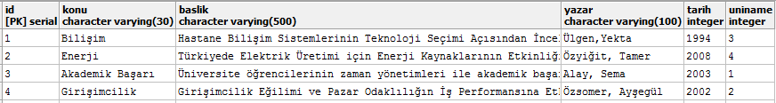

Parts Implemented by Gülşah Damla
=================================

Makaleler, işilanları ve öneriler tablolarının içerikleri, varolan çokluyu güncelleme, silme, yeni çoklu ekleme, arama gibi veritabanı işlemleri ve veritabanı bağlantı işlemleri bu kısımda açıklanacaktır.

1. Makaleler
------------

Anasayfadan *\makaleler* sekmesine gidilerek makaleler varlığına ulaşılır. Makaleler varlığının gerçeklenmesi için makaleler tablosu oluşturulmuştur. 
- Id, konu, baslik , yazar, tarih(yayın tarihi) ve uniname(üniversite ismi) sütunları bu tabloda yer alır.
- Konu, baslik ve yazar değişkenleri VARCHAR türünde tanımlıdır.
- Tarih(yayın tarihi) ve dış anahtar olarak üniversiteler tablosuna başvuran uniname(üniversite ismi) değişkeni INTEGER türünde tanımlıdır.

|

**Tablo Oluşturma**

*makaleler.py* dosyasındaki *init_makaleler_db(cursor)* fonksiyonu içerisinde tablo oluşturulmuştur. Uniname dış anahtarına silme işlemleri için *ON DELETE CASCADE* ve günceleme işlemleri için *ON UPDATE CASCADE* tanımları eklenmiştir. Başvurulan tablodaki silme ve güncelleme işlemlerini etkilenen çoklulara yansıtmak için *CASCADE* yapısı kullanılmıştır.

.. code-block:: python

   def init_makaleler_db(cursor):

      query = """CREATE TABLE IF NOT EXISTS MAKALELER (
      ID SERIAL PRIMARY KEY,
      KONU varchar(30) NOT NULL,
      BASLIK varchar(500) NOT NULL,
      YAZAR varchar(100) NOT NULL,
      TARIH integer NOT NULL,
      UNINAME INTEGER NOT NULL REFERENCES UNIVERSITY(ID) ON DELETE CASCADE ON UPDATE CASCADE
      )"""
      
      cursor.execute(query)
      insert_makaleler(cursor)
|  
 
**Satır Ekleme**
 
*makaleler.py* dosyasındaki *insert_makaleler(cursor)* fonksiyonu içerisinde tabloya yeni çoklular eklenmiştir.
 
.. code-block:: python
 
   def insert_makaleler(cursor):
   
      query = """INSERT INTO MAKALELER
      (KONU,BASLIK, YAZAR, TARIH, UNINAME) VALUES (
      'Bilişim',
      'Hastane Bilişim Sistemlerinin Teknoloji Seçimi Açısından İncelenmesi',
      'Ülgen,Yekta',
      1994,
      3
      );
      INSERT INTO MAKALELER
      (KONU,BASLIK, YAZAR, TARIH, UNINAME ) VALUES (
      'Enerji',
      'Türkiyede Elektrik Üretimi için Enerji Kaynaklarının Etkinliğinin Değerlendirilmesi',
      'Özyiğit, Tamer',
      2008,
      4
      );
      INSERT INTO MAKALELER
      (KONU,BASLIK, YAZAR, TARIH, UNINAME ) VALUES (
      'Akademik Başarı',
      'Üniversite öğrencilerinin zaman yönetimleri ile akademik başarıları arasındaki ilişki',
      'Alay, Sema',
      2003,
      1
      );
      INSERT INTO MAKALELER
      (KONU,BASLIK, YAZAR, TARIH, UNINAME ) VALUES (
      'Girişimcilik',
      'Girişimcilik Eğilimi ve Pazar Odaklılığın İş Performansına Etkileri',
      'Özsomer, Ayşegül',
      2002,
      2
      );"""
      cursor.execute(query)                  
|  

**Makale Ekleme**

Yeni makale ekleme işlemi */makaleler* sayfasında yer alır. Listeli halde bulunan makalelerin ardından bu bölüme yer verilmiştir. Bu işlem *makaleler.html* sayfası içerisindeki form ile yapılmaktadır. Dış anahtar ile bağlantı oluşturulan üniversiteler tablosundan alınacak üniversite ismi için seçim kutusu eklenmiştir.
Alınacak çoklu değerler için *makaleler.py* dosyasında Makaleler sınıfı oluşturulmuştur.

.. code-block:: python
   class Makaleler:
    def __init__(self, konu, baslik , yazar, tarih, uniname):
        self.konu = konu
        self.baslik = baslik
        self.yazar = yazar
        self.tarih = tarih
        self.uniname = uniname
|   

*server.py* dosyasındaki *makaleler_sayfasi* fonksiyonu içerisinde makaleler sınıfından makale1 adlı bir nesne oluşturularak *POST* metoduyla alınan çoklu verileri nesnenin ilgili alanlarına atılmıştır. Veritabanına ekleme işlemi *add_makaleler* fonksiyonu çağırılarak tamamlanmış olur.

.. code-block:: python
   @app.route('/makaleler', methods=['GET', 'POST'])
   def makaleler_sayfasi():
    connection = dbapi2.connect(app.config['dsn'])
    cursor = connection.cursor()
    now = datetime.datetime.now()

    if request.method == 'GET':
        query = """SELECT M.ID, M.KONU, M.BASLIK, M.YAZAR, M.TARIH, U.NAME
                    FROM MAKALELER AS M, UNIVERSITY AS U
                    WHERE(
                        (M.UNINAME= U.ID)
                    ) """
        cursor.execute(query)
        makaleler=cursor.fetchall()
        cursor.execute("SELECT ID, NAME FROM UNIVERSITY")
        university=cursor.fetchall()
        return render_template('makaleler.html', makaleler = makaleler, current_time=now.ctime(), uniname = university)
    elif "add" in request.form:

        makale1 = Makaleler(request.form['konu'],
                            request.form['baslik'],
                            request.form['yazar'],
                            request.form['tarih'],
                            request.form['university_name'])
        add_makaleler(cursor, request, makale1)
        connection.commit()
        return redirect(url_for('makaleler_sayfasi'))       
|

*add_makaleler* fonksiyonu *makaleler.py* dosyasında tanımlanmıştır. *INSERT* komutu ile oluşturulan nesne içerisindeki bilgiler veritabanına eklenir.

.. code-block:: python

   def add_makaleler(cursor, request, makale1):
   
            query = """INSERT INTO MAKALELER
            (KONU,BASLIK, YAZAR, TARIH, UNINAME ) VALUES (
            INITCAP(%s),
            INITCAP(%s),
            INITCAP(%s),
            %s,
            %s
            )"""
            cursor.execute(query, (makale1.konu,makale1.baslik, makale1.yazar,
                                   makale1.tarih, makale1.uniname))                               
|        

**Makale Arama**

Makale arama işlemi */makaleler* sayfasının sonunda yer alır. Arama çubuğunda makalenin konusu yazılarak ilgili sonuçlara erişilir. *server.py* dosyasındaki *makaleler_sayfasi* fonksiyonu içerisinde bulunan arama fonksiyonu aşağıda gösterilmiştir.          

.. code-block:: python

   elif "search" in request.form:
        aranan = request.form['aranan'];

        query = """SELECT M.ID, M.KONU,M.BASLIK, M.YAZAR, M.TARIH, U.NAME
                    FROM MAKALELER AS M, UNIVERSITY AS U
                    WHERE((
                        (M.UNINAME = U.ID)
                    ) AND (M.KONU LIKE %s))"""
        cursor.execute(query,[aranan])
        makaleler=cursor.fetchall()
        now = datetime.datetime.now()
        return render_template('makale_ara.html', makaleler = makaleler, current_time=now.ctime(), sorgu = aranan)
|  

Arama işlemi sonucu *makale_ara.html* sayfası içerisindeki forma göre listelenir.

**Makale Güncelleme**

Makaleler sayfasında yer alan her çoklunun kendisine ait güncelleme sayfası bulunur. Listeli halde bulunan her makalenin altında bulunan düzenle butonu ile */makaleler/<makale_id>* sayfasına geçiş yapılır. Güncelleme sayfası için *makale_guncelle* html sayfası oluşturuldu ve ekleme formuna benzer şekilde arama çubukları ve seçim kutuları kullanıldı. Böylece dış anahtar ile ilgili tablodan alınan niteliklerin kullanıcı tarafından seçilebilmesi sağlandı. *server.py* dosyasındaki *makaleler_update_page* fonksiyonu içerisinde *POST* metoduyla kullanıcı tarafından alınan çoklu verileri nesnenin ilgili alanlarına atılmıştır. Veritabanında güncelleme işlemi *update_makaleler* fonksiyonu çağırılarak gerçekleştirilmiş olur.

.. code-block:: python

   @app.route('/makaleler/<makale_id>', methods=['GET', 'POST'])
   def makaleler_update_page(makale_id):
    connection = dbapi2.connect(app.config['dsn'])
    cursor = connection.cursor()
    if request.method == 'GET':
        cursor.close()
        cursor = connection.cursor()
        query = """SELECT * FROM MAKALELER WHERE (ID = %s)"""
        cursor.execute(query,makale_id)
        makale=cursor.fetchall()
        now = datetime.datetime.now()
        cursor.execute("SELECT ID, NAME FROM UNIVERSITY")
        universiteler=cursor.fetchall()
        return render_template('makale_guncelle.html', makale = makale,  current_time=now.ctime(), universiteler = universiteler)
    elif request.method == 'POST':
        if "update" in request.form:
            makale1 = Makaleler(request.form['konu'],
                            request.form['baslik'],
                            request.form['yazar'],
                            request.form['tarih'],
                            request.form['university_name'])
            update_makaleler(cursor, request.form['makale_id'], makale1)
            connection.commit()
            return redirect(url_for('makaleler_sayfasi'))
 |        
 
*update_makaleler* fonksiyonu *makaleler.py* dosyasında tanımlanmıştır. *UPDATE* komutu ile oluşturulan nesne içerisindeki bilgiler veritabanında güncellenir.

.. code-block:: python
 
   def update_makaleler(cursor, id, makale1):
            query="""
            UPDATE MAKALELER
            SET KONU=INITCAP(%s), 
            BASLIK=INITCAP(%s),
            YAZAR=INITCAP(%s),
            TARIH=%s,
            UNINAME=%s
            WHERE ID=%s
            """
            cursor.execute(query, (makale1.konu,makale1.baslik, makale1.yazar,
                                   makale1.tarih,makale1.uniname, id)) 
  |        
  
**Makale Silme**  
  
Makale silme işlemi her makalenin kendi sayfası olan */makaleler/<makale_id>* sayfasında gerçeklenir. Bu sayfada düzenle butonunun altında bulunan makaleyi sil butonu seçilerek ilgili makale silinir. Kullanıcı, silme işlemi sonrası */makaleler* sayfasına yönlendirilir. 

.. code-block:: python
    elif "delete" in request.form:
            delete_makaleler(cursor, makale_id)
            connection.commit()
            return redirect(url_for('makaleler_sayfasi'))
|     

*delete_makaleler* fonksiyonu *makaleler.py* dosyasında tanımlanmıştır. *DELETE FROM {table}* komutu ile tablodaki çoklunun silinmesi sağlanır. Hangi çoklunun silineceği *WHERE ID = %s* komutuyla belirlenir.
 
.. code-block:: python
   def delete_makaleler(cursor, id):
        query="""DELETE FROM MAKALELER WHERE ID = %s"""
        cursor.execute(query, id)
|                     
