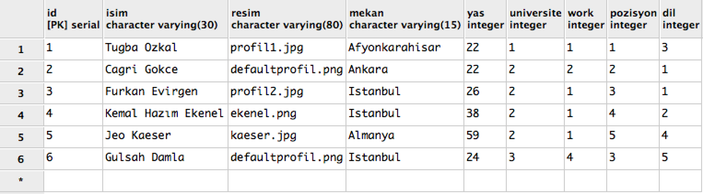
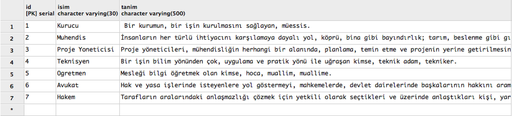

Parts Implemented by Tuğba Özkal
================================

Genel
-----

Kişiler, mailler ve meslekler tablolarının içerikleri ve yeni çoklu ekleme, varolan çokluyu silme, güncelleme arama gibi veritabanı işlemleri bu kısımda açıklanmıştır.

1. Kişiler
----------

Anasayfadan '\kisiler' sekmesine gidilerek kişiler tablosuna ulaşılabilinir.

ID, isim, profil resmi (resim), yaşadığı yer (mekan), yaş, üniversite, çalıştığı yer (work), çalıştığı pozisyon ve konuştuğu dil özelliklerini içeren
kişiler tablosu figür 1.2.1'de gösterilmiştir.

   figure 1.2.1

Üniversite, çalıştığı yer, dil ve meslek bilgileri diğer tablolardan dış anahtarla alınır.

**Tablo Oluşturma**

.. code-block:: python

   def init_kisiler_db(cursor):
       query = """CREATE TABLE IF NOT EXISTS KISILER (
       ID SERIAL PRIMARY KEY,
       ISIM VARCHAR(30) NOT NULL,
       RESIM VARCHAR(80) NOT NULL DEFAULT 'defaultprofil.png',
       MEKAN VARCHAR(15) NOT NULL,
       YAS INTEGER,
       UNIVERSITE INTEGER REFERENCES UNIVERSITY(ID) ON DELETE CASCADE ON UPDATE CASCADE,
       WORK INTEGER REFERENCES SIRKET(ID) ON DELETE CASCADE ON UPDATE CASCADE,
       POZISYON INTEGER REFERENCES MESLEKLER(ID) ON DELETE CASCADE ON UPDATE CASCADE,
       DIL INTEGER REFERENCES DIL(ID) ON DELETE CASCADE ON UPDATE CASCADE )"""

       cursor.execute(query)
       fill_kisiler_db(cursor)

Yukarıdaki kod diliminde kişiler tablosu oluşturulmuştur. Kişiler tablosu daha önce oluşturulduysa o tablo silinir ve sıfırdan yeni tablo oluşturulur.
Kodun bu partında birincil anahtar ve dış anahtarlar da belirlenmiştir. Bağlı olduğu diğer tablolardaki değişikliklerden etkilenme biçimleri de (ON DELETE CASCADE
, ON UPDATE CASCADE) yine bu kısımda belirtilmiştir. Profil resmi eklemeyenler için "defaultprofil.png" öntanımlı değişken olarak tanımlanmıştır.
İsim, resim ve mekan boş değer olarak girilemez. Son satırda çağrılan fonksiyon aşağıda gösterilmiştir.

**Başlangıç Eklemeleri**

Aşağıda belirtilen kod diliminde, daha önce oluşturduğumuz tabloya çoklular eklenir. Çoklular eklenirken "INSERT INTO" komutu kullanır.

.. code-block:: python

   def fill_kisiler_db(cursor):
       query = """INSERT INTO KISILER
                  (ISIM, RESIM, MEKAN, YAS, UNIVERSITE, WORK, POZISYON, DIL)
                      VALUES
                  ('Tugba Ozkal', 'profil1.jpg' ,'Afyonkarahisar', 22, 1, 1, 1, 3);
                   INSERT INTO KISILER
                  (ISIM, MEKAN, YAS, UNIVERSITE, WORK, POZISYON, DIL)
                       VALUES
                  ('Cagri Gokce', 'Ankara', 22, 2, 2, 2, 1);
                   INSERT INTO KISILER
                  (ISIM, RESIM, MEKAN, YAS, UNIVERSITE, WORK, POZISYON, DIL)
                       VALUES
                  ('Furkan Evirgen', 'profil2.jpg','Istanbul', 26, 2, 1, 3, 1);
                   INSERT INTO KISILER
                  (ISIM, RESIM, MEKAN, YAS, UNIVERSITE, WORK, POZISYON, DIL)
                       VALUES
                  ('Kemal Hazım Ekenel', 'ekenel.png','Istanbul', 38, 2, 1, 4, 2);
                   INSERT INTO KISILER
                  (ISIM, RESIM, MEKAN, YAS, UNIVERSITE, WORK, POZISYON, DIL)
                       VALUES
                  ('Jeo Kaeser', 'kaeser.jpg','Almanya', 59, 2, 1, 5, 4);"""

**Yeni Kişi Ekleme**

Aşağıdaki kod dilimi, yeni kişi ekleme fonksiyonudur.

.. code-block:: python

   def add_kisiler(cursor, request, kisi1):
           query = """INSERT INTO KISILER
           (ISIM, RESIM, MEKAN, YAS, UNIVERSITE, WORK, POZISYON, DIL) VALUES (
           %s,
           %s,
           INITCAP(%s),
           %s,
           %s,
           %s,
           %s,
           %s
           )"""
           cursor.execute(query, (kisi1.isim, kisi1.resim, kisi1.mekan, kisi1.yas,
                                  kisi1.universite, kisi1.work, kisi1.pozisyon,
                                  kisi1.dil))

Burada, varlık niteliklerinin girildiği diğer bir fonksiyondan kişi1 çoklusu alınır ve içeriği uygun niteliklere eklenir.

kisi1 çoklusunu döndüren fonksiyon aşağıda verilmiştir.

.. code-block:: python

   @app.route('/kisiler',methods=['GET', 'POST'])
   def kisiler_sayfasi():
       connection = dbapi2.connect(app.config['dsn'])
       cursor = connection.cursor()
       now = datetime.datetime.now()

       if request.method == 'GET':
           query2 = "SELECT ID, NAME FROM UNIVERSITY"
           cursor.execute(query2)
           university = cursor.fetchall()
           query = """SELECT K.ID, K.ISIM, K.RESIM, K.MEKAN, K.YAS, U.NAME, S.NAME,
                       M.ISIM, D.NAME FROM KISILER AS K, UNIVERSITY AS U, SIRKET AS
                       S, MESLEKLER AS M, DIL AS D
                       WHERE(
                           (K.WORK = S.ID) AND (K.UNIVERSITE = U.ID) AND
                           (K.POZISYON = M.ID) AND (K.DIL = D.ID)
                       )"""
           cursor.execute(query)
           kisi2 = cursor.fetchall()
           cursor.execute("SELECT ID, NAME FROM SIRKET")
           sirket = cursor.fetchall()
           cursor.execute("SELECT ID, ISIM FROM MESLEKLER")
           pozisyon = cursor.fetchall()
           cursor.execute("SELECT ID, NAME FROM DIL")
           diller = cursor.fetchall()
           return render_template('kisiler.html', kisiler = kisi2,
           universite = university, work = sirket, pozisyon = pozisyon,
           diller = diller)
       elif "add" in request.form:
           kisi1 = Kisiler(request.form['isim'],
                               request.form['resim'],
                               request.form['mekan'],
                               request.form['yas'],
                               request.form['university_name'],
                               request.form['work_name'],
                               request.form['pozisyon_adi'],
                               request.form['dil_adi'])
           add_kisiler(cursor, request, kisi1)
           connection.commit()
           return redirect(url_for('kisiler_sayfasi'))

GET metoduyla alınan bilgiler, html kodlarında belirtilen 'add' metoduyla ilgili niteliklere gönderilir.

**Arama Fonksiyonu**

Arama fonksiyonunda kişinin ismi arama barına girilerek arama yapılabilir. Arama fonksiyonu aşağıda gösterilmiştir.

.. code-block:: python

   elif "search" in request.form:
           aranankisi = request.form['aranankisi'];
           query = """SELECT K.ID, K.ISIM, K.RESIM, K.MEKAN, K.YAS, U.NAME, S.NAME,
                       M.ISIM, D.NAME FROM KISILER AS K,
                       UNIVERSITY AS U, SIRKET AS S, MESLEKLER AS M, DIL AS D
                       WHERE(
                           (K.WORK = S.ID) AND (K.UNIVERSITE = U.ID) AND
                           (K.POZISYON = M.ID) AND (K.DIL = D.ID)
                       ) AND (K.ISIM LIKE %s)"""
           cursor.execute(query,[aranankisi])
           kisiler=cursor.fetchall()
           now = datetime.datetime.now()
           return render_template('kisi_ara.html', kisiler = kisiler,
           current_time=now.ctime(),
           sorgu = aranankisi)

**Güncelleme Fonksiyonu**

Aşağıdaki kod diliminde yeni kişi ekleme fonksiyonuna benzer olarak güncellenecek çoklu diğer fonksiyondan kisi1 etiketiyle çekilir ve
ilgili niteliklere güncellenen bilgiler eklenir.

.. code-block:: python

   def update_kisiler(cursor, id, kisi1):
               query="""
               UPDATE KISILER
               SET ISIM=%s,
               RESIM=%s,
               MEKAN=INITCAP(%s),
               YAS=%s,
               UNIVERSITE=%s,
               WORK=%s,
               POZISYON=%s,
               DIL=%s
               WHERE ID=%s
               """
               cursor.execute(query,(kisi1.isim, kisi1.resim, kisi1.mekan, kisi1.yas,
                                     kisi1.universite, kisi1.work, kisi1.pozisyon,
                                     kisi1.dil, id))

.. code-block:: python

   @app.route('/kisiler/<kisi_id>', methods=['GET', 'POST'])
   def kisiler_update_page(kisi_id):
       connection = dbapi2.connect(app.config['dsn'])
       cursor = connection.cursor()
       if request.method == 'GET':
           cursor.close()
           cursor = connection.cursor()
           cursor.execute("SELECT ID, NAME FROM UNIVERSITY")
           universiteler = cursor.fetchall()
           cursor.execute("SELECT ID, NAME FROM SIRKET")
           sirketler = cursor.fetchall()
           cursor.execute("SELECT ID, ISIM FROM MESLEKLER")
           pozisyonlar = cursor.fetchall()
           cursor.execute("SELECT ID, NAME FROM DIL")
           diller = cursor.fetchall()
           query = """SELECT * FROM KISILER WHERE (ID = %s)"""
           cursor.execute(query, kisi_id)
           now = datetime.datetime.now()
           return render_template('kisi_guncelle.html', kisi = cursor,
                  current_time=now.ctime(), universiteler = universiteler,
                  sirketler=sirketler, pozisyonlar = pozisyonlar,
                  diller = diller)
       elif request.method == 'POST':
           if "update" in request.form:
               kisi1 = Kisiler(request.form['isim'],
                               request.form['resim'],
                               request.form['mekan'],
                               request.form['yas'],
                               request.form['university_name'],
                               request.form['work_name'],
                               request.form['pozisyon_adi'],
                               request.form['dil_adi'])
               update_kisiler(cursor, request.form['kisi_id'], kisi1)
               connection.commit()
               return redirect(url_for('kisiler_sayfasi'))

**Silme Fonksiyonu**

Silinmek istenen çoklunun birincil anahtarı olan ID'sini alarak fonksiyona gönderir ve çokluyu siler.

.. code-block:: python

   elif "delete" in request.form:
               delete_kisiler(cursor, kisi_id)
               connection.commit()
               return redirect(url_for('kisiler_sayfasi'))

.. code-block:: python

   def delete_kisiler(cursor, id):
           query="""DELETE FROM KISILER WHERE ID = %s"""
           cursor.execute(query, id)

"DELETE FROM {table}" komutu tablodaki çoklunun silinmesini sağlar. Hangi çoklunun silineceği "WHERE ID = %s" komutuyla belirlenir.

2. Meslekler
------------

ID, isim, tanım özelliklerini içeren meslekler tablosu figür 2.2.1'de gösterilmiştir.

   figure 2.2.1

Tüm sütunlar varlık içerisinde tanımlanmıştır.

**Tablo Oluşturma**

.. code-block:: python

   def init_meslekler_db(cursor):
    query = """CREATE TABLE IF NOT EXISTS MESLEKLER (
    ID SERIAL PRIMARY KEY,
    ISIM VARCHAR(30) NOT NULL,
    TANIM VARCHAR(500)
    )"""

    cursor.execute(query)
    fill_meslekler_db(cursor)

Yukarıdaki kod diliminde meslekler tablosu oluşturulmuştur. Meslekler tablosu daha önce oluşturulduysa o tablo silinir ve sıfırdan yeni tablo oluşturulur.
Kodun bu partında birincil anahtar olarak ID belirlenmiştir. Başlangıçta eklenen çoklular "fill_meslekler_db(cursor)" fonksiyonuyla varlığa eklenir.

**Başlangıç Eklemeleri**

Aşağıda belirtilen kod diliminde, daha önce oluşturduğumuz tabloya başlangıç çokluları eklenir.

.. code-block:: python

   def fill_meslekler_db(cursor):
    query = """ INSERT INTO MESLEKLER (ISIM, TANIM)
                    VALUES('Kurucu', ' Bir kurumun, bir işin kurulmasını sağlayan,
                    müessis.');
                INSERT INTO MESLEKLER (ISIM, TANIM)
                    VALUES('Muhendis', 'İnsanların her türlü ihtiyacını
                    karşılamaya dayalı yol, köprü, bina gibi bayındırlık; tarım,
                    beslenme gibi gıda; fizik, kimya, biyoloji, elektrik, elektronik
                    gibi fen; uçak, otomobil, motor, iş makineleri gibi teknik ve sosyal
                    alanlarda uzmanlaşmış, belli bir eğitim görmüş kimse');
                INSERT INTO MESLEKLER (ISIM, TANIM)
                    VALUES('Proje Yoneticisi', 'Proje yöneticileri, mühendisliğin
                    herhangi bir alanında, planlama, temin etme ve projenin yerine
                    getirilmesinde sorumluluk sahibidir.');
                INSERT INTO MESLEKLER (ISIM, TANIM)
                    VALUES('Teknisyen', 'Bir işin bilim yönünden çok, uygulama ve
                    pratik yönü ile uğraşan kimse, teknik adam, tekniker.');
                INSERT INTO MESLEKLER (ISIM, TANIM)
                    VALUES('Ogretmen', 'Mesleği bilgi öğretmek olan kimse, hoca,
                    muallim, muallime.');
                INSERT INTO MESLEKLER (ISIM, TANIM)
                    VALUES('Avukat', 'Hak ve yasa işlerinde isteyenlere yol göstermeyi,
                    mahkemelerde, devlet dairelerinde başkalarının hakkını aramayı,
                    korumayı meslek edinen ve bunun için yasanın gerektirdiği şartları
                    taşıyan kimse.');
                INSERT INTO MESLEKLER (ISIM, TANIM)
                    VALUES('Hakem', 'Tarafların aralarındaki anlaşmazlığı çözmek
                    için yetkili olarak seçtikleri ve üzerinde anlaştıkları kişi,
                    yargıcı.');
                """

    cursor.execute(query)

**Yeni Meslek Ekleme**

Aşağıdaki kod dilimi, yeni meslek ekleme fonksiyonudur. SQL dilinde yazılan programa yeni çoklu eklenirken "INSERT INTO" komutu kullanılır.

.. code-block:: python

   def add_meslekler(cursor, request, meslek1):
        query = """INSERT INTO MESLEKLER (ISIM, TANIM)
        VALUES( INITCAP(%s), %s )"""
        cursor.execute(query, (meslek1.isim, meslek1.tanim))

Burada, varlık niteliklerinin girildiği diğer bir fonksiyondan meslek1 çoklusu alınır ve içeriği uygun niteliklere eklenir.

meslek1 çoklusunu döndüren fonksiyon aşağıda verilmiştir.

.. code-block:: python

   @app.route('/meslekler',methods=['GET', 'POST'])
   def meslekler_sayfasi():
       connection = dbapi2.connect(app.config['dsn'])
       cursor = connection.cursor()
       now = datetime.datetime.now()

       if request.method == 'GET':
           query = """SELECT ID, ISIM, TANIM FROM MESLEKLER"""
           cursor.execute(query)
           meslek2 = cursor.fetchall()
           return render_template('meslekler.html', meslekler = meslek2)

       elif "add" in request.form:
           meslek1 = Meslekler(request.form['isim'],
                               request.form['tanim'])
           add_meslekler(cursor, request, meslek1)
           connection.commit()
           return redirect(url_for('meslekler_sayfasi'))

GET metoduyla alınan bilgiler, html kodlarında belirtilen 'add' metoduyla ilgili niteliklere gönderilir.
"SELECT {column} FROM {table}" komutu ile seçme işlemi yapılır.

**Arama Fonksiyonu**

Arama fonksiyonunda mesleğin ismi arama barına girilerek arama yapılabilir. Arama fonksiyonu aşağıda gösterilmiştir.

.. code-block:: python

   elif "search" in request.form:
        arananmeslek = request.form['arananmeslek'];
        query = """SELECT ID, ISIM, TANIM FROM MESLEKLER WHERE ISIM LIKE %s"""
        cursor.execute(query,[arananmeslek])
        meslekler=cursor.fetchall()
        now = datetime.datetime.now()
        return render_template('meslek_ara.html', meslekler = meslekler,
        current_time=now.ctime(), sorgu = arananmeslek)

"SELECT ID, ISIM, TANIM FROM MESLEKLER WHERE ISIM LIKE %s" satırı ile isme göre arama yapılması sağlanır.

**Güncelleme Fonksiyonu**

Aşağıdaki kod diliminde yeni meslek ekleme fonksiyonuna benzer olarak güncellenecek çoklu diğer fonksiyondan meslek1 etiketiyle çekilir ve
ilgili niteliklere güncellenen bilgiler eklenir. Güncelleme fonksiyonunda güncellenecek olan çoklu ID etiketi yardımıyla belirienir.

.. code-block:: python

   def update_meslekler(cursor, id, meslek1):
            query = """
            UPDATE MESLEKLER
            SET ISIM=INITCAP(%s),
            TANIM=INITCAP(%s)
            WHERE ID=%s
            """
            cursor.execute(query, (meslek1.isim, meslek1.tanim, id))

"INITCAP(%s)" komutu ile alınan stringin baş harfinin büyük olması sağlanır.

.. code-block:: python

   @app.route('/meslekler/<meslek_id>', methods=['GET', 'POST'])
   def meslekler_update_page(meslek_id):
       connection = dbapi2.connect(app.config['dsn'])
       cursor = connection.cursor()
       if request.method == 'GET':
           cursor.close()
           cursor = connection.cursor()
           query = """SELECT * FROM MESLEKLER WHERE (ID = %s)"""
           cursor.execute(query, meslek_id)
           now = datetime.datetime.now()
           return render_template('meslek_guncelle.html', meslek = cursor,
           current_time=now.ctime() )
       elif request.method == 'POST':
           if "update" in request.form:
               meslek1 = Meslekler(request.form['isim'],
                                   request.form['tanim'])
               update_meslekler(cursor, request.form['meslek_id'], meslek1)
               connection.commit()
               return redirect(url_for('meslekler_sayfasi'))

**Silme Fonksiyonu**

Silinmek istenen çoklunun birincil anahtarı olan ID'sini alarak fonksiyona gönderir ve çokluyu siler.

.. code-block:: python

   elif "delete" in request.form:
            delete_meslekler(cursor, meslek_id)
            connection.commit()
            return redirect(url_for('meslekler_sayfasi'))

.. code-block:: python

   def delete_meslekler(cursor, id):
           query="""DELETE FROM MESLEKLER WHERE ID = %s"""
           cursor.execute(query, id)

"DELETE FROM {table}" komutu tablodaki çoklunun silinmesini sağlar. Hangi çoklunun silineceği "WHERE ID = %s" komutuyla belirlenir.

3. Mailler
----------

ID, isim, mail ve kişi özelliklerini içeren mailler tablosu figür 3.2.1'de gösterilmiştir.

.. figure:: tugba/mailler.png
   :figclass: align-center

   figure 3.2.1

ID, mail ve şifre sütunları varlık içerisinde tanımlanmıştır. İsim ise mailin kime ait olduğunu bildirir ve kişiler tablosundan dış anahtar
bağlantısıyla çekilmiştir.

**Tablo Oluşturma**

.. code-block:: python

   def init_mailler_db(cursor):
    query = """CREATE TABLE IF NOT EXISTS MAILLER (
    ID SERIAL PRIMARY KEY,
    ISIM INTEGER REFERENCES KISILER(ID) ON DELETE CASCADE ON UPDATE CASCADE NOT NULL,
    MAIL VARCHAR(30) NOT NULL,
    SIFRE VARCHAR(30) NOT NULL
    )"""

    cursor.execute(query)
    fill_mailler_db(cursor)

Yukarıdaki kod diliminde mailler tablosu oluşturulmuştur. Mailler tablosu daha önce oluşturulduysa o tablo silinir ve sıfırdan yeni tablo oluşturulur.
Kodun bu partında birincil anahtar olarak ID belirlenmiştir. Başlangıçta eklenen çoklular "fill_mailler_db(cursor)" fonksiyonuyla varlığa eklenir. Mail ve şifre boş olamaz.
Dış anahtar bağlantısıyla çekilen isim değişkeni, çekildiği tabloda güncellenirse bu tabloda da güncellenir veya kişiler tablosunda silinirse bu tabloda da silinir.

**Başlangıç Eklemeleri**

Aşağıda belirtilen kod diliminde, daha önce oluşturduğumuz tabloya başlangıç çokluları eklenir.

.. code-block:: python

   def fill_mailler_db(cursor):
    query = """ INSERT INTO MAILLER (ISIM, MAIL, SIFRE)
                    VALUES(1, 'ozkalt@itu.edu.tr', 'tugba123');
                INSERT INTO MAILLER (ISIM, MAIL, SIFRE)
                    VALUES(2, 'cagri.gokce@itu.edu.tr', 'cagri123');
                INSERT INTO MAILLER (ISIM, MAIL, SIFRE)
                    VALUES(3, 'furkan@arhenius.com', 'furkan123');
                INSERT INTO MAILLER (ISIM, MAIL, SIFRE)
                    VALUES(4, 'ekenel@itu.edu.tr', 'hazim123');
                """
    cursor.execute(query)

**Yeni Mail Ekleme**

Aşağıdaki kod dilimi, yeni mail ekleme fonksiyonudur. SQL dilinde yazılan programa yeni çoklu eklenirken "INSERT INTO" komutu kullanılır.

.. code-block:: python

   def add_meslekler(cursor, request, meslek1):
        query = """INSERT INTO MESLEKLER (ISIM, TANIM)
        VALUES( INITCAP(%s), %s )"""
        cursor.execute(query, (meslek1.isim, meslek1.tanim))

Burada, varlık niteliklerinin girildiği diğer bir fonksiyondan mail1 çoklusu alınır ve içeriği uygun niteliklere eklenir.

mail1 çoklusunu döndüren fonksiyon aşağıda verilmiştir.

.. code-block:: python

   @app.route('/mailler',methods=['GET', 'POST'])
   def mailler_sayfasi():
       connection = dbapi2.connect(app.config['dsn'])
       cursor = connection.cursor()
       now = datetime.datetime.now()

       if request.method == 'GET':
           query2 = """SELECT ID, ISIM FROM KISILER"""
           cursor.execute(query2)
           kisi = cursor.fetchall()
           query = """SELECT M.ID, K.ISIM, M.MAIL, M.SIFRE
                       FROM MAILLER AS M, KISILER AS K
                       WHERE(
                           (M.ISIM = K.ID)
                       )"""
           cursor.execute(query)
           mail2 = cursor.fetchall()
           return render_template('mailler.html', mailler = mail2, isim = kisi)

       elif "add" in request.form:
           mail1 = Mailler(request.form['kisi_adi'],
                               request.form['mail'],
                               request.form['sifre'])
           add_mailler(cursor, request, mail1)
           connection.commit()
           return redirect(url_for('mailler_sayfasi'))

GET metoduyla alınan bilgiler, html kodlarında belirtilen 'add' metoduyla ilgili niteliklere gönderilir.
"SELECT {column} FROM {table}" komutu ile seçme işlemi yapılır. Yeni mail eklendikten sonra sayfa mailler sayfasına yönlendirilir.

**Arama Fonksiyonu**

Arama fonksiyonunda mailin ismi arama barına girilerek arama yapılabilir. Arama fonksiyonu aşağıda gösterilmiştir.

.. code-block:: python

   elif "search" in request.form:
        arananmail = request.form['arananmail'];
        query = """SELECT M.ID, K.ISIM, M.MAIL, M.SIFRE
                    FROM MAILLER AS M, KISILER AS K
                    WHERE(
                        (M.ISIM = K.ID)
                    ) AND (M.MAIL LIKE %s)"""
        cursor.execute(query,[arananmail])
        mailler=cursor.fetchall()
        now = datetime.datetime.now()
        return render_template('mail_ara.html', mailler = mailler,
        current_time=now.ctime(), sorgu = arananmail)

**Güncelleme Fonksiyonu**

Aşağıdaki kod diliminde yeni mail ekleme fonksiyonuna benzer olarak güncellenecek çoklu diğer fonksiyondan mail1 etiketiyle çekilir ve
ilgili niteliklere güncellenen bilgiler eklenir. Güncelleme fonksiyonunda güncellenecek olan çoklu ID etiketi yardımıyla belirienir.

.. code-block:: python

   def update_mailler(cursor, id, mail1):
            query = """
            UPDATE MAILLER
            SET ISIM = %s,
            MAIL = %s,
            SIFRE = %s
            WHERE ID=%s
            """
            cursor.execute(query, (mail1.isim, mail1.mail, mail1.sifre, id))

Hangi çoklunun güncelleneceği "WHERE ID=%s" komut ile belirlenir.

.. code-block:: python

   @app.route('/mailler/<mail_id>', methods=['GET', 'POST'])
   def mailler_update_page(mail_id):
       connection = dbapi2.connect(app.config['dsn'])
       cursor = connection.cursor()
       if request.method == 'GET':
           cursor.close()
           cursor = connection.cursor()
           cursor.execute("SELECT ID, ISIM FROM KISILER")
           kisiler = cursor.fetchall()
           query = """SELECT * FROM MAILLER WHERE (ID = %s)"""
           cursor.execute(query, mail_id)
           now = datetime.datetime.now()
           return render_template('mail_guncelle.html', mail = cursor,
           current_time=now.ctime(), isimler = kisiler )
       elif request.method == 'POST':
           if "update" in request.form:
               mail1 = Mailler(request.form['kisi_adi'],
                                   request.form['mail'],
                                   request.form['sifre'])
               update_mailler(cursor, request.form['mail_id'], mail1)
               connection.commit()
               return redirect(url_for('mailler_sayfasi'))

"/mailler" sayfası "mail_id"yi alarak işlem yapar.

s
**Silme Fonksiyonu**

Silinmek istenen çoklunun birincil anahtarı olan ID'sini alarak fonksiyona gönderir ve çokluyu siler.

.. code-block:: python

   elif "delete" in request.form:
               delete_mailler(cursor, mail_id)
               connection.commit()
               return redirect(url_for('mailler_sayfasi'))

.. code-block:: python

   def delete_mailler(cursor, id):
        query="""DELETE FROM MAILLER WHERE ID = %s"""
        cursor.execute(query, id)

"DELETE FROM {table}" komutu tablodaki çoklunun silinmesini sağlar. Hangi çoklunun silineceği "WHERE ID = %s" komutuyla belirlenir.

