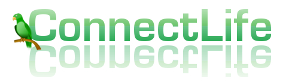

Geliştirici Rehberi (Developer Guide)
=====================================

Web projemiz olan Connect Life projesinin geliştirici bölümüne hoş geldiniz! Bu bölümde web projemizin veritabanı tasarımı ve kod tasarımı ile ilgili detayları bulabilir, site geliştirmesi için kullandığımız araçlar ve yapılar hakkında fikir sahibi olabilirsiniz. Eğer bir geliştirici değilseniz bu bölüm size karışık gelebilir, kullanıcı rehberi bölümüne göz atmanız önerilir.

Veritabanı Tasarımı (Database Design)
-------------------------------------
ConnectLife projesinin veritabanı tasarımı bu bölümde anlatılacaktır. Sitemizin veritabanı tasarımını yaparken site üzerinde gerçekleşmesi gereken her bölüm için en az bir varlık olacak şekilde bir tasarım gerçekleştirdik. Site üzerinde tamamen işlevsel ve kullanıcının aktif bir biçimde kullanabileceği yapıları veritabanında bir tablo şeklinde tasarladık. Bu tablolar arasında Şirketler, Mailler, Diller, Projeler, Lokasyonlar, Kişiler, Üniversiteler, Makaleler, İş ilanları, Öneriler, Meslekler, İlgi Alanları ve Gruplar bulunuyor. Proje veritabanı içeriksel ve ilişkisel yapısını gösteren **E-R diyagramı** aşağıda verilmiştir. Tüm tablo yapı ve içerikleri de diyagramda gösterilmiştir.

.. figure:: ER.png
   :figclass: align-center

Veritabanı tasarımında projemiz için uygun olarak düşündüğümüz PostgreSQL veritabanını kullandık. PostgreSQL'in açık kaynaklı olması, hızlı olarak işlem yapabilmesi, sistem üzerinde efektif çalışması, python ve flask için desteğinin olması ve SQLAlchemy gibi ORM yapıları ile çalışabilmesi bu seçimi yapmamızda faydası olan nedenler arasında. En büyük avantajı ise projemizde bağıntı modelli(Relational) bir veritabanı seçmemiz gerekmesi ve PostgreSQL'in bu özelliği sağlaması oldu.

.. figure:: developer_index/postgre.png
   :figclass: align-center

Proje içerisinde veritabanı dış bağlantıları yeni bir satır ve hedef tablonun birincil anahtarı üzerinden gerçekleştirildi. Örneğin İş İlanları tablosundan Şirketler tablosuna yapılan bir dış bağlantı için İlanlar tablosunda *sirket_id* isimli bir dış anahtar tanımlanarak şirketler tablosunun birincil anahtarı gösterildi. Veritabanı tanımlarından sitenin veritabanı bütünlüğü bozulmaması için ON UPDATE ve ON DELETE terimleri ile güncelleme ve silme işlemleri yapıldığında otomatik düzenlemeler yapılması sağlandı. CASCADE komutu ile tablolar arası senkronizasyonlu güncellemeler yapıldı ve RESTRICT komutu ile veritabanı bütünlüğünü bozacak işlemlerin engellenmesi sağlandı.

Veritabanı tasarımında dikkat edilen bir önemli özellik de dış anahtar seçimlerinin kullanıcıya yansıtılırken anahtar yerine dış anahtarı simgeleyen ana nesne üzerinden yapılması oldu. Örneğin kişiler üzerinde yapılan bir dış anahtar bağlantısında ilgili tabloya yapılan ekleme işleminde kişi_id'nin güncellenmesi gereken inputa kişi isimleri yerleştirildi ve kullanıcılara veritabanı id değerleri yerine gerekli bilgiler gösterilmiş oldu. Ayrıca seçme, ekleme, güncelleme ve silme gibi işlemler ID değeri temelli yapılmasına rağmen kullanıcıya ID değerleri gösterilmedi.

Kod Yapısı (Code Structure)
---------------------------

Web projemizde güncel ve hızlı web araçlarından biri olan Flask'ı tercih ettik. Python dili üzerinde çalışan bu eklenti, Python dilini web konusundaki zorluklardan kurtarmış ve bu dilin gücünü web geliştirme ile buluşturmuş popüler eklentilerden bir tanesi. Bu konuda terchi edilen bir diğer bir eklenti ise Django. Ancak Flask dilinin daha esnek ve modüler olması, eklentilerin kullanımı ve etkileşimlerinin daha iyi olması ve daha iyi customization (çeşitlendirilebilirlik) sunması bu eklentiyi tercih sebeplerimizden oldu.

.. figure:: developer_index/flask.png
   :figclass: align-center

**explain the technical structure of your code**

**to include a code listing, use the following example**::

   .. code-block:: python

      class Foo:

         def __init__(self, x):
            self.x = x

.. toctree::
   :maxdepth: 5

   TugbaOzkal
   CagriGökce
   AhmetEginkaya
   SelmanOrhan
   GulsahDamla
