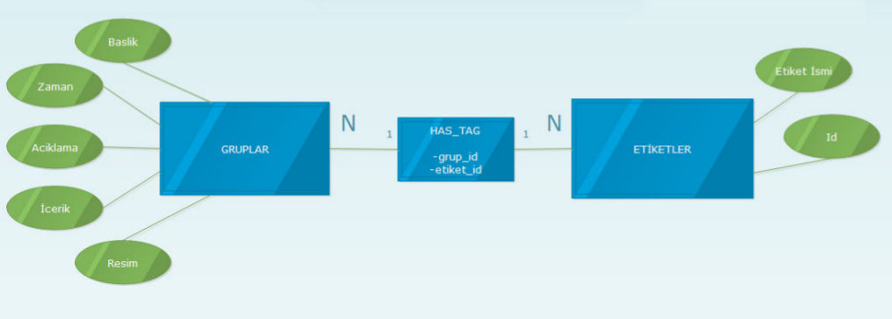
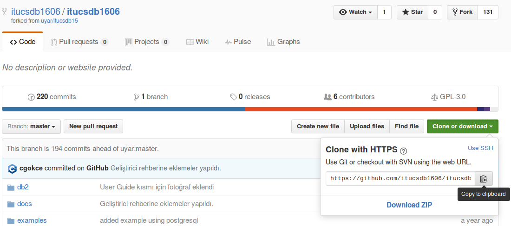

Geliştirici Rehberi (Developer Guide)
=====================================

.. figure:: developer_index/logo.jpeg
   :figclass: align-center

Web projemiz olan Connect Life projesinin geliştirici bölümüne hoş geldiniz! Bu bölümde web projemizin veritabanı tasarımı ve kod tasarımı ile ilgili detayları bulabilir, site geliştirmesi için kullandığımız araçlar ve yapılar hakkında fikir sahibi olabilirsiniz. Eğer bir geliştirici değilseniz bu bölüm size karışık gelebilir, kullanıcı rehberi bölümüne göz atmanız önerilir.

Veritabanı Tasarımı (Database Design)
-------------------------------------
ConnectLife projesinin veritabanı tasarımı bu bölümde anlatılacaktır. Sitemizin veritabanı tasarımını yaparken site üzerinde gerçekleşmesi gereken her bölüm için en az bir varlık olacak şekilde bir tasarım gerçekleştirdik. Site üzerinde tamamen işlevsel ve kullanıcının aktif bir biçimde kullanabileceği yapıları veritabanında bir tablo şeklinde tasarladık. Bu tablolar arasında Şirketler, Mailler, Diller, Projeler, Lokasyonlar, Kişiler, Üniversiteler, Makaleler, İş ilanları, Öneriler, Meslekler, İlgi Alanları ve Gruplar bulunuyor. Proje veritabanı içeriksel ve ilişkisel yapısını gösteren **E-R diyagramı** aşağıda verilmiştir.

.. figure:: ER.png
   :figclass: align-center

Gruplar tablosu tasarımında Tags(Etiketler) ve has_tag(Etiket İlişkisi) tabloları da gerçeklenmiştir. Bu tabloların ilişkisi aşağıda farklı bir E-R diyagramda gösterilmiştir. Tag ve Has_Tag tabloları Grup yapısının etiketlenmesi ve ortak etiketlere sahip kullanıcıların ilgi alanlarının bulunması amacıyla tasarlanmıştır.

Veritabanı tasarımında projemiz için uygun olarak düşündüğümüz PostgreSQL veritabanını kullandık. PostgreSQL'in açık kaynaklı olması, hızlı olarak işlem yapabilmesi, sistem üzerinde efektif çalışması, python ve flask için desteğinin olması ve SQLAlchemy gibi ORM yapıları ile çalışabilmesi bu seçimi yapmamızda faydası olan nedenler arasında. En büyük avantajı ise projemizde bağıntı modelli(Relational) bir veritabanı seçmemiz gerekmesi ve PostgreSQL'in bu özelliği sağlaması oldu.

.. figure:: developer_index/postgre.png
   :figclass: align-center

Proje içerisinde veritabanı dış bağlantıları yeni bir satır ve hedef tablonun birincil anahtarı üzerinden gerçekleştirildi. Örneğin İş İlanları tablosundan Şirketler tablosuna yapılan bir dış bağlantı için İlanlar tablosunda *sirket_id* isimli bir dış anahtar tanımlanarak şirketler tablosunun birincil anahtarı gösterildi. Veritabanı tanımlarından sitenin veritabanı bütünlüğü bozulmaması için ON UPDATE ve ON DELETE terimleri ile güncelleme ve silme işlemleri yapıldığında otomatik düzenlemeler yapılması sağlandı. CASCADE komutu ile tablolar arası senkronizasyonlu güncellemeler yapıldı ve RESTRICT komutu ile veritabanı bütünlüğünü bozacak işlemlerin engellenmesi sağlandı.

Veritabanı tasarımında dikkat edilen bir önemli özellik de dış anahtar seçimlerinin kullanıcıya yansıtılırken anahtar yerine dış anahtarı simgeleyen ana nesne üzerinden yapılması oldu. Örneğin kişiler üzerinde yapılan bir dış anahtar bağlantısında ilgili tabloya yapılan ekleme işleminde kişi_id'nin güncellenmesi gereken inputa kişi isimleri yerleştirildi ve kullanıcılara veritabanı id değerleri yerine gerekli bilgiler gösterilmiş oldu. Ayrıca seçme, ekleme, güncelleme ve silme gibi işlemler ID değeri temelli yapılmasına rağmen kullanıcıya ID değerleri gösterilmedi.

Kod Yapısı (Code Structure)
---------------------------

Web projemizde güncel ve hızlı web araçlarından biri olan Flask'ı tercih ettik. Python dili üzerinde çalışan bu eklenti, Python dilini web konusundaki zorluklardan kurtarmış ve bu dilin gücünü web geliştirme ile buluşturmuş popüler eklentilerden bir tanesi. Bu konuda terchi edilen bir diğer bir eklenti ise Django. Ancak Flask dilinin daha esnek ve modüler olması, eklentilerin kullanımı ve etkileşimlerinin daha iyi olması ve daha iyi customization (çeşitlendirilebilirlik) sunması bu eklentiyi tercih sebeplerimizden oldu.

.. figure:: developer_index/flask.png
   :figclass: align-center

**Kurulum (Setup Instructions)**

Projemiz Python 3 üzerinde ve bahsedildiği gibi Flask modülü ile birlikte çalışmaktadır. Projeyi çalıştırabilmek için öncelikle Python 3 kurulumu yapılıp ardından PIP yükleme yöneticisi ile Flask eklentisi yüklenmelidir.

Python kurulumu Windows için https://www.python.org/downloads/ adresinden Python 3 sürümünü indirerek yapılabilir. Kurulum sırasında python indirme yöneticisi PIP de indirilecek şekilde seçilmelidir. Linux ve Mac işletim sistemleri için konsoldan yükleme yapılmalıdır. Linux için aşağıdaki komutlar ile Python 3 ve PIP kurulumu yapılabilir.

.. code-block:: python

   #Python 3 kurulumu
   sudo add-apt-repository ppa:jonathonf/python-3.6
   sudo apt-get update
   sudo apt-get install python3.6
   #PIP kurulumu
   sudo easy_install pip 
   
|

Kurulumların ardından Flask eklentisi yüklenmelidir. Tüm işletim sistemleri için konsolu açıp aşağıdaki kodu yazarak Flask ve Python için postgreSQL eklentisi olan Psycopg2 kurulmalıdır. 

.. code-block:: python

   #Eklenti kurulumları
   sudo pip3 install flask
   sudo pip3 install psycopg2

|

Ayrıca projenin github adresinden erişilebilmesi için Git eklentisi de kurulmalıdır. Windows ve Mac için web adresinden kurulum dosyalarına erişilebilir. Linux için aşağıdaki komut ile uygulama merkezinden indirme yapılabilir.

.. code-block:: python

   #Git kurulumu
   sudo apt-get install git-all

|

Kurulumların tamamı bittikten sonra projenin github sayfına gelinip güncel bir **Clone-URL** alınır ve git-clone komutu ile proje lokal sisteme çekilir.

Clone işlemi tamamlandığında konsoldan python3 ile server.py çalıştırıldığında proje localhost üzerinde 0.0.0.0:5000 adresinde açılacaktır.

.. code-block:: python

   python3 server.py

|

**Kod yapısı**

Kod düzeninde programın çalışması *server.py* ana dosyasında gerçekleşmektedir. Grup üyeleri her tablo için kendilerine ait .py dosyası oluşturuldu. Her tablo yapısını simgeleyen bu .py dosyalarında veritabanı ile ilgili fonksiyonlar bulunuyor. Server.py dosyası içerisinde bu dosyalar aşağıdaki gibi çağrılıyor.

.. code-block:: python

   from university import *
   from sirketler import *
   from gruplar import *
   from kisiler import *
   from isilanlari import *
   from meslekler import *
   from mailler import *
   from makaleler import *
   from oneriler import *
   from diller import *
   from projeler import *
   from lokasyonlar import *
   from hobiler import *

|

Server.py dosyasında ayrıca veritabanı ile ilgili işlemlerle ilgili iki fonksiyon bulunuyor. Veritabanının açılıp kullanıma hazır hale getirilmesi sağlanıyor. Ayrıca konfigürasyonların yapıldığı ve HTML bağlantısının sağlandığı bir fonksiyon da mevcut.

.. code-block:: python

   app = Flask(__name__)

   def get_elephantsql_dsn(vcap_services):
       """Returns the data source name for ElephantSQL."""
       parsed = json.loads(vcap_services)
       uri = parsed["elephantsql"][0]["credentials"]["uri"]
       match = re.match('postgres://(.*?):(.*?)@(.*?)(:(\d+))?/(.*)', uri)
       user, password, host, _, port, dbname = match.groups()
       dsn = """user='{}' password='{}' host='{}' port={}
                dbname='{}'""".format(user, password, host, port, dbname)
       return dsn

   if __name__ == '__main__':
    VCAP_APP_PORT = os.getenv('VCAP_APP_PORT')
    if VCAP_APP_PORT is not None:
        port, debug = int(VCAP_APP_PORT), False
    else:
        port, debug = 5000, True
    VCAP_SERVICES = os.getenv('VCAP_SERVICES')
    if VCAP_SERVICES is not None:
        app.config['dsn'] = get_elephantsql_dsn(VCAP_SERVICES)
    else:
        app.config['dsn'] = """user='vagrant' password='vagrant'
                               host='localhost' port=5432 dbname='itucsdb'"""
   app.run(host='0.0.0.0', port=port, debug=debug)

|

Dosya içerisinde anasayfa için / adresine bir app.route çağrılıyor. Bu adreste anasayfa için hazırladığımız home.html render edilerek kullanıcıya sunuluyor.

.. code-block:: python

   @app.route('/')
   def home_page():
       now = datetime.datetime.now()
   return render_template('home.html', current_time=now.ctime())
   
|

Temel bir sayfa için 3 farklı temel app.route() yapısı bulunuyor. Bu yapılar: 

- */varlık_ismi/initdb*: Gerekli varlığın veritabanı tablo oluşumunu yapan ve ilk atamaları yapan sayfadır.
- */varlık_ismi*: Varlık ile ilgili anasayfadır. Seçme, Ekleme ve Arama işlemleri bu sayfada bulunur.
- */varlık_ismi/varlık_id*: Verilen ID ile ilişkili varlığın Güncelleme ve Silme işlemlerinin bulunduğu sayfayı açar.

Örneğin kişiler varlığı için gösterilen route yapıları ve fonksiyonları verilmiştir. Diğer varlıklar için aynı sayfalar mevcut olduğundan kod yanlızca kişiler için eklenmiştir.

.. code-block:: python

   @app.route('/kisiler/initdb')
   def initialize_database_kisiler():
       connection = dbapi2.connect(app.config['dsn'])
       cursor = connection.cursor()
       cursor.execute('''
       DROP TABLE IF EXISTS KISILER CASCADE;
       ''')
       init_kisiler_db(cursor)
       connection.commit()
       return redirect(url_for('kisiler_sayfasi'))

   @app.route('/kisiler',methods=['GET', 'POST'])
   def kisiler_sayfasi():
       connection = dbapi2.connect(app.config['dsn'])
       cursor = connection.cursor()
       now = datetime.datetime.now()

       if request.method == 'GET':
           query2 = "SELECT ID, NAME FROM UNIVERSITY"
           cursor.execute(query2)
           university = cursor.fetchall()
           query = """SELECT K.ID, K.ISIM, K.RESIM, K.MEKAN, K.YAS, U.NAME, S.NAME, M.ISIM, D.NAME
                       FROM KISILER AS K, UNIVERSITY AS U, SIRKET AS S, MESLEKLER AS M, DIL AS D
                       WHERE(
                           (K.WORK = S.ID) AND (K.UNIVERSITE = U.ID) AND (K.POZISYON = M.ID) AND (K.DIL = D.ID)
                       )"""
           cursor.execute(query)
           kisi2 = cursor.fetchall()
           cursor.execute("SELECT ID, NAME FROM SIRKET")
           sirket = cursor.fetchall()
           cursor.execute("SELECT ID, ISIM FROM MESLEKLER")
           pozisyon = cursor.fetchall()
           cursor.execute("SELECT ID, NAME FROM DIL")
           diller = cursor.fetchall()
           return render_template('kisiler.html', kisiler = kisi2, universite = university, work = sirket, pozisyon = pozisyon, diller = diller)

       elif "add" in request.form:
           kisi1 = Kisiler(request.form['isim'],
                               request.form['resim'],
                               request.form['mekan'],
                               request.form['yas'],
                               request.form['university_name'],
                               request.form['work_name'],
                               request.form['pozisyon_adi'],
                               request.form['dil_adi'])
           add_kisiler(cursor, request, kisi1)
           connection.commit()
           return redirect(url_for('kisiler_sayfasi'))
       elif "search" in request.form:
           aranankisi = request.form['aranankisi'];
           query = """SELECT K.ID, K.ISIM, K.RESIM, K.MEKAN, K.YAS, U.NAME, S.NAME, M.ISIM, D.NAME
                       FROM KISILER AS K, UNIVERSITY AS U, SIRKET AS S, MESLEKLER AS M, DIL AS D
                       WHERE(
                           (K.WORK = S.ID) AND (K.UNIVERSITE = U.ID) AND (K.POZISYON = M.ID) AND (K.DIL = D.ID)
                       ) AND (K.ISIM LIKE %s)"""
           cursor.execute(query,[aranankisi])
           kisiler=cursor.fetchall()
           now = datetime.datetime.now()
           return render_template('kisi_ara.html', kisiler = kisiler, current_time=now.ctime(), sorgu = aranankisi)

   @app.route('/kisiler/<kisi_id>', methods=['GET', 'POST'])
   def kisiler_update_page(kisi_id):
       connection = dbapi2.connect(app.config['dsn'])
       cursor = connection.cursor()
       if request.method == 'GET':
           cursor.close()
           cursor = connection.cursor()
           cursor.execute("SELECT ID, NAME FROM UNIVERSITY")
           universiteler = cursor.fetchall()
           cursor.execute("SELECT ID, NAME FROM SIRKET")
           sirketler = cursor.fetchall()
           cursor.execute("SELECT ID, ISIM FROM MESLEKLER")
           pozisyonlar = cursor.fetchall()
           cursor.execute("SELECT ID, NAME FROM DIL")
           diller = cursor.fetchall()
           query = """SELECT * FROM KISILER WHERE (ID = %s)"""
           cursor.execute(query, kisi_id)
           now = datetime.datetime.now()
           return render_template('kisi_guncelle.html', kisi = cursor, current_time=now.ctime(), universiteler = universiteler, sirketler=sirketler, pozisyonlar = pozisyonlar, diller = diller)
       elif request.method == 'POST':
           if "update" in request.form:
               kisi1 = Kisiler(request.form['isim'],
                               request.form['resim'],
                               request.form['mekan'],
                               request.form['yas'],
                               request.form['university_name'],
                               request.form['work_name'],
                               request.form['pozisyon_adi'],
                               request.form['dil_adi'])
               update_kisiler(cursor, request.form['kisi_id'], kisi1)
               connection.commit()
               return redirect(url_for('kisiler_sayfasi'))
           elif "delete" in request.form:
               delete_kisiler(cursor, kisi_id)
               connection.commit()
               return redirect(url_for('kisiler_sayfasi'))

|

Her grup elemanının *<varlık_ismi>.py* dosyasında da veritabanı ile ilgili yapılan işlemlere ait fonksiyonlar bulunur. Bu fonksiyonlar tablo oluşturma, ilk değer atama, ekleme, çıkarma silme ve güncelleme bölümlerinden oluşur. Bu yapıların genel açıklamaları aşağıda verilmiştir.

- *init_<varlik-ismi>_db*: Gerekli varlığın veritabanı tablo oluşumunu yapan fonksiyondur.
- *fill_<varlik-ismi>_db*: Gerekli tabloya ilk atamayı yapan fonksiyondur.
- *add_<varlik-ismi>_db*: Gerekli tabloya satır ekleme işlemini yapan fonksiyondur.
- *delete_<varlik-ismi>_db*: Gerekli tablodan verilen ID değerine ait satırı silen fonksiyondur.
- *update_<varlik-ismi>_db*: Gerekli tablonun verilen ID değerine ait satırını verilen bilgiler ile güncelleyen fonksiyondur.

Yukarıdaki örnek ile benzer olması açısından kişiler varlığı için olan kişiler.py dosyasındaki bu işlemleri yapan fonksiyonlar aşağıda verilmiştir.

.. code-block:: python

   def init_kisiler_db(cursor):
       query = """CREATE TABLE IF NOT EXISTS KISILER (
       ID SERIAL PRIMARY KEY,
       ISIM VARCHAR(30) NOT NULL,
       RESIM VARCHAR(80) NOT NULL DEFAULT 'defaultprofil.png',
       MEKAN VARCHAR(15) NOT NULL,
       YAS INTEGER,
       UNIVERSITE INTEGER REFERENCES UNIVERSITY(ID) ON DELETE CASCADE ON UPDATE CASCADE,
       WORK INTEGER REFERENCES SIRKET(ID) ON DELETE CASCADE ON UPDATE CASCADE,
       POZISYON INTEGER REFERENCES MESLEKLER(ID) ON DELETE CASCADE ON UPDATE CASCADE,
       DIL INTEGER REFERENCES DIL(ID) ON DELETE CASCADE ON UPDATE CASCADE )"""

       cursor.execute(query)
       fill_kisiler_db(cursor)

   def fill_kisiler_db(cursor):
       query = """INSERT INTO KISILER (ISIM, RESIM, MEKAN, YAS, UNIVERSITE, WORK, POZISYON, DIL)
                      VALUES ('Tugba Ozkal', 'profil1.jpg' ,'Afyonkarahisar', 22, 1, 1, 1, 3);
                   INSERT INTO KISILER (ISIM, MEKAN, YAS, UNIVERSITE, WORK, POZISYON, DIL)
                       VALUES ('Cagri Gokce', 'Ankara', 22, 2, 2, 2, 1);
                   INSERT INTO KISILER (ISIM, RESIM, MEKAN, YAS, UNIVERSITE, WORK, POZISYON, DIL)
                       VALUES ('Furkan Evirgen', 'profil2.jpg','Istanbul', 26, 2, 1, 3, 1);
                   INSERT INTO KISILER (ISIM, RESIM, MEKAN, YAS, UNIVERSITE, WORK, POZISYON, DIL)
                       VALUES ('Kemal Hazım Ekenel', 'ekenel.png','Istanbul', 38, 2, 1, 4, 2);
                   INSERT INTO KISILER (ISIM, RESIM, MEKAN, YAS, UNIVERSITE, WORK, POZISYON, DIL)
                       VALUES ('Jeo Kaeser', 'kaeser.jpg','Almanya', 59, 2, 1, 5, 4);"""

       cursor.execute(query)

   def add_kisiler(cursor, request, kisi1):
           query = """INSERT INTO KISILER
           (ISIM, RESIM, MEKAN, YAS, UNIVERSITE, WORK, POZISYON, DIL) VALUES (
           %s,
           %s,
           INITCAP(%s),
           %s,
           %s,
           %s,
           %s,
           %s
           )"""
           cursor.execute(query, (kisi1.isim, kisi1.resim, kisi1.mekan, kisi1.yas,
                                  kisi1.universite, kisi1.work, kisi1.pozisyon, kisi1.dil))

   def delete_kisiler(cursor, id):
           query="""DELETE FROM KISILER WHERE ID = %s"""
           cursor.execute(query, id)

   def update_kisiler(cursor, id, kisi1):
               query="""
               UPDATE KISILER
               SET ISIM=%s,
               RESIM=%s,
               MEKAN=INITCAP(%s),
               YAS=%s,
               UNIVERSITE=%s,
               WORK=%s,
               POZISYON=%s,
               DIL=%s
               WHERE ID=%s
               """
               cursor.execute(query,(kisi1.isim, kisi1.resim, kisi1.mekan, kisi1.yas,
   kisi1.universite, kisi1.work, kisi1.pozisyon, kisi1.dil, id))

|

Python dosyalarına Proje ana klasöründen, HTML dosyalarına /templates klasöründen, CSS ve projede kullanılan resim dosyalarına ise /static klasöründen erişilebilir. 

.. toctree::
   :maxdepth: 5

   TugbaOzkal
   CagriGokce
   AhmetEginkaya
   SelmanOrhan
   GulsahDamla
