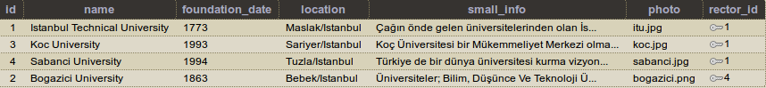
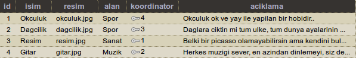
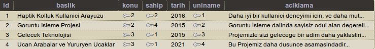

Parts Implemented by Selman Orhan
================================

Genel Bakış
------------

Bu raporda, projede yaptığım tablolar ve bu tabloların nasıl yapıldığı ve database bağlantılarının nasıl yapıldığı açıklanacaktır.

Benim proje kapsamında yaptığım tablolar şunlardır: 
  * Universiteler
  * Hobiler
  * Projeler 
  
Bu tablolarının içerikleri ve yeni eklenen ya da var olan çoklu üzerinde yapılan işlemler: 
  1. çoklu ekleme 
  2. çoklu silme
  3. çoklu güncelleme
  4. çoklu arama 
Bu veritabanı işlemleri bu kısımda açıklanmıştır. Veri tabanı ile ilgili screen shootlar ve ilgili kod parçaları da dosyaya eklenmiştir. Diğer tablolarla yapılan bağlantılar, ekleme, silme ve güncelleme işlemleri sırasında belirtilecektir. Ayrıca tablolarla ilgili **html dosyaları** ve ilgili işlemlerin *html kodları* da açıklanmıştır.

|

1. Universiteler Tablosu
------------------------

|

   
   figure 1.1 - Universiteler tablosunun database görüntüsü
   
Universiteler tablosu, ID, name, founfation_date, location, small_info, photo ve rector_id değişkenlerini içeriyor. Burada *rector_id* bilgisi *dış anahtar* kullanılarak Kişiler tablosundan çekiliyor.

**Universiteler- Tablo Oluşturma**

.. code-block:: python

    class University:
        def __init__(self, name, foundation_date, location, small_info, photo, rector_id):
            self.name = name
            self.foundation_date = foundation_date
            self.location = location
            self.small_info = small_info
            self.photo = photo
            self.rector_id = rector_id
            
Yukarıda belirtilen şekilde **class** olarak tanımlanan Universiteler tablosu, aşağıda belirtilen şekilde şekilde oluşturulur. Başlangıç değerleri için database belirli tablo verileri eklemek için *init_universities_db* fonksiyonu kullanılıyor.

**Universiteler- Başlangıç verileri ekleme**

.. code-block:: python

  def init_universities_db(cursor):
      query = """CREATE TABLE UNIVERSITY (
          ID SERIAL,
          NAME VARCHAR(100) NOT NULL,
          FOUNDATION_DATE VARCHAR(4) NOT NULL,
          LOCATION VARCHAR(80) NOT NULL,
          SMALL_INFO VARCHAR(500),
          PHOTO VARCHAR(80),
          RECTOR_ID INTEGER NOT NULL REFERENCES KISILER(ID) ON DELETE CASCADE ON UPDATE CASCADE DEFAULT 1,
          PRIMARY KEY (ID)
          )"""
      cursor.execute(query)
      insert_university(cursor)

Yukarıdaki kod diliminde Universiteler tablosu oluşturulmuştur. Bu tablosu daha önce oluşturulduysa o tablo silinir ve sıfırdan yeni tablo oluşturulur. Yukarıda görüldüğü üzere; birincil anahtar olarak ID ve Kisiler tablosuna bağlanmak için kullanılan dış anahtar olarak da rector_id belirlenmiştir. Bağlı olduğu diğer tablolardaki değişikliklerden etkilenme biçimleri de  **(ON DELETE CASCADE, ON UPDATE CASCADE)** 
şeklinde belirtilmiştir.

**Universiteler- Çoklu Ekleme Metodu**

.. code-block:: python

  def add_university(cursor, request, university1):
      query = """INSERT INTO UNIVERSITY
              (NAME, FOUNDATION_DATE, LOCATION, SMALL_INFO, PHOTO, RECTOR_ID) VALUES (
              INITCAP(%s),
              %s,
              INITCAP(%s),
              INITCAP(%s),
              %s,
              %s
              )"""
      cursor.execute(query, (university1.name, university1.foundation_date, 
      university1.location, university1.small_info, university1.photo, university1.rector_id))

*GET* metoduyla kullanıcıdan alınan bilgiler, html sayfasındaki *'add'* metoduyla yukarıdaki fonksiyon yardımıyla databasedeki daha önceden oluşturulan Universiteler tablosuna eklenir.

**Universiteler- Çoklu Silme Metodu**

.. code-block:: python

  def delete_university(cursor, id):
    query ="""DELETE FROM UNIVERSITY WHERE ID = %s"""
    cursor.execute(query, id)
  
Databaseden silinmek istenen çoklu birincil anahtar yardımıyle (ID) databaseden seçilir ve *'delete'* metoduyla yukarıdaki fonksiyona gönderilir ve çoklu databaseden silinir.

**Universiteler- Çoklu Güncelleme Metodu**

.. code-block:: python

  def update_university(cursor, id, university1):
      query = """
          UPDATE UNIVERSITY
          SET NAME=INITCAP(%s),
          FOUNDATION_DATE=%s,
          LOCATION=INITCAP(%s),
          SMALL_INFO=INITCAP(%s),
          PHOTO=%s,
          RECTOR_ID =%s
          WHERE ID=%s
          """
      cursor.execute(query, (university1.name, university1.foundation_date, university1.location, 
      university1.small_info, university1.photo, university1.rector_id, id))
      
Güncellenmek istenen çoklu birincil anahtar yardımıyla database tablosundan seçilir. *'update'* ve *GET* metodları kullanılarak kullanıcıdan alınan yeni bilgiler *POST* metodu kullanılarak database eklenir.

**Universiteler- Çoklu Arama Metodu**

.. code-block:: python
  
  elif "search" in request.form:
        searched = request.form['searched'];
        query = """SELECT U.ID, U.NAME, U.FOUNDATION_DATE, U.LOCATION, U.SMALL_INFO, U.PHOTO, K.ISIM FROM UNIVERSITY AS U,
                   KISILER AS K WHERE((U.RECTOR_ID = K.ID) AND (U.NAME LIKE %s))"""
        cursor.execute(query,[searched])
        university=cursor.fetchall()
        now = datetime.datetime.now()
        return render_template('universiteler_ara.html', university = university, current_time=now.ctime(), 
        sorgu = searched)

Arama metodu Universite çoklusunun name değişkeni üzerinden arama yapar. Aramak istenen çoklu yukarıdaki fonksiyon yardımıyla databaseden aranır ve *POST* metodu yardımıyla ekrana aktarılır.

|

2. Hobiler Tablosu
------------------------

|

   
   figure 2.1 - Hobiler tablosunun database görüntüsü
   
Hobiler tablosu, ID, isim, resim, alan, koordinator ve acıklama değişkenlerini içeriyor. Burada *koordinator* bilgisi *dış anahtar* kullanılarak Kişiler tablosundan çekiliyor.

**Hobiler- Tablo Oluşturma**

.. code-block:: python

      class Hobiler:
         def __init__(self, isim, resim,  alan, koordinator, aciklama):
            self.isim = isim
            self.resim = resim
            self.alan = alan
            self.koordinator = koordinator
            self.aciklama = aciklama
            
Yukarıda belirtilen şekilde **class** olarak tanımlanan Hobiler tablosu, aşağıda belirtilen şekilde şekilde oluşturulur. Başlangıç değerleri için database belirli tablo verileri eklemek için *init_hobiler_db* fonksiyonu kullanılıyor.

**Hobiler- Başlangıç verileri ekleme**

.. code-block:: python

  def init_hobiler_db(cursor):
     query = """CREATE TABLE IF NOT EXISTS HOBILER (
            ID SERIAL PRIMARY KEY,
            ISIM varchar(100) NOT NULL,
            RESIM VARCHAR(80) NOT NULL DEFAULT 'defaulthobi.jpg',
            ALAN varchar(100) NOT NULL,
            KOORDINATOR INTEGER NOT NULL REFERENCES KISILER(ID) ON DELETE CASCADE ON UPDATE CASCADE,
            ACIKLAMA varchar(1000) NOT NULL
            )"""
    cursor.execute(query)
    insert_hobiler(cursor)

Yukarıdaki kod diliminde Hobiler tablosu oluşturulmuştur. Bu tablosu daha önce oluşturulduysa o tablo silinir ve sıfırdan yeni tablo oluşturulur. Yukarıda görüldüğü üzere; birincil anahtar olarak ID ve Kisiler tablosuna bağlanmak için kullanılan dış anahtar olarak da koordinator belirlenmiştir. Ayrıca *resim* değişkeni kullanıcıdan alınmazsa, *'defaulthobi.jpg'* bilgisi atanır. Bağlı olduğu diğer tablolardaki değişikliklerden etkilenme biçimleri de  **(ON DELETE CASCADE, ON UPDATE CASCADE)** 
şeklinde belirtilmiştir.

**Hobiler- Çoklu Ekleme Metodu**

.. code-block:: python

  def add_hobiler(cursor, request, hobi1):
        query = """INSERT INTO HOBILER
                (ISIM, RESIM, ALAN, KOORDINATOR, ACIKLAMA) VALUES (
                INITCAP(%s),
                INITCAP(%s),
                INITCAP(%s),
                %s,
                INITCAP(%s)
                )"""
        cursor.execute(query, (hobi1.isim, hobi1.resim, hobi1.alan,
                               hobi1.koordinator, hobi1.aciklama))

*GET* metoduyla kullanıcıdan alınan bilgiler, html sayfasındaki *'add'* metoduyla yukarıdaki fonksiyon yardımıyla databasedeki daha önceden oluşturulan Hobiler tablosuna eklenir.

**Hobiler- Çoklu Silme Metodu**

.. code-block:: python

  def delete_hobiler(cursor, id):
        query="""DELETE FROM HOBILER WHERE ID = %s"""
        cursor.execute(query, id)
  
Databaseden silinmek istenen çoklu birincil anahtar yardımıyle (ID) databaseden seçilir ve *'delete'* metoduyla yukarıdaki fonksiyona gönderilir ve çoklu databaseden silinir.

**Hobiler- Çoklu Güncelleme Metodu**

.. code-block:: python

  def update_hobiler(cursor, id, hobi1):
      query="""
            UPDATE HOBILER
            SET ISIM=INITCAP(%s),
            RESIM=INITCAP(%s),
            ALAN=INITCAP(%s),
            KOORDINATOR=%s,
            ACIKLAMA=INITCAP(%s)
            WHERE ID=%s
            """
       cursor.execute(query, (hobi1.isim, hobi1.resim, hobi1.alan,
                              hobi1.koordinator, hobi1.aciklama, id))
      
Güncellenmek istenen çoklu birincil anahtar yardımıyla database tablosundan seçilir. *'update'* ve *GET* metodları kullanılarak kullanıcıdan alınan yeni bilgiler *POST* metodu kullanılarak database eklenir.

**Hobiler- Çoklu Arama Metodu**

.. code-block:: python
  
  elif "search" in request.form:
        aranan = request.form['aranan'];

        query = """SELECT H.ID, H.ISIM, H.RESIM, H.ALAN, K.ISIM, H.ACIKLAMA
                    FROM HOBILER AS H, KISILER AS K
                    WHERE((H.KOORDINATOR = K.ID) AND (H.ISIM LIKE %s))"""
        cursor.execute(query,[aranan])
        hobiler=cursor.fetchall()
        now = datetime.datetime.now()
        return render_template('hobi_ara.html', hobiler = hobiler, current_time=now.ctime(), sorgu = aranan)

Arama metodu Hobi çoklusunun isim değişkeni üzerinden arama yapar. Aramak istenen çoklu yukarıdaki fonksiyon yardımıyla databaseden aranır ve *POST* metodu yardımıyla ekrana aktarılır.

|

3. Projeler Tablosu
------------------------

|

   
   figure 2.1 - Projeler tablosunun database görüntüsü
   
Projeler tablosu, ID, baslik, konu, sahip, tarih, uniname ve acıklama değişkenlerini içeriyor. Burada *konu* bilgisi *dış anahtar* kullanılarak Meslekler tablosundan çekiliyor. *sahip* bilgisi *dış anahtar* kullanılarak Kisiler tablosundan çekiliyor. *uniname* bilgisi *dış anahtar* kullanılarak Universiteler tablosundan çekiliyor.

**Projeler- Tablo Oluşturma**

.. code-block:: python

 class Projeler:
    def __init__(self, baslik, konu, sahip, tarih, uniname, aciklama):
        self.baslik = baslik
        self.konu = konu
        self.sahip = sahip
        self.tarih = tarih
        self.uniname = uniname
        self.aciklama = aciklama
           
Yukarıda belirtilen şekilde **class** olarak tanımlanan Projeler tablosu, aşağıda belirtilen şekilde şekilde oluşturulur. Başlangıç değerleri için database belirli tablo verileri eklemek için *init_projeler_db* fonksiyonu kullanılıyor.

**Projeler- Başlangıç verileri ekleme**

.. code-block:: python

  def init_projeler_db(cursor):
    query = """CREATE TABLE IF NOT EXISTS PROJELER (
           ID SERIAL PRIMARY KEY,
           BASLIK varchar(500) NOT NULL,
           KONU INTEGER NOT NULL REFERENCES MESLEKLER(ID) ON DELETE CASCADE ON UPDATE CASCADE,
           SAHIP INTEGER NOT NULL REFERENCES KISILER(ID) ON DELETE CASCADE ON UPDATE CASCADE,
           TARIH integer NOT NULL,
           UNINAME INTEGER NOT NULL REFERENCES UNIVERSITY(ID) ON DELETE CASCADE ON UPDATE CASCADE,
           ACIKLAMA varchar(1000) NOT NULL
           )"""
    cursor.execute(query)
    insert_projeler(cursor)

Yukarıdaki kod diliminde Projeler tablosu oluşturulmuştur. Bu tablosu daha önce oluşturulduysa o tablo silinir ve sıfırdan yeni tablo oluşturulur. Yukarıda görüldüğü üzere; birincil anahtar olarak ID değişkeni kullanılır. Dış anahtar kullanılarak Meslekler tablosundan *konu* verisini, Kisiler tablosundan *sahip* verisini ve Universiteler tablosundan da *uniname* verisini çeker. Bağlı olduğu diğer tablolardaki değişikliklerden etkilenme biçimleri de  **(ON DELETE CASCADE, ON UPDATE CASCADE)** şeklinde belirtilmiştir.

**Projeler- Çoklu Ekleme Metodu**

.. code-block:: python

  def add_projeler(cursor, request, proje1):
        query = """INSERT INTO PROJELER
                (BASLIK, KONU, SAHIP, TARIH, UNINAME, ACIKLAMA) VALUES (
                INITCAP(%s),
                %s,
                %s,
                %s,
                %s,
                INITCAP(%s)
                )"""
        cursor.execute(query, (proje1.baslik, proje1.konu, proje1.sahip,
                               proje1.tarih, proje1.uniname, proje1.aciklama))

*GET* metoduyla kullanıcıdan alınan bilgiler, html sayfasındaki *'add'* metoduyla yukarıdaki fonksiyon yardımıyla databasedeki daha önceden oluşturulan Projeler tablosuna eklenir.

**Projeler- Çoklu Silme Metodu**

.. code-block:: python

  def delete_projeler(cursor, id):
        query="""DELETE FROM PROJELER WHERE ID = %s"""
        cursor.execute(query, id)
  
Databaseden silinmek istenen çoklu birincil anahtar yardımıyle (ID) databaseden seçilir ve *'delete'* metoduyla yukarıdaki fonksiyona gönderilir ve çoklu databaseden silinir.

**Projeler- Çoklu Güncelleme Metodu**

.. code-block:: python

  def update_projeler(cursor, id, proje1):
            query="""
                  UPDATE PROJELER
                  SET BASLIK = INITCAP(%s),
                  KONU= %s,
                  SAHIP =%s,
                  TARIH=%s,
                  UNINAME=%s,
                  ACIKLAMA = INITCAP(%s)
                  WHERE ID=%s
                  """
            cursor.execute(query, (proje1.baslik, proje1.konu, proje1.sahip,
                                   proje1.tarih, proje1.uniname, proje1.aciklama, id))
      
Güncellenmek istenen çoklu birincil anahtar yardımıyla database tablosundan seçilir. *'update'* ve *GET* metodları kullanılarak kullanıcıdan alınan yeni bilgiler *POST* metodu kullanılarak database eklenir.

**Projeler- Çoklu Arama Metodu**

.. code-block:: python
  
  elif "search" in request.form:
        aranan = request.form['aranan'];
        query = """SELECT P.ID, P.BASLIK, M.ISIM, K.ISIM, P.TARIH, U.NAME, P.ACIKLAMA
            FROM PROJELER AS P, MESLEKLER AS M, KISILER AS K, UNIVERSITY AS U
            WHERE(
            (P.KONU = M.ID)
            AND
            (P.SAHIP = K.ID)
            AND
            (P.UNINAME= U.ID)
            AND (P.BASLIK LIKE %s))"""
        cursor.execute(query,[aranan])
        projeler=cursor.fetchall()
        now = datetime.datetime.now()
        return render_template('proje_ara.html', projeler = projeler, current_time=now.ctime(), sorgu = aranan)

Arama metodu Proje çoklusunun isim değişkeni üzerinden arama yapar. Aramak istenen çoklu yukarıdaki fonksiyon yardımıyla databaseden aranır ve *POST* metodu yardımıyla ekrana aktarılır.

