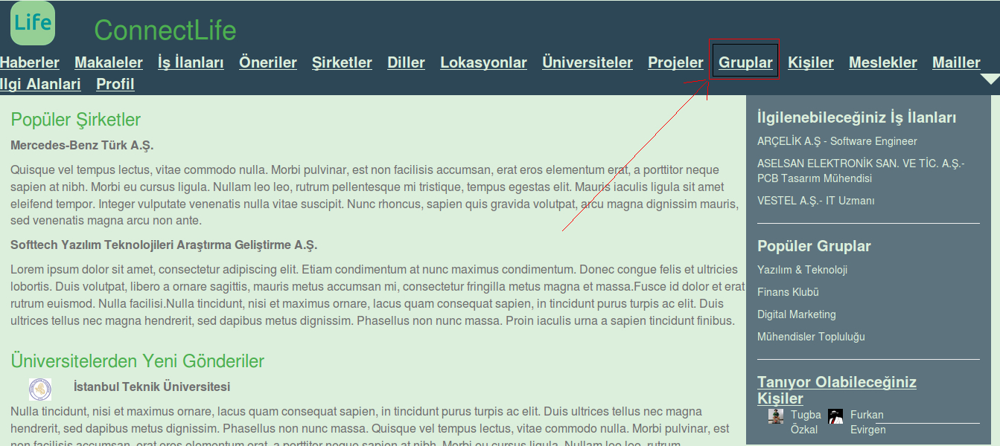
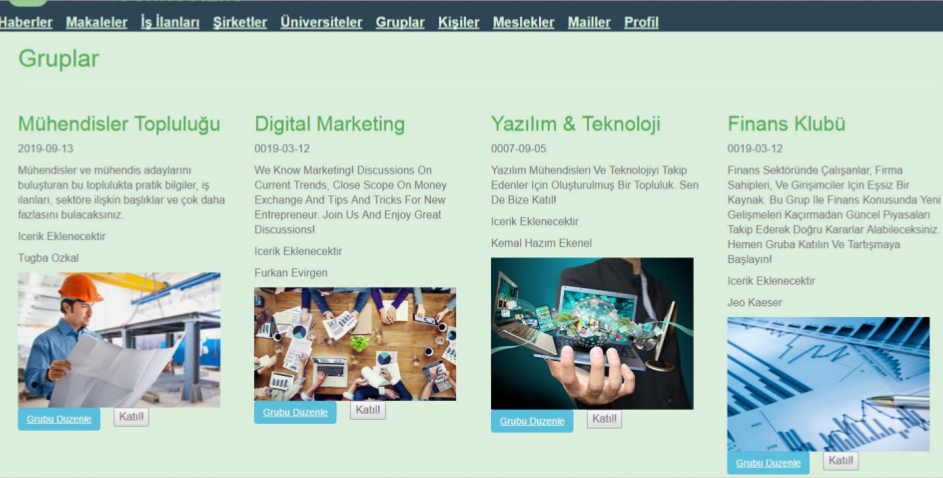
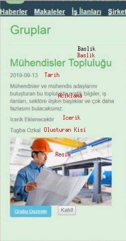
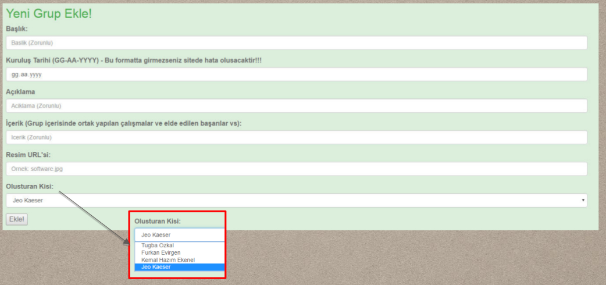
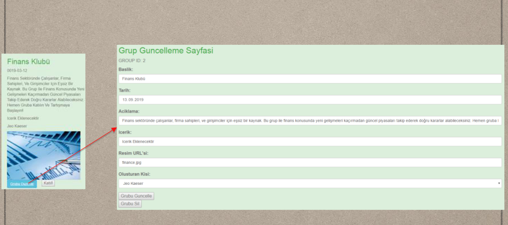

Parts Implemented by Çağrı Gökçe
================================

Genel
-----

Bu kısımda kullanıcıların site bölümleri üzerinde rahatlıkla gezmelerini ve gerekli işlevleri gerçekleştirebilmelerini sağlayan Kullanıcı Rehberi(User Guide) sunulacaktır. Gruplar, Etiketler ve Etiket ilişkileri bölümü ile ilgili rehberler sunulacak ve ekran görüntüleri paylaşılacaktır.

Sayfaya Ulaşma
--------------
Gruplar sayfasına Connect Life sitesinin navigasyon barından *Gruplar* adlı bölüme tıklayarak resimdeki gibi ulaşabilirsiniz. Aynı zamanda websitesinin giriş sayfasında */gruplar* bağlantısına giderek de bu sayfaya erişebilirsiniz.

Grupların Listelemesi
---------------------
Gruplar sayfasına ulaştığınız zaman karşınızda grupların listelendiği bir ekran göreceksiniz. Her satırda 4 grubun listelendiği ekranda tüm grup özelliklerini görebilirsiniz. Yapılacak diğer işlemlere(ara, ekle, güncelle, sil vb.) de bu sayfadan ulaşabileceksiniz, bir sonraki bölümlerde anlatılacaktır.

Her grup listelenmesi içerisinde sırasıyla Başlık, Tarih, Açıklama, İçerik, Grup Kurucusu ve Resim alanları bulunmaktadır. Aşağıda verilen resimde her nesnenin durumu gösterilmiştir.

   
Ekleme İşlemi
-------------
Gruplar sayfası içerisinde biraz aşağı inildiğinde yeni grup ekleme formu gözümüze çarpacaktır. Bu form aracılığı ile yeni Grup ekleyebilirsiniz. Eklenen grup içerisinde etiket düzenlemesi güncelleme bölümünde yapılacaktır. Grup ekleme sırasında açılır listeden oluşturan kişi olarak kendinizi seçmeniz gerekmektedir. Eğer oluşturan kişi olmak isterseniz önce kişiler sayfasından bir profil oluşturup sonra Grup oluşturarak kendinizi bu bölümde ekleyebilirsiniz. Eğer bir başkası oluştursun derseniz gösterilen *açılır liste*den oluşturan kişiyi seçmeniz gerekecektir. 

NOT: Tarih bölümüne girilen tarih formatı GG/AA/YY biçiminde olmak zorundadır.

   
Ekleme işlemi sonucunda */gruplar* sayfasına geri yönlendirileceksiniz. Listeler arasında kendi grubunuzu bulabilir ve arkadaşlarınızı davet edebilirsiniz!   

Güncelleme İşlemi
-----------------

Gruplar anasayfası içerisinde grup listemelerini görebiliyorsunuz. Bu grupların altında bulunan *Grubu Duzenle* yazan mavi butona tıkladığınızda Grup Güncelleme sayfasına yönlendirilirsiniz ve Grup Güncelleme işlemini yapabilirsiniz. Güncelleme sayfasında önceki grup özellikleri sizin için doldurulmuş olarak gelecektir. Tek yapmanız gereken istediğiniz değişiklikleri yapıp Grubu Güncelle butonuna basarak yaptığınız değişiklikleri kaydetmek olacaktır.

