Parts Implemented by Gülşah Damla
=================================

Genel
-----

Bu bölümde Makaleler, öneriler ve işilanları sayfalarının ekran görüntüleri, yeni çoklu ekleme, varolan çokluyu silme, güncelleme ve arama fonksiyonlarını gerçekleyen kısımların kullanıcı arayüzü açıklanacaktır.
Anasayfada bulunan sekmeler ile bu sayfalara erişim sağlanır.

1. Makaleler
------------

Anasayfadan *\makaleler* sekmesine gidilerek makaleler sayfasına ulaşılır. Makaleler sayfasının ekran görüntüsü figür 1.1'de verilmiştir.

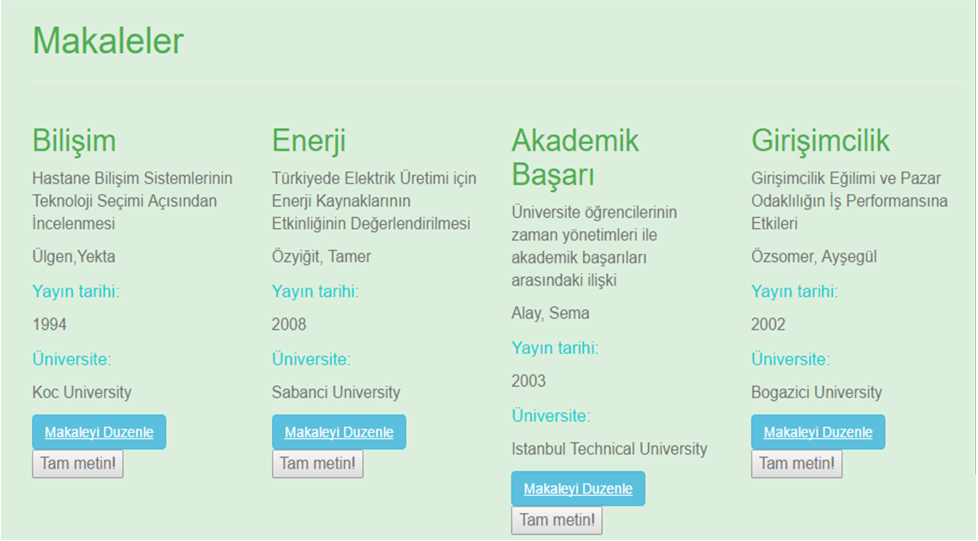
   
    figure 1.1
    
Makaleler sayfasında yer alan makalelerin şu bilgilerine erişilir:

- Makalenin konusu
- Makalenin başlığı
- Yazar adı
- Yayın tarihi
- Yayınlandığı üniversite adı

**Makale Ekleme**

Makaleler sayfasına yeni bir makale eklenmek istendiğinde listeli halde bulunan makalelelerin alt kısmında bulunan *Yeni Makale Ekle!* bölümü kullanılır. Eklenecek makalelerin ilgili bilgileri girildikten sonra *Makale Ekle* butonuyla yeni makale, makaleler sayfasına eklenmiş olur. İlgili bölüm figür 1.2'de gösterilmiştir.

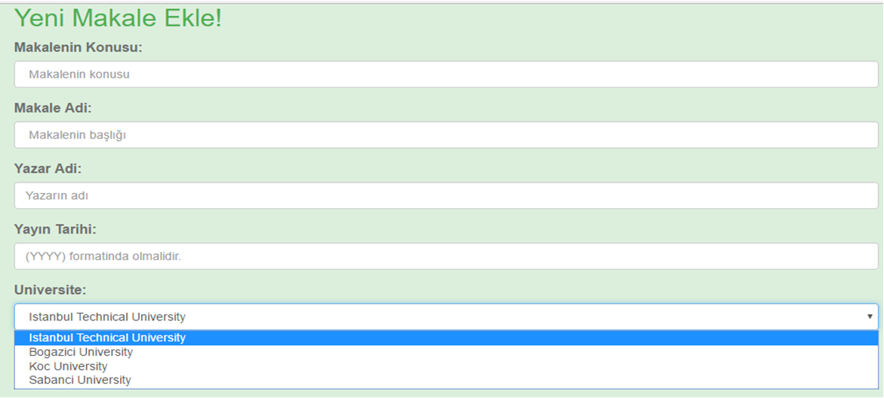
   
    figure 1.2
 
   
**Makale Arama**

Sayfada yer alan makaleler arasından bir makale aranmak istendiğinde sayfanın alt kısmında yer alan *Makale Ara!* bölümü kullanılır. Figür 1.3' de yer verilen arama çubuğuna makalenin konusu yazılıp *Ara!* butonuyla ilgili makale bilgisine erişilir. Makale arama sonucu sayfası figür 1.4'de gösterilmiştir.   

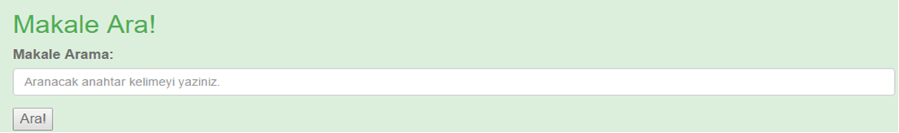
   
   figure 1.3
   
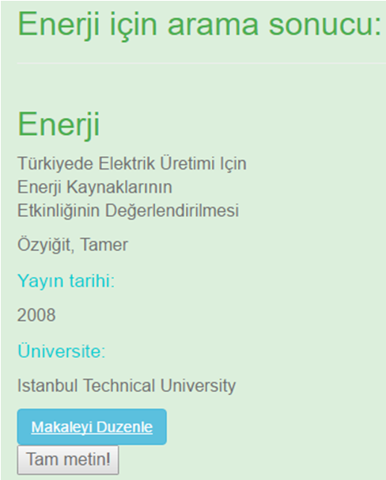
   
   figure 1.4

   
**Makale Güncelleme ve Silme**

Kayıtlı makaleler içerisinde güncellenmesi gereken makale için bilgilerinin altında yer alan *Makaleyi Duzenle* butonuyla makale güncelleme sayfasına geçiş yapılır. Makalenin yayınlandığı üniversite otomatik olarak boşluklara yazılır. Güncellenmek istenilen bilgi değiştirilir ve *Makaleyi Guncelle** butonuyla makale bilgileri güncellenmiş olur. Sonrasında kullanıcı Makaleler sayfasına yönlendirilir ve sonuçlar güncellenmiş haliyle listelenir. İlgili bölüm figür 1.5'de gösterilmiştir.
 
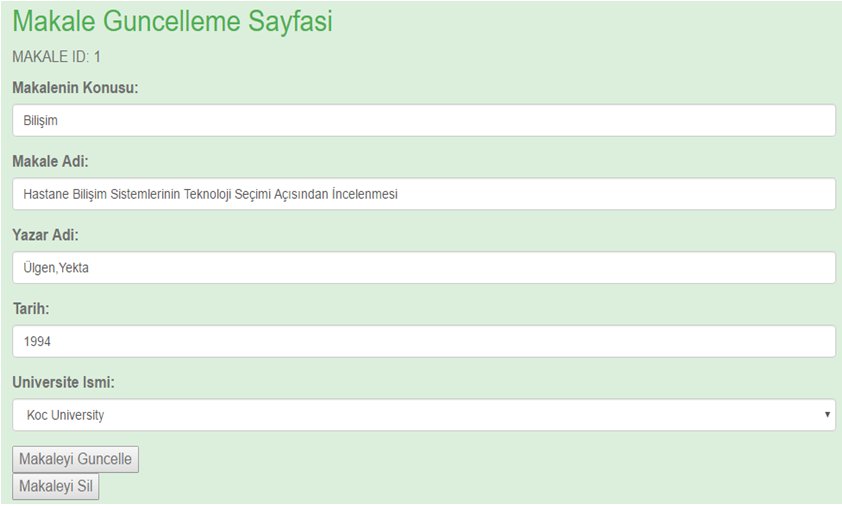
   
   figure 1.5

Eğer bir makale silinmek isteniyorsa *Makaleyi Duzenle** butonuyla geçiş yapacağı güncelleme sayfası alt kısmında yer alan *Makaleyi Sil** butonuna basılarak makale silme işlemi gerçekleştirilir. Silme işleminden sonra kullanıcı Makaleler sayfasına yönlendirilir ve makaleler listesinin son hali gösterilir.

2. İş ilanları
--------------

Anasayfadan *\isilanlari* sekmesine gidilerek işilanları sayfasına ulaşılır. İşilanları sayfasının ekran görüntüsü figür 2.1'de verilmiştir.

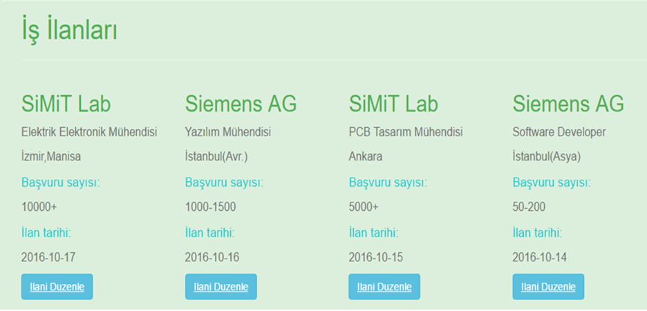
   
   figür 2.1

İşilanları sayfasında yer alan ilanların şu bilgilerine erişilir:  

- Şirketin adı 
- Pozisyon bilgisi
- Şirketin lokasyonu
- Toplam başvuru sayısı
- İlan tarihi

**İlan Ekleme**

İşilanları sayfasına yeni bir ilna eklenmek istendiğinde listeli halde bulunan ilanların alt kısmında bulunan *Yeni İlan Ekle!* bölümü kullanılır. Eklenecek ilanların ilgili bilgileri girildikten sonra *İlan Ekle* butonuyla yeni ilan, işilanları sayfasına eklenmiş olur. İlgili bölüm figür 2.2'de gösterilmiştir.

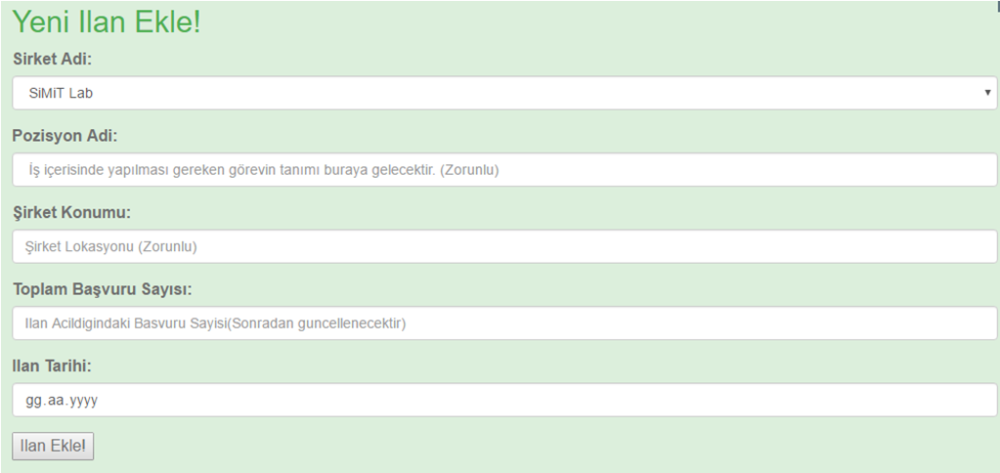
   
   figure 2.2
 
   
**İlan Arama**  

Sayfada yer alan işilanları arasından bir ilan aranmak istendiğinde sayfanın alt kısmında yer alan *İlan Ara!* bölümü kullanılır. Figür 2.3' de yer verilen arama çubuğuna ilanda yer alan şirket ismi yazılıp *Ara!* butonuyla ilgili ilan bilgisine erişilir.
    
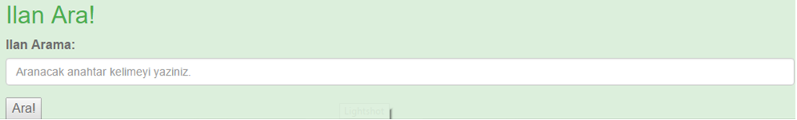
  
   figure 2.3
 
   
**İlan Güncelleme ve Silme**

Kayıtlı işilanları içerisinde güncellenmesi gereken ilan için bilgilerinin altında yer alan *İlani Duzenle* butonuyla ilan güncelleme sayfasına geçiş yapılır. İlanda yer alan şirket ismi otomatik olarak boşluklara yazılır. Güncellenmek istenilen bilgi değiştirilir ve *İlani Guncelle** butonuyla ilan bilgileri güncellenmiş olur. Sonrasında kullanıcı İşilanları sayfasına yönlendirilir ve sonuçlar güncellenmiş haliyle listelenir. İlgili bölüm figür 2.4'de gösterilmiştir.

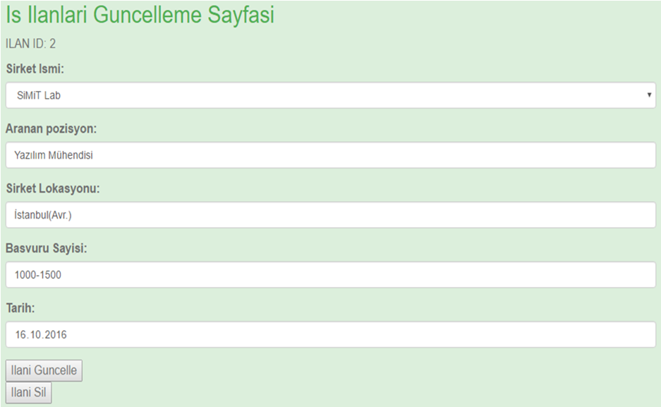
     
   figure 2.4
   
Eğer bir ilan silinmek isteniyorsa *İlani Duzenle** butonuyla geçiş yapacağı güncelleme sayfası alt kısmında yer alan *Ilani Sil** butonuna basılarak ilan silme işlemi gerçekleştirilir. Silme işleminden sonra kullanıcı İşilanları sayfasına yönlendirilir ve işilanları listesinin son hali gösterilir. 

3. Öneriler
-----------

Anasayfadan *\oneriler* sekmesine gidilerek öneriler sayfasına ulaşılır. Öneriler sayfasının ekran görüntüsü figür 3.1'de verilmiştir.

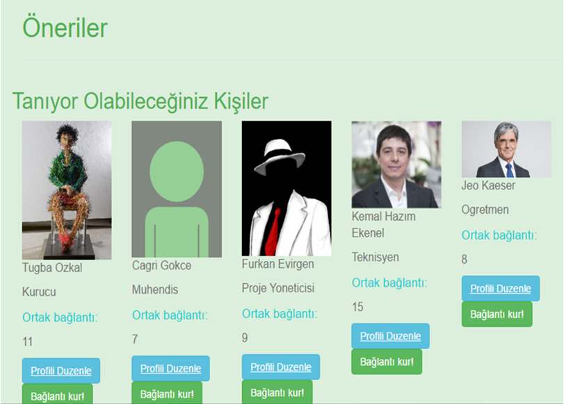
   
   figür 3.1
   
Öneriler sayfasında yer alan önerilerin şu bilgilerine erişilir: 

- Kişinin resmi
- Kişinin ismi
- Meslek bilgisi
- Ortak bağlantı sayısı

**Öneri Ekleme** 

Öneriler sayfasına yeni bir öneri eklenmek istendiğinde listeli halde bulunan önerilerin alt kısmında bulunan *Yeni Öneri Ekle!* bölümü kullanılır. Eklenecek önerilerin ilgili bilgileri girildikten sonra *Oneri Ekle* butonuyla yeni öneri, öneriler sayfasına eklenmiş olur. İlgili bölüm figür 3.2'de gösterilmiştir.

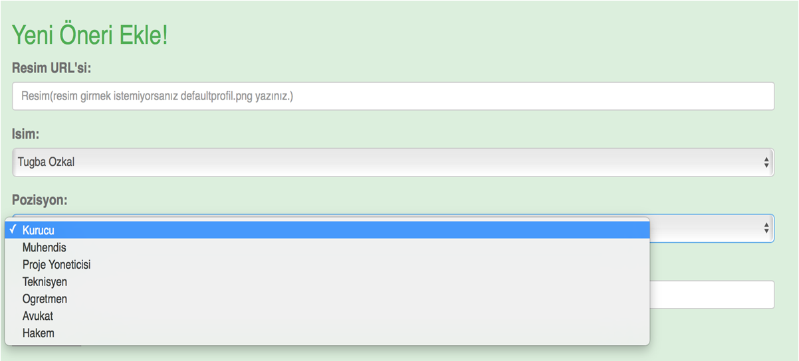
   
   figür 3.2

   
**Öneri Arama**

Sayfada yer alan öneriler arasından bir öneri aranmak istendiğinde sayfanın alt kısmında yer alan *Oneri Ara!* bölümü kullanılır. Figür 3.3' de yer verilen arama çubuğuna önerilen kişinin ismi yazılıp *Ara!* butonuyla ilgili öneri bilgisine erişilir.

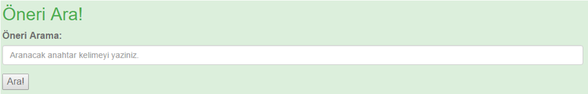

   figür 3.3

  
**Öneri Güncelleme ve Silme**

Kayıtlı öneriler içerisinde güncellenmesi gereken öneri için bilgilerinin altında yer alan *Profili Düzenle* butonuyla öneri güncelleme sayfasına geçiş yapılır. Öneri bilgilerinden kişi ismi ve meslek bilgisi otomatik olarak boşluklara yazılır. Güncellenmek istenilen bilgi değiştirilir ve *Oneriyi Güncelle** butonuyla öneri bilgileri güncellenmiş olur. Sonrasında kullanıcı Öneriler sayfasına yönlendirilir ve sonuçlar güncellenmiş haliyle listelenir. İlgili bölüm figür 3.4'de gösterilmiştir.

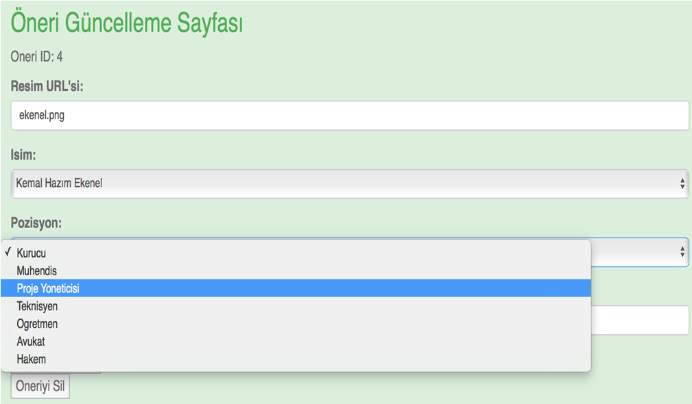
   
   figür 3.4

Eğer bir öneri silinmek isteniyorsa *Profili Duzenle** butonuyla geçiş yapacağı güncelleme sayfası alt kısmında yer alan *Oneriyi Sil** butonuna basılarak öneri silme işlemi gerçekleştirilir. Silme işleminden sonra kullanıcı Öneriler sayfasına yönlendirilir ve öneriler listesinin son hali gösterilir.

  
