Parts Implemented by Selman Orhan
===================================

Genel Bakış
------------

Bu raporda, projede yaptığım sayfalar ve bu sayfalarda nelerin bulundugu ve kullanıcıların bu sayfalarda hangi bilgilere ulaşıp hangi işlemleri yapabilecekleri açıklanacaktır.

Benim proje kapsamında yaptığım Sayfalar şunlardır: 
  * Üniversiteler
  * Hobiler
  * Projeler 
  
Bu sayfalarının kullanıcı görüntüleri ve yeni çoklu ekleme, varolan çokluyu silme, güncelleme ve arama fonksiyonlarını gerçekleyen kısımların kullanıcı arayüzü açıklanacaktır.

1. Üniversiteler Sayfası
------------------------
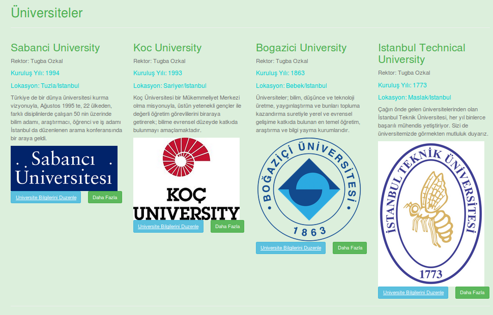
   
   figure 1.1 - Üniversiteler sayfasının genel görüntüsü

Üniversiteler sayfasına ana ekrandan Üniversiteler segmesine tıklayarak geçiş yapılır. Üniversiteler sayfasına geçiş yapan kullanıcı figure 1.1 deki sayfa ile karşılaşır. Bu sayfada database'e kayıtlı üniversiteler ve her üniversite hakkında databasede kayıtlı bazı bilgiler sıralanmıştır.

Kullanıcılar Üniversiteler sayfasında bulunan her bir üniversite ile ilgili şu bilgilerini görebilir:
  - Üniversite Adı
  - Rektor Adı
  - Kuruluş yılı
  - Lokasyon Bilgisi
  - Genel Bilgi
  - Üniversite Logosu
  - Üniversite Bilgilerini Düzenle butunu
  - Daha Fazla Butonu 
  
Kullanıcıların daha güncel bir üniversiteler sayfasını görüntülemeleri icin, üniversiteler sayfası açıldıktan sonra;
**http://itucsdb1606.mybluemix.net/universiteler/initdb** şeklinde sayfa adresinin sonuna *initdb* eklemeleri gerekir.

**Yeni Üniversite Ekleme Fonksiyonu**

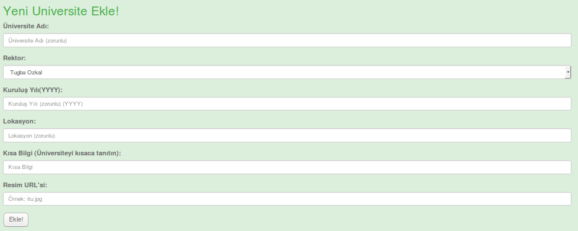
   
   figure 1.2 - Yeni üniversite ekleme sayfası görüntüsü

Üniversiteler sayfasına yeni bir universite eklemek isteyen kullanıcı Üniversiteler sayfası içerisinde listelenen üniversitelerin alt kısmında **Yeni Universite Ekle!** bölümünden eklenecek üniversiteye dair gerekli bilgileri girdikten sonra **Ekle!** butonuna basarak yeni *Universite* ekleyebilir. Ekle butonuna bastıktan sonra sayfa otomatik olarak yenilenecektir ve eklenen üniversite, üniversiteler anasayfasında listelenen üniversiteler arasında görünecektir.

**Üniversite Arama Fonksiyonu**

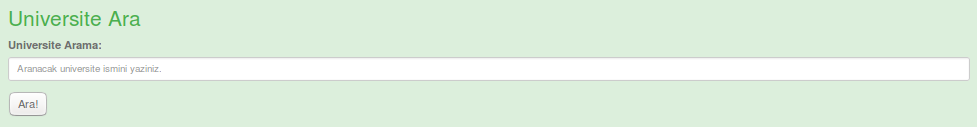
   
   figure 1.3 - Üniversite arama sayfası görüntüsü

Üniversiteler anasayfasında listelenen üniversiteler arasından herhangi bir üniversiteyi aramak isteyen kullanıcı, Üniversiteler sayfasında bulunan **Universite Ara!** bölümünde aramak istediği üniversitenin ismini girerek arama yapabilir. Eğer aranan üniversite kayıtlı üniversiteler arasında ise, bulunan üniversite bilgileri *figure 1.4* şeklinde bir yeni bir sayfada listelenirler. Eğer aranan üniversite bilgisine ulaşılmazsa arama sonucunda boş bir ekranla karşılaşırlar.

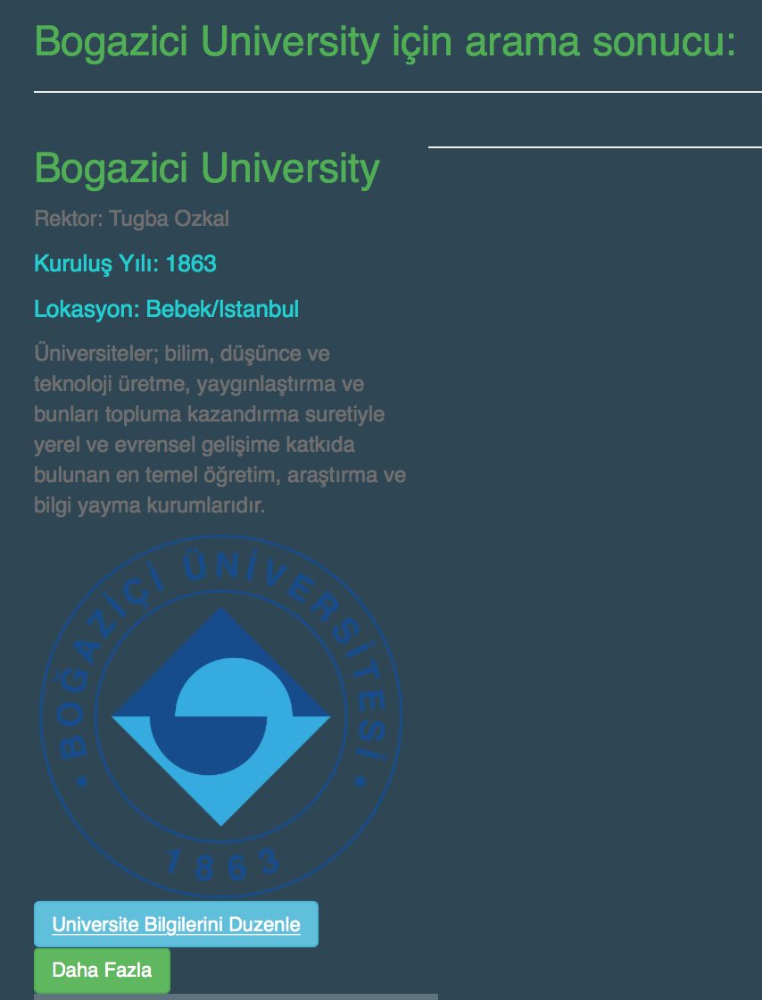
   
   figure 1.4 - Üniversite arama sonucu sayfası görüntüsü

**Üniversite Güncelleme Fonksiyonu**

Kayıtlı üniversiteler içerisinde üniversite bilgileri güncellenecek bir üniversite varsa listelenen üniversitenin bilgilerinin altındaki **Universiteyi Düzenle** butonuna basılarak üniversite güncelleme sayfasına aktarılır. üniversitenin bilgileri otomatik olarak boşluklara yazılır. Güncellenmek istenilen bilgi değiştirilir. Diğerlerinin değiştirilmesine gerek yoktur, eski bilgiler tekrar kullanılır. Daha sonra **Universiteyi Güncelle** butonuna basılarak üniversite bilgileri güncellenmiş olur (bakınız. *figure 1.5*). Butona basıldıktan sonra kullanıcı üniversiteler sayfasına yönlendirilir ve güncelleme sonuçları listelenir.

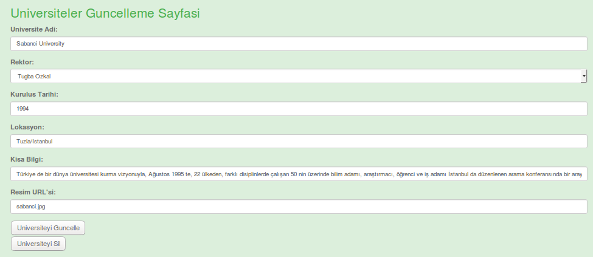
   
   figure 1.5 - Üniversite güncelleme ve silme sayfası görüntüsü

**Üniversite Silme Fonksiyonu**

Eğer bir üniversite silinmek isteniyorsa güncelleme ile aynı şekilde **Universiteyi Düzenle** butonu ile geçiş yapacağı güncelleme sayfası altında **Universiteyi Sil** butonuna basılarak üniversite silme işlemi gerçekleştirilir (bakınız: *figure 1.5*). Silme işleminden sonra kullanıcı üniversiteler ana sayfasına yönlendirilir ve üniversiteler listesinin son hali gösterilir.

2. İlgi Alanları Sayfası
------------------------
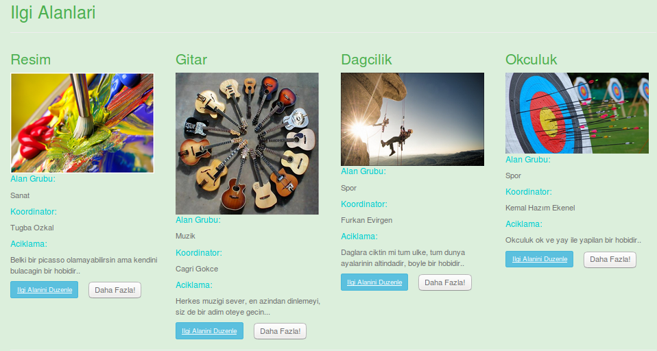
   
   figure 2.1 - İlgi Alanları sayfasının genel görüntüsü

İlgi Alanları sayfasına ana ekrandan İlgi Alanları segmesine tıklayarak geçiş yapılır. İlgi Alanları sayfasına geçiş yapan kullanıcı figure 2.1 deki sayfa ile karşılaşır. Bu sayfada database'e kayıtlı hobiler ve her hobi hakkında databasede kayıtlı bazı bilgiler sıralanmıştır.

Kullanıcılar İlgi Alanları sayfasında bulunan her bir ilgi alanı ile ilgili şu bilgilerini görebilir:
  - İlgi Alanı Adı
  - Resim Bilgisi
  - Alan Adı
  - Koordinatör Bilgisi
  - Açıkama Bilgisi
  - İlgi Alanını Düzenle butunu
  - Daha Fazla Butonu 
  
Kullanıcıların daha güncel bir ilgi alanları sayfasını görüntülemeleri icin, ilgi alanları sayfası açıldıktan sonra;
**http://itucsdb1606.mybluemix.net/hobiler/initdb** şeklinde sayfa adresinin sonuna *initdb* eklemeleri gerekir.

**Yeni İlgi Alanı Ekleme Fonksiyonu**

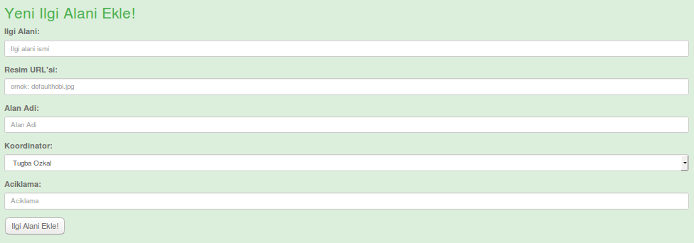
   
   figure 2.2 - Yeni ilgi alanı ekleme sayfası görüntüsü

İlgi alanları sayfasına yeni bir ilgi alanı eklemek isteyen kullanıcı ilgi alanları sayfası içerisinde listelenen ilgi alanlarının alt kısmında **Yeni İlgi Alanı Ekle!** bölümünden eklenecek ilgi alanına dair gerekli bilgileri girdikten sonra **Ekle!** butonuna basarak yeni *ilgi alanı* ekleyebilir. Ekle butonuna bastıktan sonra sayfa otomatik olarak yenilenecektir ve eklenen ilgi alanı, ilgi alanları anasayfasında listelenen ilgi alanlarının arasında görünecektir.

**İlgi Alanı Arama Fonksiyonu**

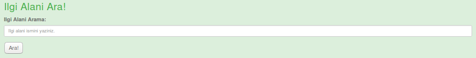
   
   figure 2.3 - İlgi alanı arama sayfası görüntüsü

İlgi alanları anasayfasında listelenen ilgi alanlarının arasından herhangi bir ilgi alanını aramak isteyen kullanıcı, ilgi alanları sayfasında bulunan **İlgi alanı Ara!** bölümünde aramak istediği ilgi alanının ismini girerek arama yapabilir. Eğer aranan ilgi alanı kayıtlı ilgi alanları arasında ise, bulunan ilgi alanı bilgileri yeni bir sayfada listelenirler. Eğer aranan ilgi alanı bilgisine ulaşılmazsa arama sonucunda boş bir ekranla karşılaşırlar.

**İlgi Alanı Güncelleme Fonksiyonu**

Kayıtlı ilgi alanları içerisinde ilgi alanı bilgileri güncellenecek bir ilgi alanı varsa listelenen ilgi alanlarının bilgilerinin altındaki **İlgi Alanını Düzenle** butonuna basılarak ilgi alanı güncelleme sayfasına aktarılır. ilgi alanınının bilgileri otomatik olarak boşluklara yazılır. Güncellenmek istenilen bilgi değiştirilir. Diğerlerinin değiştirilmesine gerek yoktur, eski bilgiler tekrar kullanılır. Daha sonra **İlgi Alanını Güncelle** butonuna basılarak ilgi alanı bilgileri güncellenmiş olur (bakınız. *figure 2.4*). Butona basıldıktan sonra kullanıcı ilgi alanları sayfasına yönlendirilir ve güncelleme sonuçları listelenir.

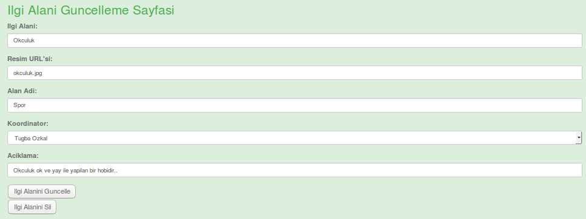
   
   figure 2.4 - İlgi Alanları güncelleme ve silme sayfası görüntüsü

**İlgi Alanları Silme Fonksiyonu**

Eğer bir ilgi alanı silinmek isteniyorsa güncelleme ile aynı şekilde **İlgi Alanını Düzenle** butonu ile geçiş yapacağı güncelleme sayfası altında **İlgi Alanını Sil** butonuna basılarak ilgi alanı silme işlemi gerçekleştirilir (bakınız: *figure 2.4*). Silme işleminden sonra kullanıcı ilgi alanları ana sayfasına yönlendirilir ve ilgi alanları listesinin son hali gösterilir.

3. Projeler Sayfası
------------------------
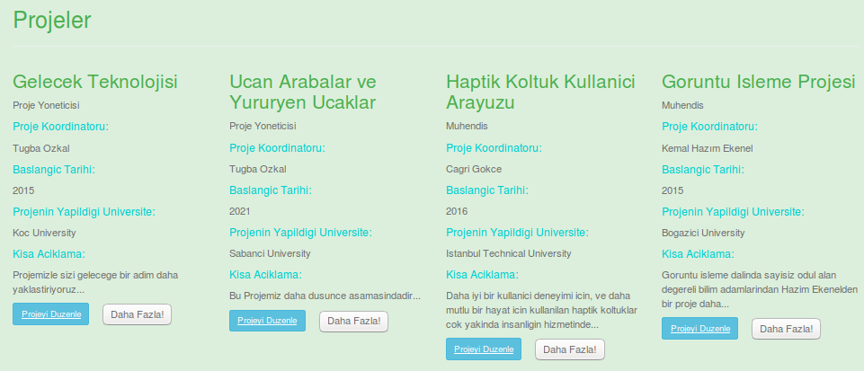
   
   figure 3.1 - Projeler sayfasının genel görüntüsü

Projeler sayfasına ana ekrandan Projeler segmesine tıklayarak geçiş yapılır. Projeler sayfasına geçiş yapan kullanıcı *figure 3.1* deki sayfa ile karşılaşır. Bu sayfada database'e kayıtlı projeler ve her proje hakkında databasede kayıtlı bazı bilgiler sıralanmıştır.

Kullanıcılar projeler sayfasında bulunan her bir projeler ile ilgili şu bilgilerini görebilir:
  - Proje Başlığı
  - Konu Bilgisi
  - Proje Sahibi
  - Proje Başlama Tarihi
  - Universite Bilgisi
  - Açıklama Bilgisi
  - Projeyi Düzenle butunu
  - Daha Fazla Butonu 
  
Kullanıcıların daha güncel bir projeler sayfasını görüntülemeleri icin, projeler sayfası açıldıktan sonra;
**http://itucsdb1606.mybluemix.net/projeler/initdb** şeklinde sayfa adresinin sonuna *initdb* eklemeleri gerekir.

**Yeni Proje Ekleme Fonksiyonu**

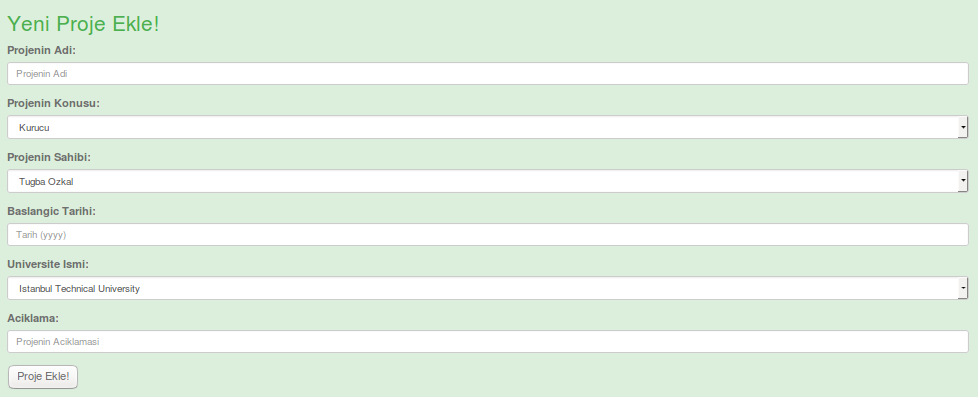
   
   figure 3.2 - Yeni proje ekleme sayfası görüntüsü

Projeler sayfasına yeni bir proje eklemek isteyen kullanıcı projeler sayfası içerisinde listelenen projelerin alt kısmında **Yeni Proje Ekle!** bölümünden eklenecek projeye dair gerekli bilgileri girdikten sonra **Ekle!** butonuna basarak yeni *proje* ekleyebilir. Ekle butonuna bastıktan sonra sayfa otomatik olarak yenilenecektir ve eklenen proje, projeler anasayfasında listelenen projeler arasında görünecektir.

**Proje Arama Fonksiyonu**

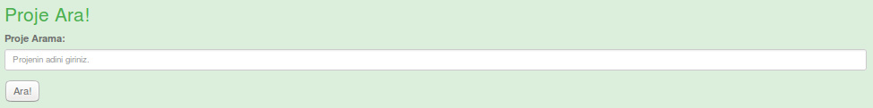
   
   figure 3.3 - Proje arama sayfası görüntüsü

Projeler anasayfasında listelenen projelerin arasından herhangi bir proje aramak isteyen kullanıcı, projeler sayfasında bulunan **Proje Ara!** bölümünde aramak istediği projenin ismini girerek arama yapabilir. Eğer aranan proje kayıtlı projeler arasında ise, bulunan proje bilgileri yeni bir sayfada listelenirler. Eğer aranan proje bilgisine ulaşılmazsa arama sonucunda boş bir ekranla karşılaşırlar.

**Proje Güncelleme Fonksiyonu**

Kayıtlı projeler içerisinde proje bilgileri güncellenecek bir proje varsa listelenen projelerin bilgilerinin altındaki **Proje Düzenle** butonuna basılarak proje güncelleme sayfasına aktarılır. proje bilgileri otomatik olarak boşluklara yazılır. Güncellenmek istenilen bilgi değiştirilir. Diğerlerinin değiştirilmesine gerek yoktur, eski bilgiler tekrar kullanılır. Daha sonra **Projeyi Güncelle** butonuna basılarak proje bilgileri güncellenmiş olur (bakınız. *figure 3.4*). Butona basıldıktan sonra kullanıcı projeler sayfasına yönlendirilir ve güncelleme sonuçları listelenir.

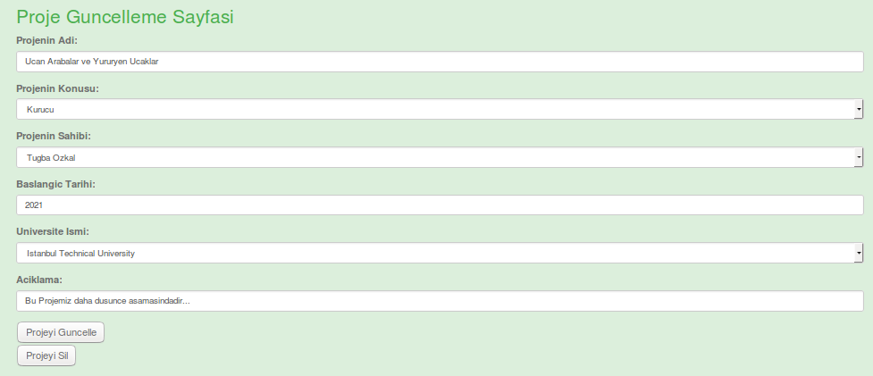
   
   figure 2.4 - Proje güncelleme ve silme sayfası görüntüsü

**Proje Silme Fonksiyonu**

Eğer bir proje silinmek isteniyorsa güncelleme ile aynı şekilde **Projeyi Düzenle** butonu ile geçiş yapacağı güncelleme sayfası altında **Projeyi Sil** butonuna basılarak proje silme işlemi gerçekleştirilir (bakınız: *figure 3.4*). Silme işleminden sonra kullanıcı projeler ana sayfasına yönlendirilir ve projeler listesinin son hali gösterilir.
