Parts Implemented by Tuğba Özkal
================================

Genel
-----

Bu bölümde 3 tablo; diğer tablolarla olan bağlantıları ve yeni ekleme, güncelleme, silme, arama işlemleriyle gösterilmiştir.

Anasayfadaki sekmeler bu sayfalara ulaşmayı sağlar.

1. Kişiler
----------

Kişiler sayfasının görüntüsü figür 1.1.1'de verilmiştir. Bu sayfaya '\kisiler' uzantısıyla ulaşmak mümkündür.

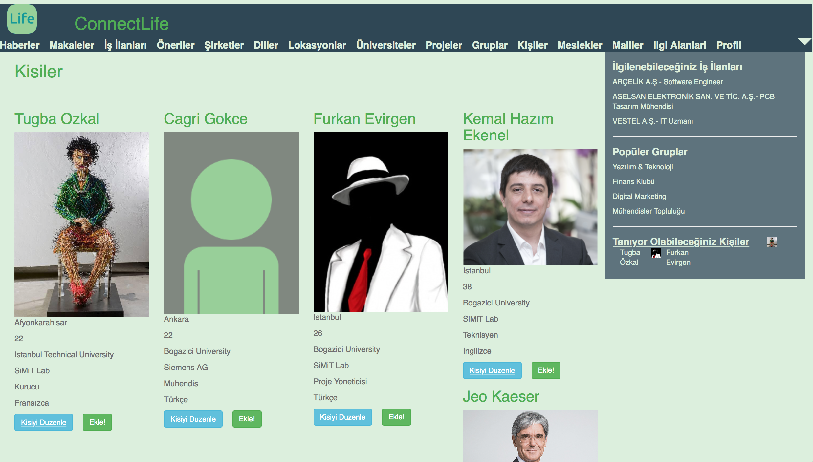

   figure 1.1.1

Kişilere ait bilgilerde kişinin ismi, profil resmi, yaşı, yaşadığı yer, mesleği, üniversitesi, çalıştığı yer ve dili bulunur.

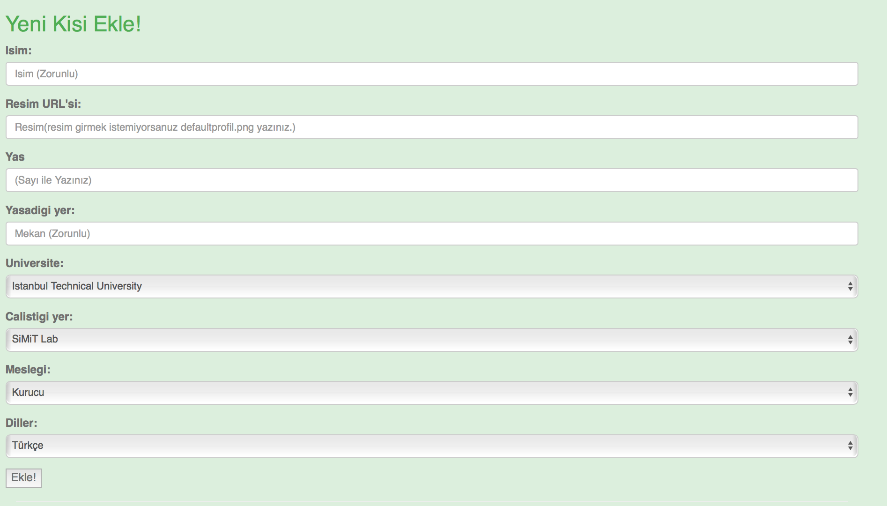

   figure 1.1.2

Figür 1.1.2'de görüldüğü gibi meslek, dil, üniversite ve çalıştığı yer bilgileri seçenekten işaretlenebilir.

Kişi ismi figür 1.1.3'te gösterilen bara girilerek aranan kişi figür 1.1.4'te verilen örnek gibi arama sonucu sayfasına yansıtılır.

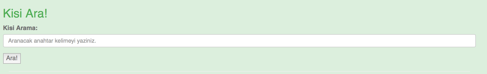

   figure 1.1.3

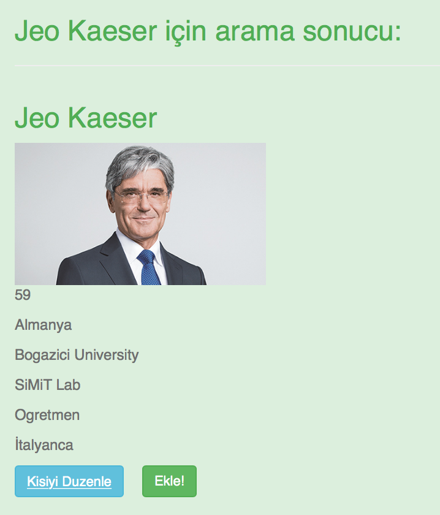

   figure 1.1.4

Kişi güncelleme sayfası yeni kişi ekleme sayfasına benzer. Yeni kişi ekleme bölümü '/kisiler' sekmesindeyken, kişi güncellenmesi
için farklı sayfaya yönlendirme vardır. Bu sayfaya ulaşmak için güncellenmek istenen kişinin altındaki 'kişiyi güncelle' butonuna
basılması gerekir. Sayfa görünümü figür 1.1.5'te gösterilmiştir.

Güncellenecek bilgiler girildikten sonra 'kişiyi güncelle' butonuna tıklanır.

Bu sayfada kişinin silinmesine de imkan tanınır. Silinmesi için 'kişiyi sil' butonuna tıklanması gerekir.

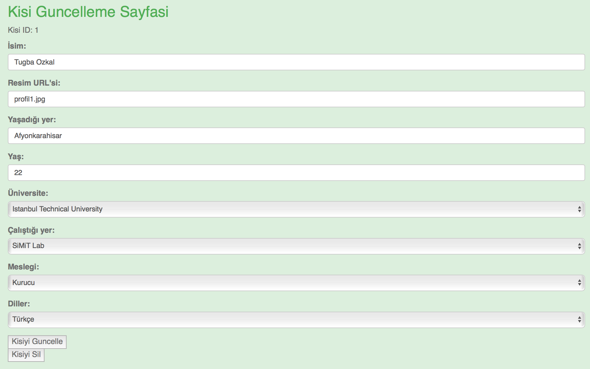

   figure 1.1.5

2. Meslekler
------------

Meslekler sayfasının görüntüsü 2.1.1'de gösterilmiştir. Meslekler tablosunda mesleğin adı ve tanımı bulunur. Bu sayfaya '\meslekler' uzantısıyla
erişmek mümkündür.

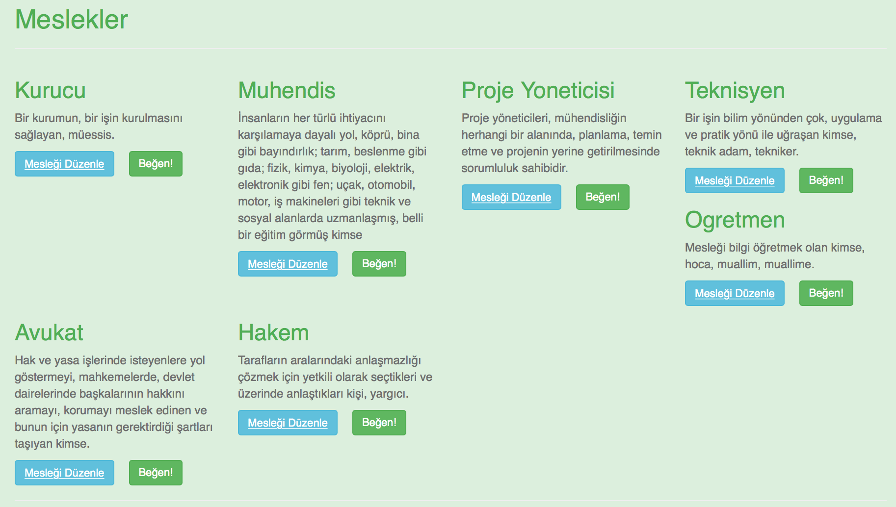

   figure 2.1.1

Sayfanın altına inildiğinde yeni meslek ekleme kısmına ulaşılır. Gerekli bilgiler girildikten sonra 'meslek ekle' butonuna
tıklandığında sayfada eklenen yeni meslek görüntülenebilir. Yeni meslek ekleme kısmı figür 2.1.2'de gösterilmiştir. Yeni meslek
eklenirken tüm bilgilerin girilmesi zorunludur.

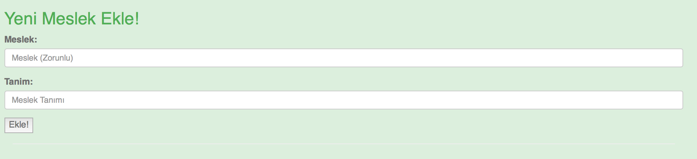

   figure 2.1.2

Meslek arama barına mesleğin ismi yazılarak arama yapılabilir. Büyük küçük harf duyarlılığı vardır. Bulunmak istenen mesleğin ismi ve
tanımı figür 2.1.4'teki örnekte gösterildiği gibi arama sonucu sayfasında listelenir.

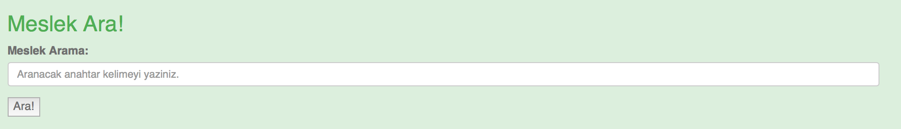

   figure 2.1.3

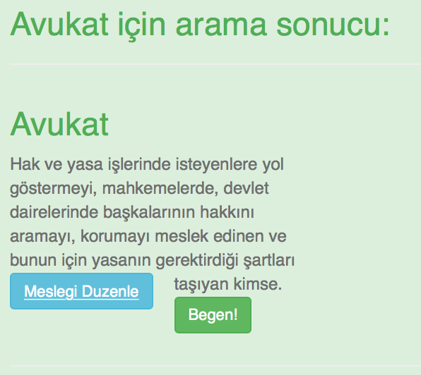

   figure 2.1.4

Meslek güncellenirken güncellenmesi istenen mesleğin altındaki 'mesleği güncelle' butonuna tıklanması gerekir. Bu buton kullanıcıyı meslek
güncelleme sayfasına yönlendirir. Burada kullanıcı güncellenen bilgileri girerek 'güncelle' butonuna tıklar ve tekrar meslekler sayfasına
yönelir. Güncellenen meslek bu sayfada görüntülenir. Meslek güncelleme sayfasının görüntüsü figür 2.1.5'te gösterilmiştir.

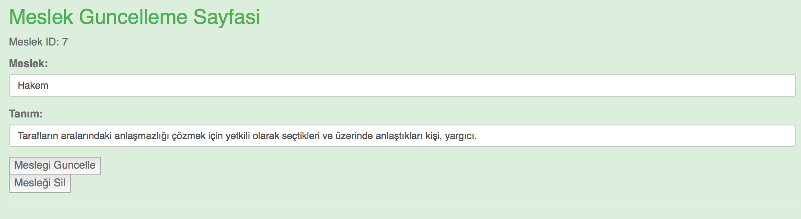

   figure 2.1.5

3. Mailler
----------

Mailler sayfasına '\mailler' uzantısıyla erişilinir. Bu tablo mailin kime ait olduğu bilgisini, mailin tümünü ve şifresini içerir. Şifre
string özelliğinde olup ekrana yıldız olarak yansıtılır. Mailin kişi bilgisi kişiler tablosundan çekilir. Örnek sayfa görüntüsü figür 3.1.1'de
gösterilmiştir.

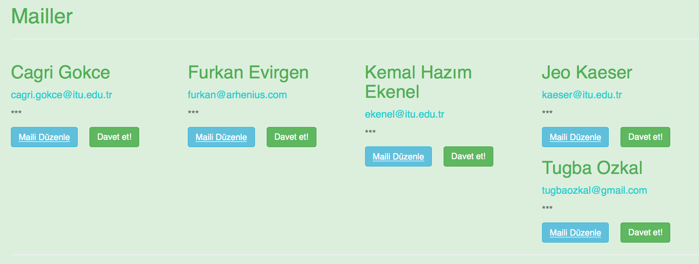

   figure 3.1.1

Sayfanın altına inildiğinde yeni mail ekleme kısmına ulaşılınır. Yeni mail eklenirken ilk olarak mailin kime ait olduğu bilgisi seçeneklerden
seçilir. Mail adresi ve şifre girilerek 'yeni mail ekle' butonuna tıklanmasıyla mail eklenmiş olur. Şifre girilirken güvenlik amacıyla girilen
değerler yıldızla kapatılmıştır. Aynı kişiye ait birden fazla mail eklenebilir. Örnek ekran görüntüsü figür 3.1.2'de gösterilmiştir.

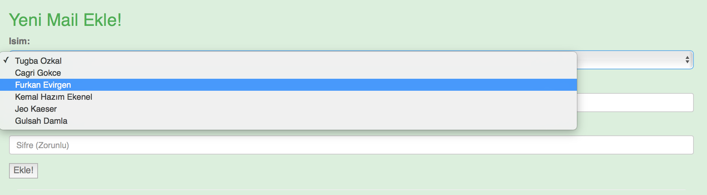

   figure 3.1.2

Mail araması yapılması için mail adresinin arama barına yazılması gerekir. Arama barı figür 3.1.3'te gösterilmiştir.

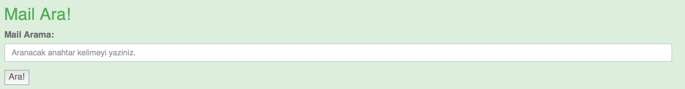

   figure 3.1.3

Mail adresiyle yapılan arama sonucunda mailin sahibi, mail adresi ve şifre (yıldız olarak) gösterilmiştir. Arama sonucu örneği figür 3.1.4'te
bulunabilir.

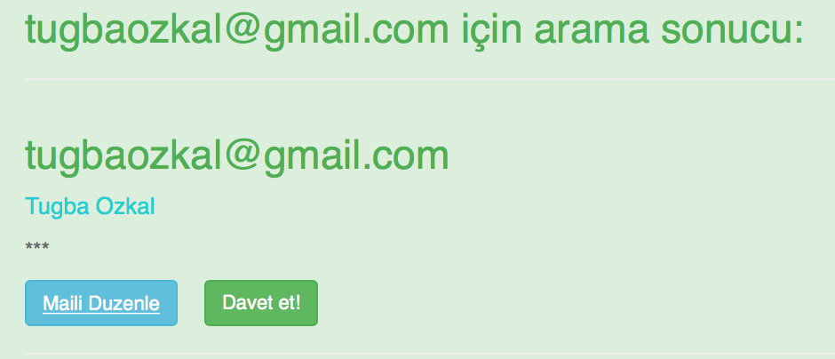

   figure 3.1.4

Mailin güncellenmesi için figür 3.1.1'de gösterilen sayfadaki 'mail güncelle' butonlarından birine tıklanarak butonun ait olduğu mail
güncellenebilir. Farklı sayfaya yönlendirilen kullanıcı yeni mail ekleme sayfasının benzeri olan bir sayfayla karşılaşır. Sayfanın ekran görüntüsü
figür 3.1.5'te verilmiştir. Güncellenen bilgiler girilerek 'maili güncelle' butonuna tıklanır ve kullanıcı maillerin listelendiği sayfaya
yönlendirilir. Güncellenen mail bu sayfada görüntülenebilir.

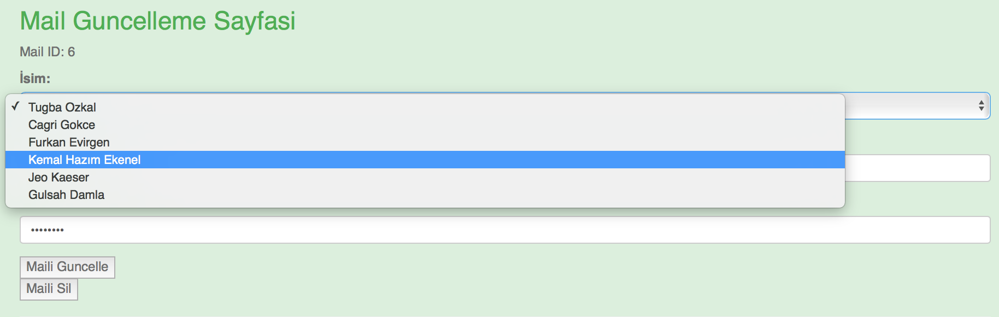

   figure 3.1.5

