Parts Implemented by Ahmet Eğinkaya
===================================

Genel Bilgilendirme
-------------------

Proje raporunun bu kısmında Sirket, lokasyon ve dil sayfalarının kullanıcı görüntüleri ve yeni çoklu ekleme, varolan çokluyu silme, güncelleme ve arama fonksiyonlarını gerçekleyen kısımların kullanıcı arayüzü açıklanacaktır.

|
1. Sirket
---------

Şirketler sayfasına ana ekrandan Şirketler butonuna tıklayarak geçiş yapılır. Şirketler sayfasına geçiş yapan kullanıcı figure 1.1 deki sayfa ile karşılaşır. Bu sayfada database'e kayıtlı şirketler sıralanmıştır.

|

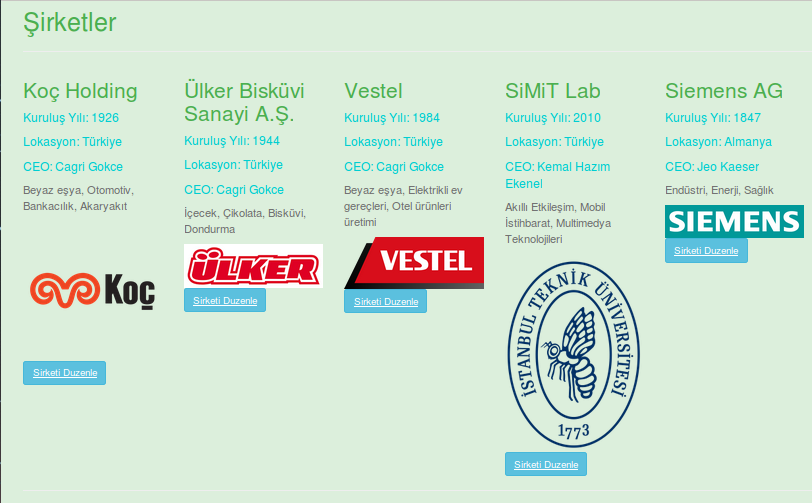

   figure 1.1

|

  Kullanıcılar Şirketler sayfasında ilgili şirketin şu bilgilerini görebilir:

|

  - Şirketin adı
  - Kuruluş yılı
  - Lokasyonu
  - CEO'su
  - Şirketin çalışma alanları
  - Şirketin logosu

|

**Yeni Şirket Ekleme**

Şirketler sayfasına yeni bir şirket eklemek isteyen kullanıcı Şirketler sayfası içerisinde listelenen şirketlerin alt kısmında **Yeni Şirket Ekle!** bölümünden eklenecek şirkete dair gerekli bilgileri girdikten sonra **Ekle!** butonuna basarak yeni şirket ekleyebilir. Ekle butonuna bastıktan sonra sayfa otomatik olarak yenilenecektir ve eklenen şirket listelenen şirketler arasında görünecektir. Figure 1.2 de ekran görüldüğü üzere.

|

.. figure:: ahmet/sirketekran2.png
   :figclass: align-center

   figure 1.2

|

**Arama Fonksiyonu**

Kayıtlı şirketler arasından herhangi bir şirketi aramak isteyen kullanıcı Şirketler sayfasının en alt kısmında bulunan **Şirket Ara!** bölümüne aranacak şirketin ismini girerek arama yapabilir. Eğer aranan şirket kayıtlı ise sadece aranan şirket bilgilerinin bulunduğu sayfa ekrana gelir. Eğer aranan şirket kayıtlı değil ise arama sonucunda boş bir ekranla karşılaşırlar.
|

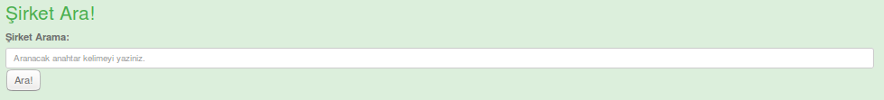

   figure 1.3

|

**Güncelleme Fonksiyonu ve Silme**

Kayıtlı şirketler içerisinde şirket bilgileri güncellenecek bir şirket varsa listelenen şirketin bilgilerinin altındaki **Şirketi Düzenle** butonuna basarak şirket güncelleme sayfasına aktarılır. Şirketin bilgileri otomatik olarak boşluklara yazılır. Güncellenmek istenilen bilgi değiştirilir. Diğerlerinin değiştirilmesine gerek yoktur, eski bilgiler tekrar kullanılır. Daha sonra **Sirketi Güncelle** butonuna basılarak şirket bilgileri güncellenmiş olur. Butona basıldıktan sonra kullanıcı Şirketler sayfasına yönlendirilir ve güncelleme sonuçları listelenir.

Eğer bir şirket silinmek isteniyorsa güncelleme ile aynı şekilde **Şirketi Düzenle** butonu ile geçiş yapacağı güncelleme sayfası altında **Şirketi Sil** butonuna basılarak şirket silme işlemi gerçekleştirilir. Silme işleminden sonra kullanıcı Şirketler sayfasına yönlendirilir ve şirketler listesinin son hali gösterilir.

|

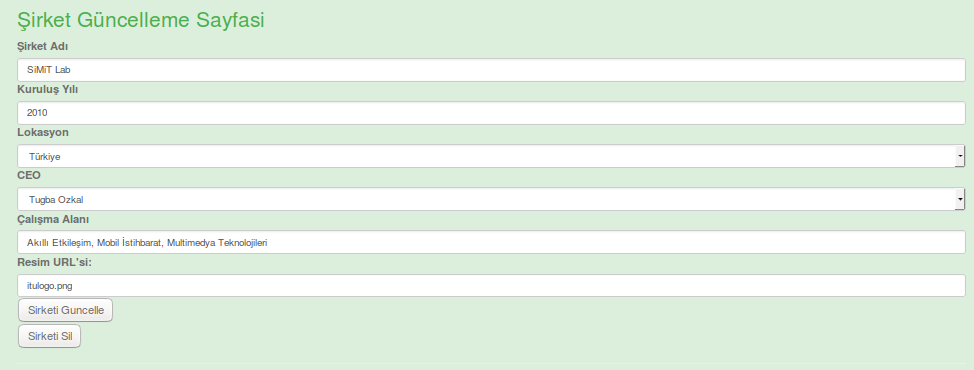

   figure 1.4

|

2. Dil
------

Diller sayfasına ana ekrandan Diller butonuna tıklayarak geçiş yapılır. Diller sayfasına geçiş yapan kullanıcı figure 1.1 deki sayfa ile karşılaşır. Bu sayfada database'e kayıtlı diller sıralanmıştır.

|

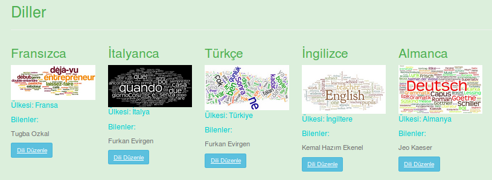

   figure 2.1

|

  Kullanıcılar Diller sayfasında ilgili dilin şu bilgilerini görebilir:

|

  - Dilin adı
  - Dil ile ilgili bir resim
  - Kullanıldığı ülke
  - Dili kullananlar

|

**Yeni Dil Ekleme**

Diller sayfasına yeni bir dil eklemek isteyen kullanıcı Diller sayfası içerisinde listelenen dillerin alt kısmında **Yeni Dil Ekle!** bölümünden eklenecek dile ait gerekli bilgileri girdikten sonra **Ekle!** butonuna basarak yeni dil ekleyebilir. Ekle butonuna bastıktan sonra sayfa otomatik olarak yenilenecektir ve eklenen dil listelenen Diller arasında görünecektir. Figure 1.2 de ekran görüldüğü üzere.

|

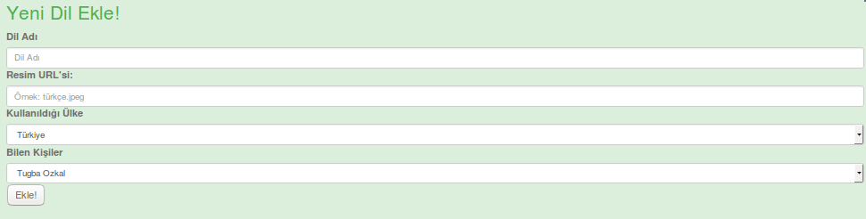

   figure 2.2

|

**Arama Fonksiyonu**

Kayıtlı Diller arasından herhangi bir dili aramak isteyen kullanıcı Diller sayfasının en alt kısmında bulunan **Dil Ara!** bölümüne aranacak dilin ismini girerek arama yapabilir. Eğer aranan dil kayıtlı ise sadece aranan dil bilgilerinin bulunduğu sayfa ekrana gelir. Eğer aranan dil kayıtlı değil ise arama sonucunda boş bir ekranla karşılaşırlar.
|

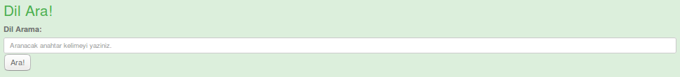

   figure 2.3

|

**Güncelleme Fonksiyonu ve Silme**

Kayıtlı Diller içerisinde dil bilgileri güncellenecek bir dil varsa listelenen dilin bilgilerinin altındaki **Dili Düzenle** butonuna basarak dil güncelleme sayfasına aktarılır. Dilin bilgileri otomatik olarak boşluklara yazılır. Güncellenmek istenilen bilgi değiştirilir. Diğerlerinin değiştirilmesine gerek yoktur, eski bilgiler tekrar kullanılır. Daha sonra **Dili Güncelle** butonuna basılarak dil bilgileri güncellenmiş olur. Butona basıldıktan sonra kullanıcı Diller sayfasına yönlendirilir ve güncelleme sonuçları listelenir.

Eğer bir dil silinmek isteniyorsa güncelleme ile aynı şekilde **Dili Düzenle** butonu ile geçiş yapacağı güncelleme sayfası altında **Dili Sil** butonuna basılarak dil silme işlemi gerçekleştirilir. Silme işleminden sonra kullanıcı Diller sayfasına yönlendirilir ve Diller listesinin son hali gösterilir.

|

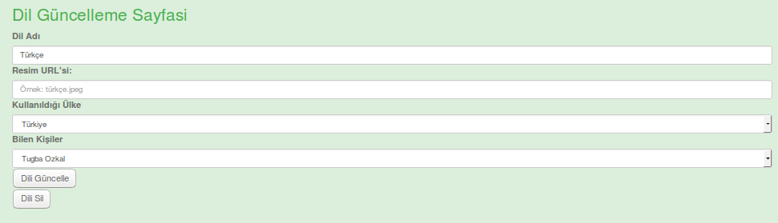

   figure 2.4

|

2. Lokasyon
-----------

Lokasyonlar sayfasına ana ekrandan Lokasyonlar butonuna tıklayarak geçiş yapılır. Lokasyonlar sayfasına geçiş yapan kullanıcı figure 1.1 deki sayfa ile karşılaşır. Bu sayfada database'e kayıtlı lokasyonlar sıralanmıştır.

|

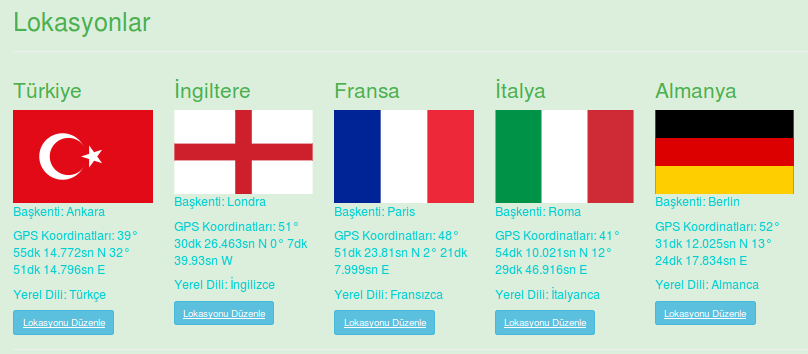

   figure 3.1

|

  Kullanıcılar Lokasyonlar sayfasında ilgili lokasyonin şu bilgilerini görebilir:

|

  - Dilin adı
  - Lokasyon ile ilgili bir resim
  - Kullanıldığı ülke
  - Dili kullananlar

|

**Yeni Lokasyon Ekleme**

Lokasyonlar sayfasına yeni bir lokasyon eklemek isteyen kullanıcı Lokasyonlar sayfası içerisinde listelenen lokasyonlarin alt kısmında **Yeni Lokasyon Ekle!** bölümünden eklenecek lokasyona ait gerekli bilgileri girdikten sonra **Ekle!** butonuna basarak yeni lokasyon ekleyebilir. Ekle butonuna bastıktan sonra sayfa otomatik olarak yenilenecektir ve eklenen lokasyon listelenen Lokasyonlar arasında görünecektir. Figure 1.2 de ekran görüldüğü üzere.

|

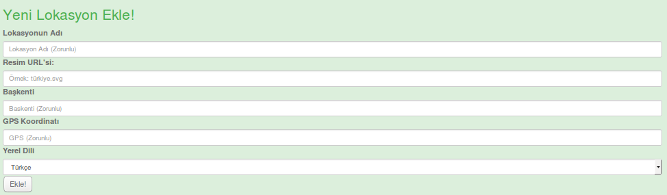

   figure 3.2

|

**Arama Fonksiyonu**

Kayıtlı Lokasyonlar arasından herhangi bir lokasyonu aramak isteyen kullanıcı Lokasyonlar sayfasının en alt kısmında bulunan **Lokasyon Ara!** bölümüne aranacak lokasyonun ismini girerek arama yapabilir. Eğer aranan lokasyon kayıtlı ise sadece aranan lokasyon bilgilerinin bulunduğu sayfa ekrana gelir. Eğer aranan lokasyon kayıtlı değil ise arama sonucunda boş bir ekranla karşılaşırlar.
|

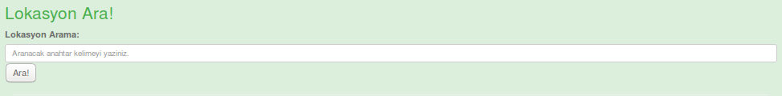

   figure 3.3

|

**Güncelleme Fonksiyonu ve Silme**

Kayıtlı Lokasyonlar içerisinde lokasyon bilgileri güncellenecek bir lokasyon varsa listelenen lokasyonun bilgilerinin altındaki **Lokasyonu Düzenle** butonuna basarak lokasyon güncelleme sayfasına aktarılır. Dilin bilgileri otomatik olarak boşluklara yazılır. Güncellenmek istenilen bilgi değiştirilir. Diğerlerinin değiştirilmesine gerek yoktur, eski bilgiler tekrar kullanılır. Daha sonra **Lokasyonu Güncelle** butonuna basılarak lokasyon bilgileri güncellenmiş olur. Butona basıldıktan sonra kullanıcı Lokasyonlar sayfasına yönlendirilir ve güncelleme sonuçları listelenir.

Eğer bir lokasyon silinmek isteniyorsa güncelleme ile aynı şekilde **Dili Düzenle** butonu ile geçiş yapacağı güncelleme sayfası altında **Lokasyonu Sil** butonuna basılarak lokasyon silme işlemi gerçekleştirilir. Silme işleminden sonra kullanıcı Lokasyonlar sayfasına yönlendirilir ve Lokasyonlar listesinin son hali gösterilir.

|

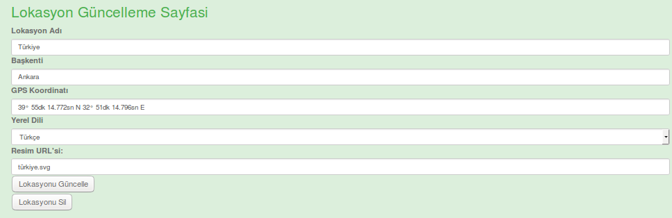

   figure 3.4

|
